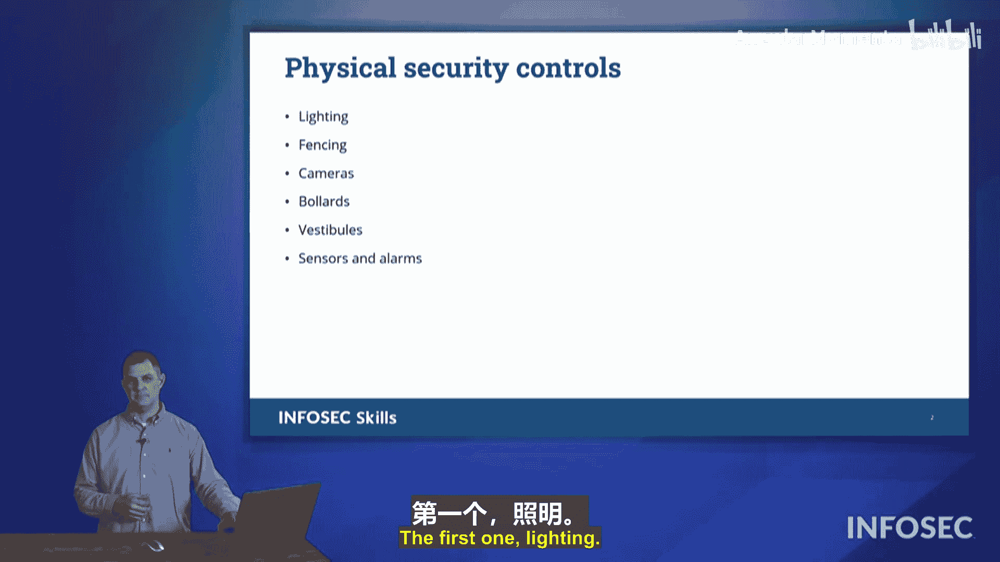

# 005：物理安全控制措施 🛡️

在本节课中，我们将学习保护组织物理安全的各种控制措施。物理安全是整体安全策略的重要组成部分，如果攻击者能够直接接触到我们的系统，将会带来严重问题。我们将逐一探讨几种关键的物理安全控制手段。

## 概述

物理安全旨在保护组织的物理资产、人员和信息免受未经授权的访问、损坏或盗窃。我们将依据CompTIA Security+考试目标，介绍以下核心控制措施：照明、围栏、摄像头、护柱、前厅以及传感器与警报器。

---

## 照明 💡

上一节我们概述了物理安全的重要性，本节中我们首先来看看照明。很多人不会将照明视为一种物理安全控制，但它确实是。许多恶意行为者不希望自己的行为被他人看见，犯罪活动常在暗处发生。因此，良好的照明有助于保障场所安全。

试想，如果让你选择走一条黑暗的小巷还是一条明亮的小巷，你会选哪个？照明能提供安全与保障，这是我们与生俱来的认知。此外，照明还能帮助我们通过摄像头观察情况，或让安保人员看清周围环境。

---

## 围栏 🚧

接下来我们讨论围栏。围栏有多种形式和尺寸，主要功能是界定设施的边界并阻止入侵。

以下是三种常见的围栏类型：

*   **赫斯科防爆墙**：这是一种由土方工程构成的快速部署屏障，通常由厚重的金属丝网和填充物制成。它成本低、效果好，能抵御轻武器射击，并能迅速为军事力量建立防御 perimeter。
*   **白金汉宫围栏**：这种围栏在保证功能性的同时，也考虑了美观。它有效阻止了入侵者越过边界，并且其顶部的镀金装饰使其在照片中看起来更赏心悦目。
*   **白色尖桩栅栏**：这种栅栏无法阻止坚定的入侵者，但它能有效地传达“这是我的领地，那是你的”或“禁止擅入”的信息。它主要是一种所有权的宣示，而非坚固的物理屏障。

总之，围栏既可以作为物理屏障，也可以作为所有权的象征，用于定义设施的边界。

---

## 摄像头 📹

现在，我们来看看摄像头。摄像头对于保护组织非常有用，它们可以同时监控多个区域的情况，从而放大安全力量的观察视角。

摄像头主要有两种用途：

*   **检测性控制**：用于记录和查看已发生的事件。
*   **威慑性控制**：通过将摄像头显眼地安装在建筑物的角落或柱子上，可以警告潜在的犯罪分子“我们正在监控”，从而阻止其犯罪行为。

此外，摄像头也可以隐蔽使用。例如，商店门框上的针孔摄像头可以清晰地拍摄每位顾客的面部，这在发生盗窃或抢劫时能提供关键证据。

---

## 护柱 🚏

另一个重要的概念是护柱。如果你没有航海背景，可能对这个词不太熟悉。护柱最初指码头系船用的系缆桩，而在安全领域，它指的是建筑物前那些金属立柱。

护柱的主要作用是：

*   **阻止车辆通行**：防止车辆（例如用于“撞抢”盗窃）冲撞建筑物。
*   **允许行人通行**：行人可以自由地在立柱间穿行。

有些护柱设计得比较有装饰性，例如塔吉特商店外的那些大红球。虽然它们间距较大，可能无法完全阻止所有车辆，但同样起到了护柱的功能和装饰作用。

---

## 前厅（访问控制前厅/防尾随通道） 🚪

在CompTIA考试中，我们还会遇到“前厅”这个概念，它过去常被称为“防尾随通道”。

一个访问控制前厅的工作原理如下：

1.  外部门打开，人员进入前厅。
2.  外部门必须关闭后，内部门才能打开。
3.  任何时候，只能有一扇门处于开启状态。

这种设计的主要目的是防止两种社会工程学攻击：

*   **尾随**：指某人未经你知晓或同意，跟在你身后进入受控区域。例如，你刷卡进门后，有人迅速抓住即将关闭的门溜进来。
*   **捎带**：指你出于善意（例如看到对方双手拿满东西）主动为他人开门，允许其利用你的授权凭证进入。这需要你的“自愿参与”。

访问控制前厅能有效防止这两种情况发生，因为无法同时保持两扇门开启，从而确保了每次进入都是受控且经过授权的。

---

## 传感器与警报器 🔔

最后，我们来探讨传感器和警报器。这些设备用于检测特定区域的活动或运动。

以下是几种常见的传感器类型：

*   **被动红外传感器**：通过检测人体发出的红外线来感知区域内是否有人。
*   **激光束**：通过建立不可见的激光束“绊网”，当光束被阻断时触发警报。
*   **压力传感器**：安装在地板或房间内，检测是否有人踏入或进入。
*   **微波/超声波传感器**：通过测量空间距离的变化来检测入侵。例如，一个10英尺长的走廊，如果传感器突然测到距离变为4或5英尺，则表明有人穿过，从而触发警报。

传感器和警报器是我们在设施中可以使用的另一种有效的物理安全控制形式。

---

## 总结

本节课中，我们一起学习了多种关键的物理安全控制措施。我们了解了**照明**如何提供安全保障和威慑作用；探讨了**围栏**如何界定边界并阻止入侵；分析了**摄像头**在检测和威慑两方面的用途；认识了**护柱**如何阻止车辆冲击；深入理解了**前厅（防尾随通道）** 如何防止尾随和捎带攻击；最后，介绍了各种**传感器与警报器**如何检测未经授权的活动。这些控制措施共同构成了保护组织物理安全的基础，是CompTIA Security+考试中的重要知识点。