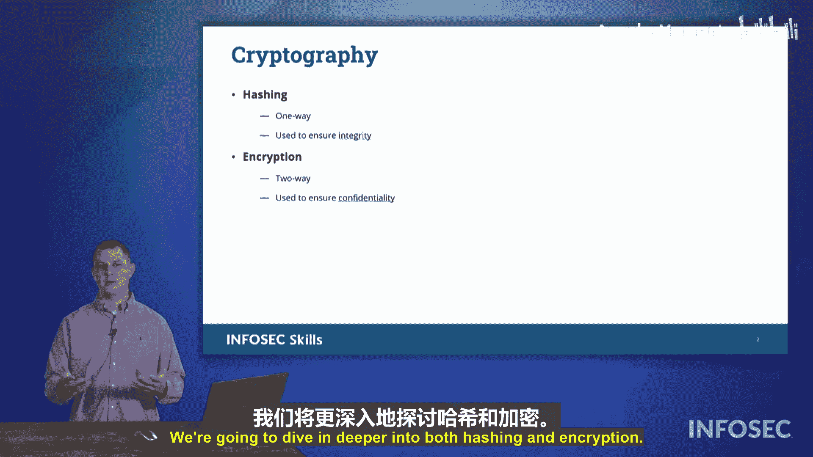

# 006：密码学入门 🔐


在本节课中，我们将要学习密码学的基本概念。密码学是网络安全的核心，它不仅仅是加密，还包含哈希等其他重要技术。我们将探讨这两者的区别、用途以及它们如何共同保护数据的机密性和完整性。

---

## 密码学概述

密码学是网络安全中的一个重要概念。当我们谈论密码学时，人们通常会立刻想到加密。但我们讨论的不仅仅是加密。

当我们审视密码学时，它包含两个主要方面：**哈希**和**加密**。很多人会立刻关注加密，因为加密是一个双向的过程。你可以加密某些内容，然后也可以解密它。这是一个来回的过程：你可以加密，也可以解密。我们使用加密来确保**机密性**，即我们希望秘密的事情保持秘密。

---

## 哈希：单向的数据指纹

上一节我们介绍了密码学的两个分支，本节中我们来看看哈希。

哈希则是一条单向通道。你可以对数据进行哈希运算，但无法对哈希值进行“反哈希”运算。你是从数据中**推导**出一个哈希值。我们使用哈希来保护**完整性**，以检测数据是否被更改。

以下是哈希的核心特点：
*   **单向性**：无法从哈希值还原出原始数据。
*   **固定长度**：无论输入数据多大，输出的哈希值长度固定（例如，SHA-256生成256位的哈希值）。
*   **雪崩效应**：原始数据的微小改动会导致哈希值发生巨大变化。
*   **抗碰撞性**：很难找到两个不同的输入产生相同的哈希值。

一个简单的哈希函数（伪代码）表示如下：
```
hash_value = hash_function(data)
```

---

## 加密：双向的秘密通信

了解了哈希的单向特性后，我们再来看看加密的双向过程。

加密是一个双向过程，它使用密钥来转换数据。加密的目的是确保只有授权方才能读取信息。

加密过程涉及两个核心操作：
*   **加密**：使用加密算法和密钥将明文转换为密文。公式可表示为：`C = E(K, P)`，其中C是密文，E是加密函数，K是密钥，P是明文。
*   **解密**：使用解密算法和相应的密钥将密文恢复为明文。公式可表示为：`P = D(K, C)`，其中D是解密函数。

根据密钥的使用方式，加密主要分为两类：对称加密和非对称加密，我们将在后续课程中详细探讨。

---

## 总结



本节课中我们一起学习了密码学的基础。我们了解到密码学包含**哈希**和**加密**两大支柱。哈希是一种单向函数，用于验证数据的完整性，确保数据未被篡改。加密则是一种双向过程，用于确保数据的机密性，防止未授权访问。理解这两者的区别和用途是构建安全系统的基石。在接下来的课程中，我们将深入探讨各类具体的哈希算法和加密技术。