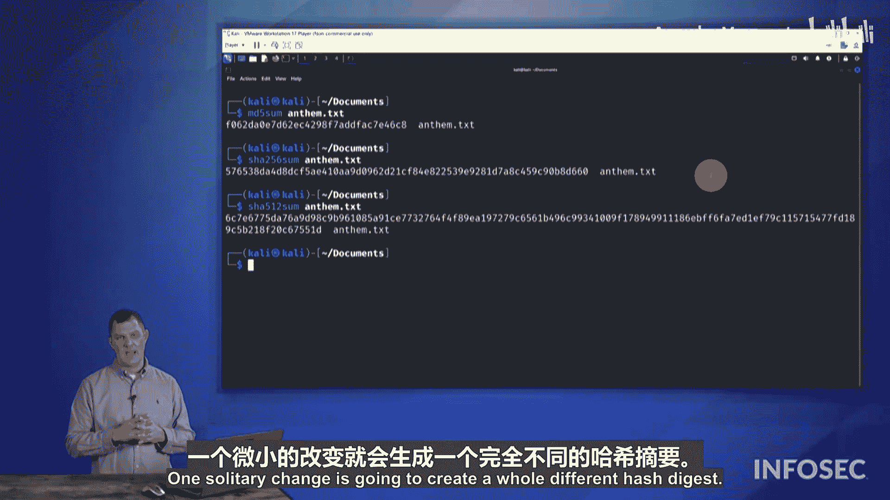

# 008：哈希算法演示

## 概述
在本节课程中，我们将学习密码学中的一个核心组件——哈希算法。我们将了解哈希是什么，它如何工作，以及它在检测文件完整性和保护密码方面的实际应用。课程将通过一个演示来直观展示不同哈希算法的输出。

## 哈希算法简介
哈希是密码学的一个关键组成部分。哈希是一种检测文件是否被更改的方法，也是一种保护密码的方式。

哈希的核心是哈希算法。该算法是单向的。我们可以将一些明文形式的信息输入，然后通过哈希算法运行，最终得到一个称为“摘要”的输出。

摘要是一串看似随机的字母和数字组合，是一个连续的字符串。哈希算法的输出对于其提供的输入是唯一的。

## 哈希的工作原理与特性
如果我将某些信息（例如某种数字文件）通过哈希算法运行，我们将得到一个哈希摘要。我可以获取任何输入，并找到一个对该哈希输入唯一的输出。

因为这是单向的，意味着我可以获取某种数据（例如电影《阿甘正传》的副本），通过哈希算法运行它，我们将得到一个唯一的字母和数字字符串。这个字符串对该特定文件是唯一的。

如果对该电影进行任何编辑，都会改变输出。

如果我输入一个PDF格式的《白鲸记》副本，并通过哈希算法运行，我将得到一个唯一的字母和数字字符串，该字符串与所有其他输入文件的结果完全不同。

## 哈希碰撞与算法安全性
如果我拥有两个输入，它们产生了相同的输出，这被称为“碰撞”。

一旦我们确定某个哈希算法能够产生碰撞，那么该算法就被认为是“被破解的”哈希算法。它随后会被弃用或淘汰，我们不再使用它，以防止他人制造此类碰撞。

我们希望避免碰撞的原因是：如果我有一款软件，我想检测自软件供应商完成最终设计以来，该软件是否被加入了任何东西。当我们通过哈希算法运行时，每次都会得到相同的输出。如果某些恶意软件作者将恶意软件植入该可执行文件中，我通过哈希算法运行它，却得到了与原始文件相同的输出，这将是一个问题。因为我无法判断这个可执行文件是否感染了恶意软件。它具有相同的哈希输出。因此，我希望使用更安全的、不会产生碰撞的加密哈希算法。

## 常见的哈希算法类型
以下是我们可以使用的不同类型的哈希算法：
*   **MD5**：已经存在了很长时间。它的缺点是可以产生碰撞，我们从90年代中期就知道了这一点。然而，我们仍在某些普通场景下继续使用它，因为在大多数情况下它足够好。但一旦涉及安全问题，就应该放弃MD5。
*   **SHA-256**：更安全的加密哈希算法。
*   **SHA-512**：更安全的加密哈希算法。

这些不同哈希算法的哈希输出（摘要）变得越来越长。

## 哈希算法演示
现在，让我们通过一个实际演示来看看这些哈希算法在运行时的样子。

在这个虚拟机上，我运行着Kali Linux。为了通过Security+考试，你不需要成为Linux大师。我使用它只是因为它在Kali Linux上很容易生成不同的哈希摘要。

让我们来看一下。如果我进入`documents`目录，这里有一些不同的文件。这些不同的文本文件内容并不重要，但如果我查看其中一个，我可以看到国歌《星条旗》的歌词。

如果我将这个文件通过哈希算法运行（在考试中你不需要知道具体命令，这里只是展示其样子），使用Linux命令行下的`md5sum`命令，我们会得到输出。例如：`foxtrot062deltaalpha...`。我通常会看这个摘要的开头四五个字符和结尾四五个字符。这就是MD5摘要，即该哈希算法的输出。

## 演示：微小改动对哈希的影响
现在，如果我们对国歌文件只修改一个字符会发生什么？例如，在“star spangled banner”中加入一个连字符。我们从根本上改变了国歌的信息吗？当然没有。但你可以看到，我们最终为国歌得到了一个完全不同的哈希摘要。我们改变了一个字符，增加了一个连字符，就完全改变了整个哈希摘要。

如果我撤销这个更改，将其恢复原状，再次运行哈希算法，你可以看到它回到了原始状态。我们回到了最初的哈希值。

请注意，我们无法检测到中间是否发生过更改。哈希算法所做的是比较起点和终点，查看输入和最终输出是否匹配。如果它们相同，则哈希摘要相同。

## 哈希摘要的表示与挑战
另一个要点是，如果我们查看那个哈希摘要，你会看到里面有许多不同的字符。你在这里看到的字母和数字范围是0到9和A到F，这为我们每个位置提供了16种可能性（十六进制表示）。

哈希摘要或哈希算法面临的一个挑战是，它必须能够处理世界上的所有数据。我们只是在看国歌。如果我们把一个字符从大写改为小写，或者把所有内容都改成大写，或把所有内容都改成小写，或把所有内容放在一行，都会产生问题，因为每次我们都会得到一个新的哈希摘要。

想想世界上存在多少数据，想想你今天生成了多少数据，仅仅是观看这个视频或今天早上查看电子邮件。你收到的每一封电子邮件，每一封可能包含任何字母数字组合、任何数量附件的电子邮件。今天存在的数据可能性似乎是无穷无尽的。

此外，你还必须考虑过去曾经存在的所有数据。那是大量的数据。如何捕获、如何表示过去的数据，似乎有无限多种方式。

我们还必须考虑未来所有将会存在的数据。我们必须能够解释这些数据及其可能的表示方式。所以，本质上，你是在获取数据可能被创建的所有看似无穷的可能性，并试图将其塞进哈希摘要有限的可能组合中。

因此，在某个基本层面上，你最终总会得到一个哈希值，但你必须能够证明这一点，而这正是密码学家、数学家和统计学家面临的挑战所在。

## 从MD5过渡到更安全的算法
对于MD5，问题在于我们没有足够唯一的值来应对我们拥有的看似无限的可能性。所以如今，我们在许多安全哈希应用场景中不再使用MD5，而是使用SHA-256。

使用SHA-256，如果我们对`anthem.txt`进行哈希，你可以看到我们最终得到一个更长的哈希摘要。我们不再局限于之前的位数，长度大约增加了一倍。

如果这还不够，如果你想未来证明自己，希望使用最长的哈希算法，我可以在这里使用SHA-512。如果我使用SHA-512对国歌文件进行哈希，你可以看到它更长，仍然是SHA-256的两倍长。这样，我们就有更多的“停车位”（比喻），让我们的数据可以生成唯一的字母数字字符串。

再次强调，这里的每个位置都是一个十六进制表示（0-9和A-F），每个位置有16种可能性。但这是我们可以保护数据并检测是否发生更改的一种方式。一个单独的更改将产生一个完全不同的哈希摘要。

## 总结
本节课我们一起学习了哈希算法的核心概念。我们了解到哈希是一种单向函数，能将任意长度的数据映射为固定长度的唯一摘要，常用于验证数据完整性和安全存储密码。我们探讨了哈希碰撞的概念及其对算法安全性的影响，并比较了MD5、SHA-256和SHA-512等常见算法的特点。通过演示，我们直观地看到即使输入发生微小变化，哈希输出也会截然不同，同时也理解了哈希空间有限性与数据无限性之间的根本挑战。最后，我们认识到在安全要求高的场景中，应使用如SHA-256或SHA-512等更现代、抗碰撞的哈希算法来替代已存在漏洞的MD5。

接下来，让我们看看如何使用哈希来保护密码。