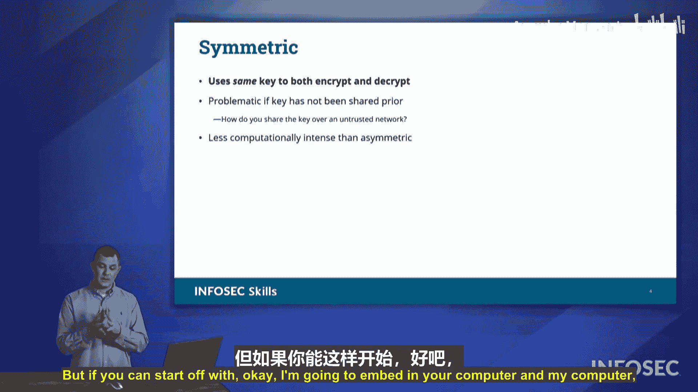

# 009：对称加密 🔐

在本节中，我们将学习加密的基本概念，并重点探讨对称加密的工作原理、应用场景及其优缺点。

加密是一种保护信息免受未授权方访问的方法，其核心目标是保障信息的**机密性**。加密算法主要分为两类：**非对称加密**和**对称加密**。本节我们将重点讨论对称加密。

## 对称加密简介

对称加密在实际中的应用比您想象的更为广泛。理解其工作原理是掌握加密技术的基础。

对称加密的核心在于，**加密和解密使用的是同一把密钥**。这就像一把钥匙既能锁门也能开门。为了直观理解，我们可以看一个简单的例子：ROT13密码。

ROT13是一种替换式密码，其规则是将字母表中的每个字母向后移动13位。因为英文字母有26个，移动13位后，A会变成N，B会变成O，依此类推。有趣的是，由于移动了半个字母表，加密和解密的过程是完全相同的操作。例如，字母“A”加密后变成“N”，而“N”解密后又变回“A”。

以下是一个ROT13的对应表：
*   A ↔ N
*   B ↔ O
*   C ↔ P
*   … (以此类推)

这意味着，即使我不告诉您一段文本是密文还是明文，您也可以通过ROT13规则找到对应的字母来转换它。当然，ROT13强度很低，无法用于保护真正的机密，但它完美地诠释了对称加密“同一把密钥”的核心思想。

## 动手练习：解密ROT13

为了加深理解，让我们通过几个例子来练习使用ROT13进行解密。以下是四个经过ROT13加密的单词，请尝试解密它们。

第一个词很短，很简单。请解密这个词：`ENSL`。
*   **解密过程**：E → R，N → A，S → F，L → Y。
*   **解密结果**：`EASY`。

现在请尝试解密第二个词：`URYYB`。
*   **解密过程**：U → H，R → E，Y → L，Y → L，B → O。
*   **解密结果**：`HELLO`。

接下来是第三个词：`VASBFRP`。
*   **解密过程**：V → I，A → N，S → F，B → O，F → S，R → E，P → C。
*   **解密结果**：`INFOSEC`。

最后，挑战一个较长的词：`PLCULRAPELCGB`。您可以暂停阅读，先自行尝试解密。
*   **解密结果**：`CRYPTOGRAPHY`。

通过以上练习，您应该已经熟悉了对称加密中“同一密钥”的操作模式。当然，现代技术中使用的对称加密算法（如AES）远比ROT13复杂和强大。

## 对称加密的挑战与优势

上一节我们通过例子理解了对称加密的工作原理，本节我们来看看它在实际应用中面临的主要挑战以及为何仍被广泛使用。

对称加密最大的挑战是**密钥分发问题**。既然加密和解密需要同一把密钥，那么通信双方必须安全地共享这把密钥。试想，如果我和你被遥远的山脉隔开，我如何能将密钥安全地交到你手中？通过无线电发送？敌人可能会窃听。通过不信任的网络传输？密钥可能被截获。因此，在双方地理分隔的情况下，安全地交换初始密钥是一个难题。通常的解决方案是双方最初在同一物理地点交换密钥，或者借助其他安全手段（如我们即将讲到的非对称加密）来传递这把对称密钥。

尽管存在密钥分发难题，我们仍然大量使用对称加密，这是因为它有一个关键优势：**效率高**。与非对称加密相比，对称加密的计算强度低得多，对系统资源的消耗小。非对称加密涉及极其庞大的数学运算，会带来沉重的计算负担。

因此，在实际的安全通信中（例如访问HTTPS网站），通常会采用一种混合模式：
1.  首先使用**非对称加密**来建立安全的初始连接，并安全地交换一个**会话密钥**。
2.  然后，双方切换使用**对称加密**和刚才交换的会话密钥，来进行后续大量数据的快速、高效加密通信。

这种组合方式既利用了非对称加密解决密钥分发问题的能力，又发挥了对称加密高效处理数据的优势。

## 总结

本节课中，我们一起学习了对称加密的核心知识。我们了解到对称加密使用同一把密钥进行加密和解密，并通过ROT13的例子直观理解了这一概念。同时，我们也认识到对称加密面临密钥分发的挑战，但其计算效率高的特点使其在与非对称加密结合的现代安全通信中扮演着不可或缺的角色。

接下来，我们将深入探讨**非对称加密**，看看它如何解决密钥分发的难题。