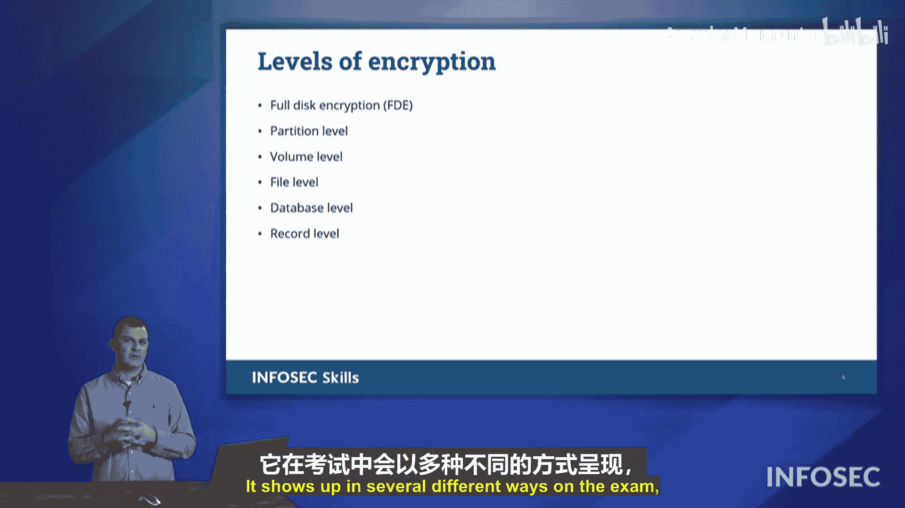

# 010：非对称加密 🔐

在本节中，我们将深入探讨非对称加密。

上一节我们介绍了对称加密，它使用相同的密钥进行加密和解密。本节中我们来看看非对称加密，正如您所猜测的，它使用不同的密钥。因此，我们将讨论这两种不同的密钥，以及它们是如何被使用的。实际上，一个密钥之所以是公钥，另一个是私钥，并没有本质的区别，区别仅在于它们的使用方式。

这一切都建立在一个称为**迪菲-赫尔曼密钥交换**的概念之上。虽然这不是一个需要深入测试的主题，但我们需要理解公钥和私钥以及它们的使用方式。

迪菲和赫尔曼这两位作者提出了一个想法：我可以使用一个密钥、一个值、一个数字来加密，而解密的唯一方法是使用另一个在数学上相关的值。我们在实践中看到的这些值，长度可达数千位，是极其巨大的天文数字，它们涉及非常大的质数。当将它们相乘并进行某些数学运算时，最终会得到这两个在数学上相关的值，但你无法仅凭其中一个值推导出另一个。

它们的关系还在于，其中一个能够加密数据，即使你知道那个值，你仍然无法解密。这听起来很不可思议，因为数字如此巨大，我们很难完全理解。你用一种方式加密，然后用另一个值来解密。

这两个密钥在功能上没有区别。一个可以在公开场合使用，另一个在私密场合使用。决定它们是公钥还是私钥的，在于你是否分享它。如果我给你一个值，那将成为我的公钥。另一个值，我会妥善保管，那将成为我的私钥。我不会与任何人分享私钥，绝不。我只分享我的公钥。

公钥之所以公开，是因为它是我分享出去的部分。而私钥，我则严密保管，不与任何人分享。

以下是加密的典型应用场景：

屏幕上的图表展示了发送方有一些需要加密的明文，他们将要发送一些东西给接收方。为了促成这次交换，发送方向接收方请求其公钥。发送方拿到公钥后，用它加密数据。全世界都能看到发送方正在向接收方发送信息。事实上，全世界也都能获得该公钥的副本。但这无关紧要，因为即使你拥有公钥，也不意味着你能解密用该公钥加密的信息。

能够解密用公钥加密的信息的唯一东西，您猜对了，就是私钥。那么谁拥有私钥呢？在整个世界数十亿台计算机中，只有接收方拥有它。他们不会与任何人分享私钥，绝不。因此，只有接收方能够解密发送方发送给他们的消息。

非对称加密存在一个问题，最后一点指出了这一点：

*   **计算密集**。请记住，我们使用的数字长达数千位。这些数字如此巨大，以至于你看到它们打印出来时会感到震惊。你的计算机必须处理这些大数字，这本身就是一个负担，然后它还必须使用这些完整的值来解密刚刚发送的每一个字节的消息。这将对你的系统性能造成影响。

因此，我们试图尽快脱离非对称加密。我们会使用非对称加密来建立通信，目的是发送一个对称密钥，以便我们可以切换到对称加密。之后，我们的系统都会觉得轻松，可以顺畅地发送数据。**非对称加密用于建立连接，而对称加密通常用于维持连接**。

这里也值得指出，公钥和私钥本身并没有固有的定义属性来区分公与私。这两个值在某种程度上是无法区分的，区别全在于它们如何被使用。因此，**用公钥加密的任何内容只能用私钥解密**。**用私钥加密的任何内容只能用公钥解密**。这听起来很奇怪，为什么我会想用私钥加密东西呢？因为全世界都能访问公钥。这似乎不合逻辑。我们将在后续学习数字签名和代码签名时，探讨我们如何用私钥加密某些东西，以便全世界都能验证。这听起来很奇怪，我们稍后会深入探讨。

接下来，让我们深入了解如何交换密钥。

如果我通过我们正在使用的**同一通信信道**向您发送密钥，这被称为**带内交换**。我使用相同的通信信道来发送关于我们加密方案的信息。

还有一种方式是**带外交换**。这是我们主要的通信线路，但在这里我有另一条途径，我将通过它向您发送密钥，以便您可以使用该密钥来促进我们的主要通信。这可能是通过聊天消息、电子邮件、普通邮件、烟雾信号等形式。只要我使用与主要通信方式不同的渠道将信息传递给您，就被称为带外交换。这就是我们在发送方和接收方之间交换密钥的方式。

此外，当我们谈论密钥长度时，我说过这些密钥是天文数字般巨大。对于密钥强度而言，**长度即强度，越长越强**。因此，当您查看密钥长度时，例如 AES 256，其位数远比如 AES 128（仅128位）强大得多。所以，长度即强度，越长越强。

我们在许多不同的场景中看到加密的应用。我们有一个概念，稍后会深入探讨，称为**全盘加密**，即加密驱动器上的所有数据。或者，我们也可以只加密一个分区，或者加密驱动器卷，具体取决于我们的结构。我们可以在不同级别上使用加密：我们也可以加密单个文件，这取决于我们想要实现的目标。如果我们在数据库中存储数据，我们可以加密整个数据库，也可以加密该数据库中的单个记录。加密级别在考试目标中被提及，并以几种不同的方式出现在考试中。但这里要理解的主要一点是，**非对称加密是一种进行公钥和私钥交换的方式**。

在本节课中，我们一起学习了非对称加密的基本原理，包括公钥和私钥的概念、迪菲-赫尔曼密钥交换的思想、非对称加密的计算密集型特点、带内与带外密钥交换的区别，以及密钥长度与强度的关系。我们还简要了解了加密在不同级别的应用。

在接下来的章节中，我们将更深入地探讨如何利用加密。