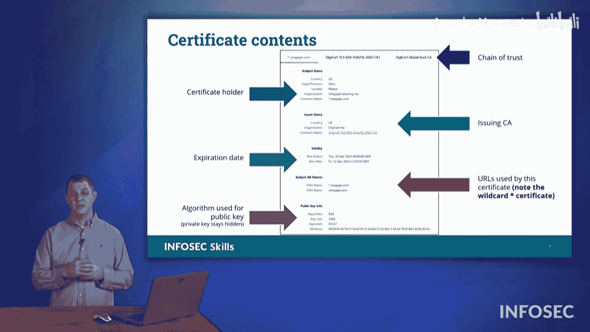

# 011：PKI与数字证书 🔐

在本节课中，我们将要学习公钥基础设施和数字证书的核心概念。我们将了解PKI如何利用公钥和私钥来确保通信安全，以及证书颁发机构在验证身份和建立信任链中的关键作用。

## 公钥基础设施概述

公钥基础设施利用公钥和私钥对。我们已经讨论过如何使用公钥加密信息，然后只有对应的私钥才能解密。PKI通过确保一个公钥只属于一个组织来支持这一机制。

为什么这一点很重要？因为使用该公钥加密的信息，只有对应的私钥才能解密。我们不希望两个组织共享一个公钥，因为这可能意味着它们会共享私钥，从而能够读取对方的机密信息。

因此，我们利用证书颁发机构颁发的数字证书来确保每个组织只有一个证书或一个公钥。

## 证书颁发机构

这些证书由证书颁发机构颁发。每个个体或组织获得的证书都是唯一的。对于世界上每个拥有证书的组织来说，只要证书是由第三方公共证书颁发机构颁发的，它们就拥有一个唯一的证书。

也存在自行签署证书的情况。这意味着您充当了自己组织的证书颁发机构。但这仅限于您的组织内部，您只能为自己的组织颁发证书。这类证书通常用于未连接到互联网的内部网络。如果外部人员连接到您的网络，而您使用的是自签名证书，他们将会收到“无效证书”的弹出警告。

## 信任链与证书签发

证书颁发机构的信任来自其他组织。它们向其他组织颁发证书。一个证书颁发机构从另一个证书颁发机构获得授权，然后才能向您提供证书。整个过程由证书签名请求启动。

您需要在考试中能够识别这个术语，它可能作为答案选项出现。证书签名请求启动了证书签发流程。当您希望从证书颁发机构获得证书时，您需要向它们提交一个CSR，然后它们的系统才会开始运作。

## 证书验证与状态查询

证书颁发机构会查看其他证书颁发机构已颁发的证书。它们会检查现有的其他证书，以确认即将颁发给您的公钥是否已存在匹配项，这暗示着可能存在与之关联的私钥。证书颁发机构维护着它们已颁发证书的记录。

它们还提供查询服务，以便其他证书颁发机构可以检查该证书是否已被注册。此外，这也允许您进行查询，以了解该证书是否已被使用，以及信息是否来自合法来源。证书颁发机构提供该查询服务。

它们还可以提供您证书的谱系、传承或血统，展示信任链。您的证书来自颁发它的证书颁发机构，但它们的信任又从何而来？它们从某个中间证书颁发机构获得信任，而中间机构最终又从根证书颁发机构获得了证书。正如您在此处图像中看到的，存在一个类似家族树的信任链。

## 证书状态检查机制

当您在此处进行查询时，我们有两种机制可以查看证书的状态。

我们可以使用OCSP，即在线证书状态协议。或者，我们也可以使用证书吊销列表。在线证书状态协议允许主机（您或我）查询证书颁发机构，询问“嘿，我收到了这个证书，它的状态如何？”您也可以查阅由该证书颁发机构颁发的证书吊销列表。在这种情况下，CRL几乎就像一个禁飞名单，它列出了已被吊销、不再受支持的证书，这些证书在某种意义上已失去信任。

## 证书字段结构解析

接下来，我们来看看证书上不同字段的结构。在这个演示中，我们有一个示例证书。在本例中，Infosec的母公司Cengage拥有以下字段（这是我们手头的一个较旧的证书）。

在最顶部，您可以看到信任链。它显示Cengage的证书来自DigiCert。DigiCert的颁发机构又从DigiCert的根证书颁发机构获得信任，后者是全球根证书颁发机构的一部分。

下面的字段提供了证书持有者的信息。在本例中是Cengage Learning Inc.。它显示了我们的公司邮寄地址位于俄亥俄州梅森。然后它说明了使用该证书的站点或服务器名称是 `*.cengage.com`。Cengage维护的任何子域名，例如邮件服务器或Infosec网站，只要是 `cengage.com` 的子域名，并且托管在面向Cengage.com的服务器上，都将由同一证书覆盖。

下面的这个字段告诉我们关于颁发证书机构的信息。这就是顶部信任链显示的地方。它提供了关于此证书颁发机构的信息。在本例中，颁发者是DigiCert，并提供了颁发该证书的证书颁发机构的信息。

## 证书有效期与替代名称

在这下面，或许最吸引检查证书的人注意的是**过期日期**——这个证书的有效期是多久？这是一个管理控制措施。从技术上讲，没有理由规定证书不能持续三个月、六个月、一年甚至十年。这将由过期日期定义。事实上，有些证书确实可以持续数十年，但大多数颁发机构只给您一年或可能仅三个月的有效期。这将在实际证书本身的过期日期中列出。

接下来在证书上要看的是**主题替代名称**。在本例中，它显示 `*.cengage.com` 或具体的 `cengage.com`。这是一个我们可以放入其他域名的地方。因此，如果 `cengage.com` 拥有此证书，并且希望将Cengage集团的其他部分列在此处，那么我们会在这里列出。例如，`infosecinstitute.com` 理论上可以由同一证书覆盖，但正如我们将在即将到来的演示中看到的，它拥有自己的证书。

## 加密算法与公钥

我们示例证书上的最后一个字段在最底部。它显示了用于提供证书公钥的算法细节。这可以有很多不同的格式。在这里，我们看到这是一个RSA加密证书。还有椭圆曲线密码学被使用，许多不同类型的算法被用在证书中，这将在此证书的底部定义。这些是证书中需要注意的一些字段。

现在，让我们花点时间去看看一个真实的、正在使用的证书是什么样子。

---

本节课中，我们一起学习了公钥基础设施和数字证书的基本原理。我们了解了PKI如何通过公钥和私钥确保安全通信，证书颁发机构在建立信任链中的核心作用，以及如何通过CSR申请证书。我们还解析了数字证书的关键字段，如信任链、持有者信息、颁发者、有效期、主题替代名称和使用的加密算法。最后，我们探讨了检查证书状态的两种机制：OCSP和CRL。理解这些概念对于管理网络安全和身份验证至关重要。