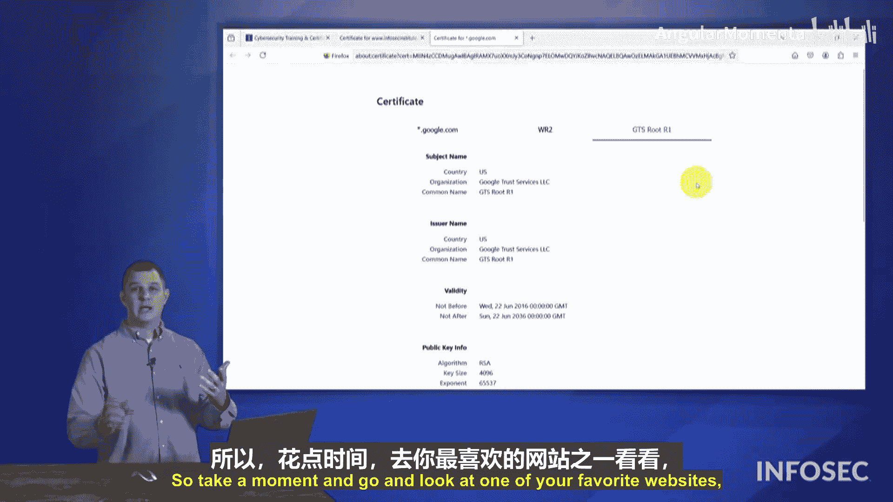

# 012：PKI证书演示 🛡️

在本节课中，我们将通过实际演示来探索互联网上真实存在的数字证书。我们将查看两个不同网站的证书，了解其包含的关键信息，例如颁发者、有效期和主题备用名称。

---

## 查看证书信息

上一节我们介绍了公钥基础设施的基本概念，本节中我们来看看如何在实际的网站证书中识别这些信息。

首先，我们访问了InfoSec Institute的网站。在浏览器地址栏的顶部，可以看到一个锁形图标，这表示与该服务器建立了安全连接。

点击这个锁形图标，可以查看网站的证书。弹出的证书窗口展示了我们之前在视频中学到的相同字段。

*   **证书持有者**：此证书颁发给了 `infosecinstitute.com`。
*   **颁发者**：此证书由Google Trust Services颁发，具体来自其下属的证书颁发机构 `G1`。
*   **有效期**：证书的有效期从2024年6月22日到2024年9月20日。在此日期之后，系统管理员需要更新证书，否则它将被加入**证书吊销列表**并被新证书取代。
*   **主题备用名称**：此证书仅覆盖 `www.infosecinstitute.com` 这一个网站。
*   **加密信息**：证书使用了椭圆曲线密码学。

继续向下滚动，可以看到颁发此证书的中间CA（`G1`）的证书信息。它的有效期更长，从2023年12月到2029年2月。

而最顶层的根CA证书（`GlobalSign Root CA`）有效期则非常长，从2016年6月到2036年6月，长达20年。这是因为根CA不经常直接颁发终端证书，因此其证书寿命很长。

---

## 主题备用名称的扩展应用

了解了单个网站的证书后，我们来看一个更复杂的案例，它展示了证书如何服务于多个服务。

我们访问了YouTube.com并查看其证书。有趣的是，证书的“颁发给”字段显示的是 `google.com`，完全没有提及YouTube。

以下是此证书的关键特点：

*   **证书名称**：颁发给 `*.google.com`。
*   **有效期**：相对较短。
*   **主题备用名称**：这是最值得关注的部分。此证书通过**主题备用名称**字段覆盖了谷歌大量的服务和域名。

当我们展开主题备用名称列表时，会发现一个庞大的列表：

*   全球各地的谷歌服务，如 `google.ca`（加拿大）、`google.co.jp`（日本）、`google.co.in`（印度）等。
*   谷歌的其他项目和服务，如AMP服务、广告服务、Google Flights等。
*   其中也包含了 `youtube.com`。这正是为什么在YouTube网站上能查看到此证书的原因。

**结论**：谷歌为其众多服务使用了一张统一的证书。这是一种高效的管理和安全策略，通过**主题备用名称**扩展，用一张证书保护了所有相关的域名和服务。

这张证书的信任链同样可以追溯回我们之前看到的Google Trust Services根证书。

---

## 动手实践建议

建议你花点时间访问一个你常用的网站，点击地址栏的锁形图标查看其证书。仔细查看各个字段，特别是**主题备用名称**，你会发现这是用一个证书保护多个不同服务的巧妙方法。

---

本节课中，我们一起通过实际例子查看了网站的数字证书，学习了如何识别证书的持有者、颁发者、有效期等关键信息，并重点了解了**主题备用名称**如何让一张证书服务于多个域名，这是现代PKI应用中一个非常实用的功能。