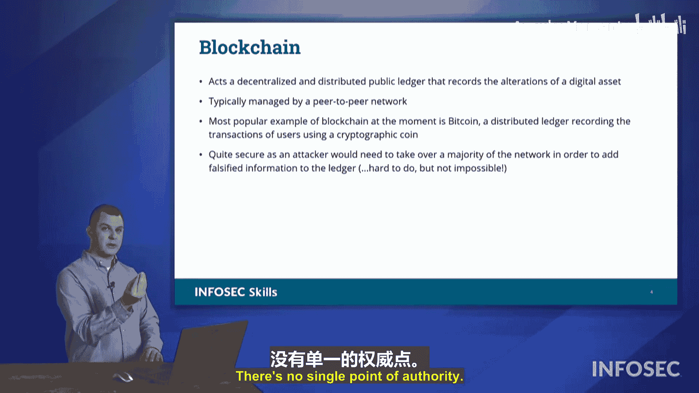

# 013：密码学的应用 🔐

在本节课中，我们将要学习密码学在网络安全中的几种具体应用方式。我们将探讨代码签名、数字签名以及区块链技术，了解它们如何确保数据的真实性、完整性和不可否认性。

## 代码签名

上一节我们介绍了密码学的重要性，本节中我们来看看它的第一个具体应用：代码签名。代码签名用于验证软件或更新的来源和完整性。

假设一个组织（例如微软）需要向客户发送一个操作系统更新。接收方如何确认这个更新确实来自微软，并且在传输过程中未被篡改？代码签名可以解决这个问题。

以下是代码签名的运作流程：

1.  **生成哈希摘要**：组织（如微软）首先对其要发布的代码、更新或补丁文件运行哈希算法，生成一个唯一的“哈希摘要”。这个摘要就像文件的数字指纹，任何对文件的微小改动都会导致摘要值完全不同。
2.  **使用私钥加密**：然后，组织使用其严格保密的**私钥**对这个哈希摘要进行加密。在非对称加密体系中，用私钥加密的数据，只能用对应的**公钥**来解密。
3.  **分发签名代码**：加密后的哈希摘要（即数字签名）和相关的证书（证明签名者身份）会与原始代码文件一起打包分发给用户。
4.  **接收方验证**：用户的系统收到签名代码后，会提取签名和证书。系统会获取微软的**公钥**（这是公开可用的），并用它来解密数字签名，得到原始的哈希摘要。
5.  **完整性校验**：同时，用户的系统会对接收到的代码文件重新计算哈希摘要。最后，将新计算的摘要与解密得到的原始摘要进行比对。

这个过程的意义在于：
*   **不可否认性**：如果公钥能成功解密签名，就证明该签名一定是用对应的私钥加密的。由于只有微软持有其私钥，因此可以确信代码确实来自微软。
*   **完整性**：如果两个哈希摘要完全一致，则证明代码在传输过程中未被篡改。

因此，代码签名同时提供了**完整性**和**不可否认性**的保障。

## 数字签名

理解了代码签名后，我们来看看一个非常相似的概念：数字签名。数字签名的工作原理与代码签名完全相同，都是通过哈希和加密来运作。

数字签名同样提供不可否认性。你会将数字签名用于诸如数字合同等场景，即在线上签署具有法律效力的文件。其核心流程同样是：发送方用私钥加密文件的哈希值，接收方用公钥解密并验证哈希，从而确认签名者的身份和文件的完整性。

## 区块链

另一个在课程目标中提到的密码学概念是区块链。虽然它在近期的Security+考试中出现不多，但未来可能涉及。区块链在业界被广泛讨论，那么它是如何工作的呢？

解释区块链运作的最佳类比之一是房地产交易。在美国各地的郡县，房地产交易记录是公开的、分布式的账本。任何人都可以去当地法院查询某块土地历史上所有的所有权变更记录。当你购买房产时，会进行“产权调查”，以确保产权清晰，没有历史遗留的所有权争议。这要求所有交易都必须公开记录并归档。

区块链与之类似，它是一个**去中心化的、分布式的公共账本**。
*   **去中心化**：意味着没有单一的中央管理机构。如果要攻击它，无法通过攻击单一点来破坏整个网络，这增强了系统的健壮性，避免了单点故障。
*   **分布式**：账本数据分布在网络的所有节点上。
*   **公共账本**：它记录了所有公开的交易。区块链最常与加密货币（如比特币）关联。每个加密货币单位都有其价值，可以像分割土地一样被分割和交易。

以下是区块链交易的简化过程：

1.  当一笔交易发生时（例如，Tommy将一些加密货币转给Tiffany），该交易信息会被广播到区块链网络。
2.  网络中的所有节点都会收到这笔交易信息。
3.  节点会验证交易的有效性，并为其生成哈希摘要。
4.  通过一种共识机制（如工作量证明），网络中的节点对这笔交易达成一致认可。
5.  一旦达成共识，这笔交易就会作为一个“区块”，被添加到所有节点共同维护的、不可篡改的历史交易记录链（即区块链）上。

这种设计带来了安全性：由于所有节点都拥有完整的交易历史记录，事后任何人试图篡改或否认某笔交易（例如，声称钱是转给他的而不是Tiffany）都会与其他节点的记录冲突，从而被拒绝。篡改区块链需要同时控制网络中超过半数的节点（即51%攻击），这对于大型区块链网络来说极其困难且成本高昂，虽然并非完全不可能，尤其是在一些小型加密货币网络中曾有发生。

总而言之，区块链是一种利用密码学哈希和分布式共识来确保交易安全与透明的技术。

## 总结

本节课中我们一起学习了密码学的三种关键应用。
*   **代码签名**和**数字签名**利用非对称加密和哈希函数，为软件和数字文档提供了**完整性**验证和**不可否认性**证明。
*   **区块链**则构建了一个去中心化的分布式账本，通过共识机制和密码学哈希来确保交易记录的透明与防篡改，为像加密货币这样的系统建立了信任基础。

这些技术是构建安全数字世界的基石。