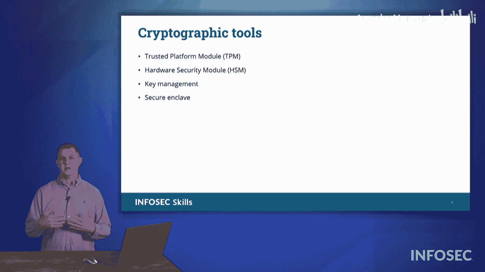

# 014：密码学工具 🔐

在本节课中，我们将要学习几种关键的密码学工具。这些工具对于实现安全的密码学协议至关重要，它们包括密钥管理、安全飞地、可信平台模块和硬件安全模块。理解这些工具如何协同工作，将帮助我们更好地在网络安全实践中应用密码学。

---

上一节我们介绍了密码学在网络安全中的核心地位，本节中我们来看看几种辅助我们运用密码学协议的具体工具。

以下是课程目标中列出的几种主要工具：
*   **可信平台模块**
*   **硬件安全模块**
*   **密钥管理**
*   **安全飞地**

首先，我们来探讨密钥管理。这主要涉及密钥的轮换。正如我们讨论证书时提到的，你需要能够轮换你的密钥。这确保了即使攻击者获取了你密钥的副本，他们也无法长期利用它，因为你每隔一段时间就会更换密钥。

---

接下来要讨论的术语是安全飞地。大多数现代移动设备内部都内置了一个安全飞地。手机中会有一块专门用于存储密码学数据的内存区域，这些数据在设备内部受到保护，这就是所谓的安全飞地。许多手机会使用生物识别技术来解密或提供对安全飞地中存储数据的访问权限。数据以加密状态存储，因此，在未首先通过身份验证访问该信息之前，无法直接从设备中窃取数据。

---

下一个主题是可信平台模块。可信平台模块是一个微小的芯片。它可以是主板上的一个外围设备，也可以直接焊接在主板上。从图示中可以看到，这个小型设备的核心是一个微小的专用芯片。这个芯片能够生成哈希值，并存储特定的密码学密钥。这些密钥既存储在短期内存中，也有只读内存用于存储密码学安全密钥。它的作用是提供一种识别计算机身份的方式。例如，当我的系统与某个远程系统通信时，我会访问该设备并要求：“从你的可信平台模块发回一些信息给我。”这样我就知道我正在与我了解和信任的那个远程系统通信。

看着屏幕上的图示，我想让你思考一下可信平台模块。你可以把它想象成一个“微小平台模块”，因为它与我们接下来要看的硬件——硬件安全模块——有很大不同。

---

硬件安全模块。如果你了解计算机硬件，你可能会看着它想：这看起来真像一张显卡。你是对的。它的内部核心是一个图形处理器单元。GPU 是这台设备的数学处理核心，上面有巨大的散热片来散发 GPU 产生的热量。但如果你仔细观察这张硬件安全模块的图片，你会发现它上面没有视频输出接口。它看起来就像一张没有视频连接器的显卡。这就是硬件安全模块。在上面安装 GPU 的意义何在？

你的主计算机处理器速度非常快，是一个性能强大的处理器。但你的主 CPU 是一个通用处理器。它非常擅长管理大量不同的进程，并一次处理一点点任务，可以说是一个分时处理器。我们以为计算机同时做很多事情，但实际上，它们是以极快的速度轮流处理一大堆不同任务的一小部分。

另一方面，为电子游戏生成图形而创建的图形处理器单元则非常专注于数学计算。它处理所有的几何变换，比如当你在走廊转弯、看到走廊尽头的怪物，或者开门看到僵尸时，你的视角发生变化，所有这些几何计算都由你的图形处理器单元处理。GPU 非常擅长处理数学运算。

因此，通过添加一个硬件安全模块，你可以将生成或处理那些庞大的公钥和私钥密码学算法的计算负担转移或卸载出去。所有那些公钥和私钥的加密解密操作，你的通用 CPU 处理起来效率不高，而 GPU 则可以轻松应对。所以，拥有一个硬件安全模块，就等于为你的系统添加了另一个图形处理器。

我想让你思考一下，这是一块硬件，它体积很大。你甚至可以认为 HSM 中的“H”代表“巨大”，而 TPM 则代表“微小”。这样你就有了一个规模上的差异。它们都为主计算机处理密码学过程，但硬件安全模块比微小的可信平台模块大得多。所以，你有微小的 TPM 和巨大的 HSM。

---

本节课中我们一起学习了密钥管理、安全飞地、可信平台模块和硬件安全模块这四种密码学工具。所有这些工具协同工作，为我们的主计算机提供密码学处理能力，使我们能够在多种不同的场景中有效地利用密码学。