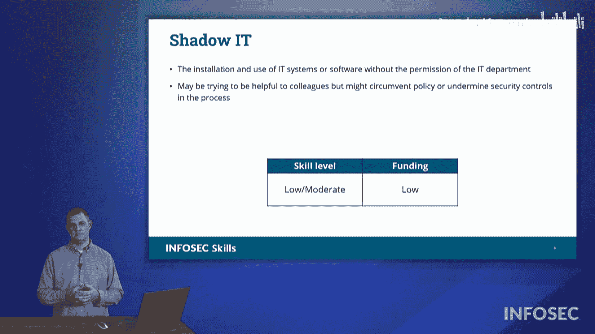

# 015：威胁行为体

在本节中，我们将学习CompTIA Security+ 701考试中可能出现的各种威胁行为体。我们将了解他们的特点、动机和技能水平，这对于评估安全风险和制定防御策略至关重要。

## 概述

不同的系统漏洞总是会吸引不同的威胁行为体。这些行为体可能采取行动，利用这些漏洞发起各种攻击。本节我们将逐一审视考试中可能出现的各类威胁行为体。

以下是我们要讨论的威胁行为体列表，我们将按此顺序进行讲解：国家行为体、无技能攻击者、黑客行动主义者、有组织犯罪、内部威胁以及影子IT。

## 国家行为体/高级持续性威胁

在这些威胁行为体中，最重要或最引人注目的，通常是新闻中最常出现的国家行为体或高级持续性威胁。

这些行为体由外国政府或国家资助和运作。识别国家行为体攻击者的一个关键标志是其**高度复杂性**。他们会想出新颖且有创意的方法来利用各种漏洞，其资金水平是无与伦比的。如果他们需要某些特殊知识、特殊工具或培训，他们会聘请世界顶尖专家并为此提供资金。

驱动国家行为体的主要因素不一定是声望或为其母国创造财富，尽管有时也会涉及。真正驱动他们的是**国家利益**。无论其母国或东道国的国家利益是什么，这都将成为他们的行动目标。

## 无技能攻击者

与国家行为体处于光谱另一极的是无技能攻击者。

如前所述，它过去在某些圈子中被称为“脚本小子”，现在考试中我们称其为“无技能攻击者”。这是一个略带贬义的术语，意指技能水平低、可能对正在发生的事情理解不深的攻击者。同时，由于他们主要是自筹资金，因此资金水平也较低。

这是典型的刻板印象中的黑客形象。他们并不完全清楚自己在做什么，只是连接使用他人创建的工具。他们不创造新的漏洞或利用漏洞的新工具，而是使用现成的工具。他们只知道按部就班操作以获得某种回报。驱动他们的动机通常是**声望**，以便向他人炫耀。

许多组织可能会轻视这类攻击者，认为无需担心。但请不要急于忽视他们。即使无技能攻击者可能不理解其行为，他们用来攻击你组织的漏洞利用仍然可能对你的组织安全造成重大损害。

## 黑客行动主义者

接下来，在技能水平上稍高一些的是黑客行动主义者。

这是一群有“事业”的黑客。他们受道德、社会、政治或哲学差异驱动，试图传播他们的信息。他们试图侵入其他组织，向该组织的支持者或拥护者传播信息，以期改变观点或政策。

就技能水平而言，他们处于**中等**水平，比脚本小子更先进、更复杂。这些人知道自己在做什么。在资金方面，他们可能会得到某些同情团体的支持。

黑客行动主义者就是一个试图传播特定信息的黑客团体。例如，黑客团体“匿名者”就符合这个特征。多年来，匿名者一直向其受害者传达信息，表明他们不会容忍对方在特定问题上的立场，并试图破坏该组织的通信。

## 有组织犯罪

另一个更高级的团体，在某些方面可与高级持续性威胁或国家行为体相提并论的，就是有组织犯罪。

这里我们谈论的不是黑手党或贩毒集团，尽管它们确实都有网络行动。我们更关注的是勒索软件团伙、网络漏洞利用团伙等试图从组织那里勒索钱财的团体。就技能水平而言，这些行为体确实非常复杂。在资金方面，他们资金雄厚，并且舍得投入。

驱动有组织犯罪的唯一动机就是**赚钱**。他们不关心政治信息、道德观点、声望甚至国家荣誉，他们只想要钱。有组织犯罪从其受害者那里寻求资金，进行勒索、敲诈、实施身份盗窃等。在行业中，有时也会将其称为高级持续性威胁，但在考试中，APT特指国家行为体攻击者。

## 内部威胁

也许更贴近办公室环境的是内部威胁。

这是指从建筑物内部进行操作攻击者。可能是一个心怀不满的员工，也可能是一个笨手笨脚的员工。例如，有人错过了晋升机会，或者认为自己的合同不会被续签，他们可能会寻求报复，并对雇佣他们的组织发起某种攻击。

内部威胁的技能水平可能是**中等**。他们可能是IT团队的一员、服务器管理员或程序员。他们知道如何隐藏行踪、掩盖痕迹。在资金方面，他们主要是自筹资金，不会花费大量金钱，也不一定得到外部组织的支持。内部威胁真正危险之处在于，他们拥有对网络的**授权访问权限**。他们本应因为工作而在网络中，但同时却在私下进行恶意活动。

这里列出的还包括缺乏经验的员工，他们也可能是问题所在。仅仅因为他们无意造成伤害，并不意味着伤害没有发生。例如，“不小心”删除了所有客户数据或“意外”破坏了设施的供电线路。即使他们是员工，你仍然需要保护组织免受用户行为的影响。

## 影子IT

影子IT是指办公室里的员工，他们自认为精通计算机，并试图“帮忙”。

例如，他们可能会说：“我知道这个怎么弄，我们不需要叫IT，我们自己就能搞定。”或者“为什么其他公司的同事都有Wi-Fi，我们不能有？午餐时我去买个无线路由器，我们自己建个Wi-Fi网络。”这违反了公司政策。公司没有Wi-Fi可能是因为需要遵守不同的政策和法规。

影子IT试图绕过官方政策，他们本意是想帮忙，但实际上却造成了问题。同样，你需要保护组织免受这些内部人员行为的影响。他们属于你的网络，受雇工作，但同时也在尝试做其他事情。他们的技能水平参差不齐，可能懂也可能不懂。在资金方面，除了午餐时间买个路由器之类，他们的资金水平也较低。

## 总结

在这个表格格式中，列出了所有不同的威胁行为体。请花点时间复习一下。考试需要你了解的是表格中列出的**技能水平**、他们拥有的**资金量**，并真正思考是**什么驱动着这些不同威胁行为体的利益**。

你不需要死记硬背这些主题的任何列表，也不一定需要填写像这样的表格中的所有空白。但你需要知道，在给定情境或描述的情况下，是哪种威胁行为体在起作用。这些就是Security+ 701考试中需要了解的威胁行为体。

本节课中，我们一起学习了CompTIA Security+ 701认证考试中涉及的六类主要威胁行为体：国家行为体、无技能攻击者、黑客行动主义者、有组织犯罪、内部威胁和影子IT。我们分析了每类行为体的典型特征、技能水平、资金来源和核心动机。理解这些差异对于在实际工作中进行威胁评估、制定针对性的安全防御策略至关重要。