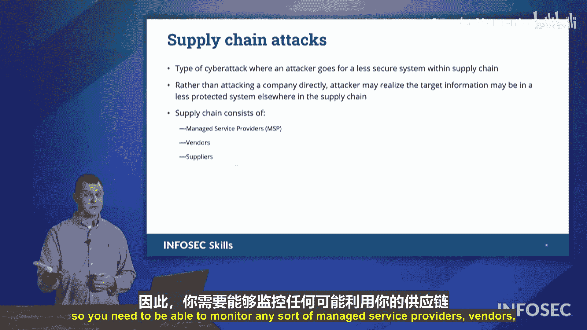

# 016：威胁向量

在本节课中，我们将学习组织可能面临的各种攻击途径，即威胁向量。了解这些向量是构建有效防御的第一步。我们将逐一探讨Security+考试中提到的关键威胁向量和攻击服务。

## 概述

攻击可以通过多种不同的方式针对我们的组织。本节将详细介绍Security+考试中提及的一些主要威胁向量和攻击服务，包括基于消息、文件、网络和供应链的攻击。

## 基于消息的攻击 📨

上一节我们介绍了攻击的多样性，本节中我们来看看基于消息的攻击。这类攻击通过电子邮件、短信或聊天消息等形式传递。

以下是几种常见的基于消息的攻击类型：

*   **网络钓鱼**：通过欺诈性电子邮件诱骗用户点击恶意链接或提供敏感信息。
*   **短信钓鱼**：通过短信进行类似网络钓鱼的攻击。
*   **即时消息/社交媒体钓鱼**：通过社交媒体平台上的私信或即时消息进行欺诈。

此外，我们还会看到基于语音的攻击，例如**语音钓鱼**。攻击者会冒充微软支持或国税局等机构拨打电话进行诈骗。

## 基于文件的攻击 📁

除了直接发送消息，攻击者还会利用文件作为载体。基于文件的攻击涉及携带恶意软件的文件。

需要特别注意的是**无文件恶意软件**。这种恶意软件在执行后不会在系统中留下文件痕迹，从而掩盖其行踪。但严格来说，在攻击过程的某个阶段，仍然有一个初始文件被加载并执行了恶意代码。

以下是其他一些基于文件的攻击方式：

*   **隐写术**：将信息或恶意代码隐藏在其他文件（如图片）中。
*   **图像携带的恶意软件**：恶意代码隐藏在图像文件中，由系统中的其他程序触发执行。隐写术也可用于从网络中秘密窃取数据。

## 可移动媒体与物理隔离系统 💾

数据不仅可以通过网络传输，也可以通过物理设备移动。可移动媒体是一个重要的威胁向量。

这包括大容量存储设备，如外接硬盘、U盘、数码相机或各种记忆棒。攻击者可以利用这些设备从组织内部窃取数据，或者将恶意软件带入组织内部。

与此相关的一个概念是**物理隔离系统**。这类系统通常不连接外部网络，数据通过可移动介质进行传输。历史上著名的伊朗震网病毒攻击，就是通过U盘将恶意软件引入了物理隔离的核设施系统。

## 软件与网络漏洞 🔓

软件和网络本身的弱点也是常见的攻击入口。

**存在漏洞的软件**如果未能及时安装补丁和更新，就会被攻击者利用。此外，网络中可能存在**不受支持的系统或应用**。这些可能是用户私自引入的，由于不被官方管理，它们往往得不到监控和更新，从而成为安全漏洞。

网络本身也可能存在问题：

*   **有线网络**：办公室中未使用的网络端口如果仍处于激活状态，可能被未经授权的人员接入。
*   **无线网络**：无线电信号是公开的，攻击者可以监听未加密的无线网络流量。
*   **蓝牙**：许多移动设备和电脑都配备蓝牙。蓝牙设备会不断广播其唯一标识符，这可能被用于跟踪设备位置（例如在零售店中）。不使用时应关闭蓝牙。

## 开放端口与弱凭证 🚪

网络配置不当会直接打开攻击之门。

**开放的网络端口**是潜在的攻击向量。防火墙上的服务端口如果无需使用，应当保持关闭。端口号（例如**80**）用于指示数据包的目标服务（如网页服务器）。

**弱密码或默认凭证**是另一个严重问题。许多设备出厂时使用如 `admin`/`admin` 这样的默认密码，如果未更改，攻击者可以轻易登录。必须确保所有系统，尤其是面向互联网的系统，都使用了强密码。

## 供应链攻击 ⛓️

即使组织自身的安全防护很强，攻击者也可能通过第三方找到突破口。

**供应链攻击**指攻击者通过入侵组织的供应商、合作伙伴或服务提供商，进而利用其访问权限渗透到目标组织网络。因此，监控和管理所有第三方实体的安全状况至关重要。

## 总结

本节课中，我们一起学习了Security+考试涵盖的主要威胁向量。我们探讨了基于消息、文件、可移动媒体的攻击，分析了软件漏洞、网络弱点（包括有线、无线和蓝牙）、开放端口与弱密码的风险，并了解了供应链攻击的概念。认识这些攻击途径是制定全面安全策略的基础。