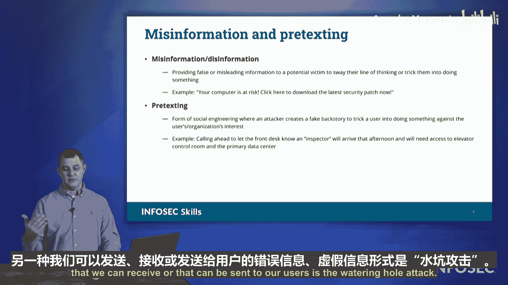

# 017：社会工程学攻击剖析 🎣

在本节课中，我们将要学习社会工程学攻击的各种形式。社会工程学是指攻击者利用心理操纵技巧，试图从组织或个人处获取敏感信息，或诱使人们做出他们通常不会做的事情。理解这些攻击手法对于构建有效的安全防御至关重要。

## 社会工程学概述

社会工程学攻击的核心在于利用人性弱点，而非技术漏洞。攻击者通过欺骗、诱导和操纵，使目标在不知不觉中泄露信息或执行危险操作。接下来，我们将逐一剖析几种常见的社会工程学攻击类型。

## 钓鱼攻击

钓鱼攻击是最常见的社会工程学攻击形式之一。攻击者向大量目标发送欺诈性信息，期望其中一部分人会上当。这种攻击成本低，但往往出奇地有效。

以下是钓鱼攻击的主要特点：
*   **广撒网**：攻击者并不确定具体谁会中招，因此向尽可能多的目标发送信息。
*   **低投入高回报**：对攻击者而言，只需制作一封伪造的电子邮件或网站，就有可能获得丰厚的回报。
*   **利用信任**：通常伪装成可信的来源，如银行、知名公司或同事。

## 鱼叉式钓鱼与鲸钓攻击

上一节我们介绍了广撒网式的钓鱼攻击，本节中我们来看看更具针对性的变种。

**鱼叉式钓鱼** 是一种针对特定个人或组织的定向攻击。攻击者会事先收集目标信息，使欺诈信息看起来高度可信。其攻击逻辑可以概括为：
`攻击目标 = 特定个人（基于其职位、权限、行为）`

**鲸钓攻击** 是鱼叉式钓鱼的一个子类，特指针对组织内“大鱼”的攻击，例如首席执行官、首席财务官等高管。攻击者看中的是他们手中的高级权限和影响力。在考试中，一个重要的提示是：**如果题目中出现了“CEO”，那么极有可能在考查“鲸钓攻击”**。

## 其他媒介的钓鱼攻击

钓鱼攻击不仅限于电子邮件，它已扩展到其他通信渠道。

以下是基于不同媒介的钓鱼攻击变种：
*   **语音钓鱼**：攻击者通过电话进行欺诈，常伪装成技术支持或政府机构。
*   **短信钓鱼**：通过短信发送欺诈链接，诱骗用户点击。
*   **品牌冒充**：攻击者伪造知名品牌的标识、名称或通信风格，以增强欺骗性。

## 冒充与虚假信息

攻击者常常通过冒充他人或散布虚假信息来建立信任或制造恐慌。

**冒充** 可以发生在个人层面，也可以是对整个品牌的冒充。其目的是利用被冒充方的良好声誉来降低目标的警惕性。

**虚假信息** 是指故意传播不实信息，以误导目标或促使其采取特定行动。例如，弹窗警告用户电脑已感染病毒，并诱导其下载所谓的“安全补丁”（实为恶意软件）。

##  pretexting攻击

Pretexting是指攻击者为实施攻击而精心编造一个合情合理的场景或借口。这个“剧本”旨在让后续的欺诈行为显得顺理成章。

例如，攻击者可能提前数天致电目标公司，冒充安全检查员，预告“下周将上门巡检”。随后在约定时间，同伙装扮成检查员出现，由于有之前的“预告”，门卫或员工更容易允许其进入。**Pretexting的核心是创造一个虚假的上下文，为攻击行为铺平道路。**

## 水坑攻击

最后一种我们要看的是水坑攻击。这种攻击不是主动追逐目标，而是潜伏在目标必然会访问的地点，守株待兔。

其攻击模式类似于自然界中鳄鱼在 watering hole（水坑）边伏击前来饮水的动物。攻击者会入侵目标群体经常访问的网站（如行业论坛、供应商网站），或利用 **typosquatting** 攻击。

**typosquatting** 是指注册与知名网站域名极其相似的错误拼写域名。例如：
*   将 `google.com` 注册为 `gooogle.com`（多一个o）。
*   将 `workday.com` 注册为 `w0rkday.com`（用数字0代替字母o）。

当用户因拼写错误访问这些恶意网站时，就可能泄露凭证或下载恶意软件。

## 总结

本节课中我们一起学习了社会工程学的主要攻击手法。我们从广泛的钓鱼攻击讲起，深入探讨了更具针对性的鱼叉式钓鱼和鲸钓攻击，并了解了通过电话、短信等不同媒介实施的变种。我们还分析了攻击者如何通过冒充、散布虚假信息、编造借口等手段进行欺骗，最后探讨了以逸待劳的水坑攻击及与之相关的typosquatting技术。牢记这些攻击的本质是操纵人心，对于识别和防范社会工程学威胁至关重要。