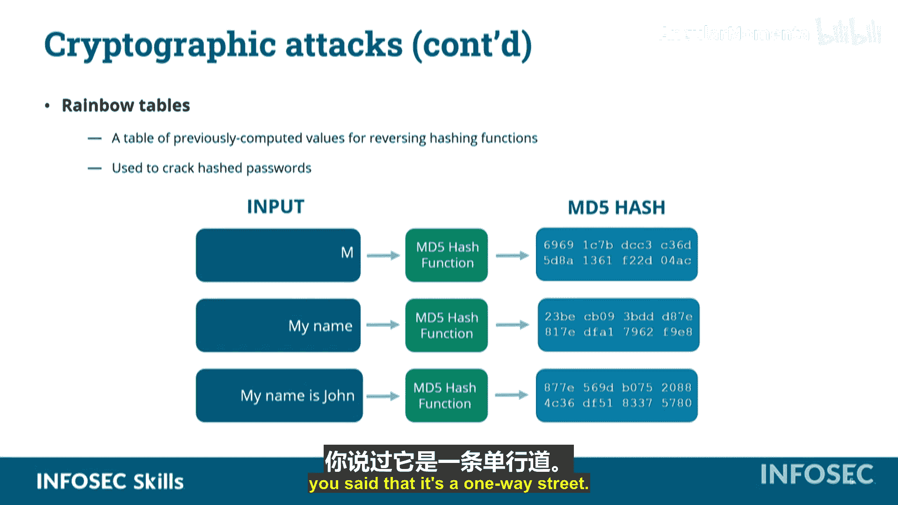

# 018：密码学攻击 🛡️

在本节课中，我们将要学习各种针对加密数据的攻击方法。攻击者常常试图获取我们通过加密措施保护的数据。了解这些攻击的原理，有助于我们更好地保护信息安全。

## 密码攻击 🔑

上一节我们介绍了密码学攻击的总体概念，本节中我们来看看最常见的攻击形式——密码攻击。攻击者试图获取我们已加密的密码。

以下是几种主要的密码攻击类型：

*   **暴力破解攻击**：这是最简单、最直接的密码攻击形式。攻击者会尝试**每一个可能的输入组合和排列**，直到猜中PIN码、密码或其他目标。其核心问题是耗时极长，理论上最终会成功，但现实中可能因时间、连接中断等因素而不可行。
*   **字典攻击**：这种攻击并非使用真正的词典，而是使用一个由**先前泄露过的密码**组成的列表。这个列表可能非常庞大（例如超过1TB）。如果你在不同系统中重复使用密码，一旦某个系统被攻破，你的密码就可能被加入这个列表，从而在其他系统上被轻易破解。
*   **密码喷洒攻击**：与字典攻击针对单个用户尝试所有密码不同，密码喷洒攻击是使用**一个或少数几个常用密码**，去尝试**攻击系统上的所有用户**，直到找到使用该密码的账户。

## 生日攻击 🎂

上一节我们讨论了针对密码的直接攻击，本节中我们来看看一种基于统计原理的密码学攻击——生日攻击。这种攻击与个人的生日无关，而是基于一个统计学上的奇特现象。

统计学告诉我们，在一个群体中，**只需要23个人**，就有超过50%的概率使得其中任意两人的生日相同。这之所以成立，是因为随着人数增加，两两比较的次数会急剧增长，远超我们的直觉。

生日攻击正是利用了这种原理：将一个看似很大的数字（如365天），在实践中匹配成功的概率所需尝试次数**远小于预期**。在密码学中，这意味着找到哈希碰撞（两个不同输入产生相同哈希值）可能比想象中更容易。

## 碰撞攻击 💥

上一节我们了解了生日攻击的原理，本节中我们来看看一种具体的哈希函数攻击——碰撞攻击。

碰撞是指**两个不同的输入经过哈希函数计算后，得到了相同的输出摘要**。碰撞攻击就是针对密码学哈希函数，**刻意寻找能产生相同哈希输出的两个不同输入**。

这种攻击主要影响那些已知存在碰撞缺陷的哈希算法。攻击者可能利用这一点，例如，将一个恶意软件嵌入到官方补丁中，并使其哈希值与官方补丁相同。用户验证哈希值一致后，可能会安装这个恶意补丁，从而在系统中释放恶意软件。

## 已知明文攻击 📜

除了针对哈希函数的攻击，加密算法本身也可能受到攻击。本节我们介绍已知明文攻击。

已知明文攻击是指攻击者**已经知道部分或全部加密前的原始数据（明文）**，以及其对应的加密后的数据（密文）。利用这些信息，攻击者可以尝试推导出加密密钥或算法模式。

一个著名的例子是电影《模仿游戏》中破解恩尼格玛密码机的场景。密码破译员知道每条德国密电的结尾都是“Heil Hitler”（向希特勒致敬）。这个**已知的固定明文结尾**，成为了他们逆向推导恩尼格玛密码机转子设置的关键突破口，从而开始破解整个加密体系。

如果攻击者不知道明文，只有密文（即唯密文攻击），破解难度会大得多。但已知明文攻击无疑能暴露加密机制的弱点。

## 彩虹表攻击 🌈

最后，我们来学习一种针对哈希密码的高效攻击方法——彩虹表攻击。

彩虹表利用了**预先计算好的哈希值**数据库。它通过寻找哈希值的模式，进行反向查找，试图找出能产生特定哈希输出的原始输入。

你可能会问：哈希不是单向的吗？仅凭哈希摘要无法反推输入。这没错，但彩虹表会**遍历所有可能的输入**，计算其哈希值并存储起来。当需要破解一个哈希值时，它就在这个庞大的预计算表中进行查找匹配。

彩虹表在破解哈希密码方面非常有效，但前提是攻击者**必须知道系统所使用的具体哈希算法、加盐方式等**。它的名字来源于其涵盖了所有可能的输入范围，就像彩虹包含了所有颜色的光谱一样。

---

**本节课总结**：本节课我们一起学习了多种密码学攻击方法。我们了解了**暴力破解、字典攻击和密码喷洒**等针对密码的直接攻击；探讨了基于统计的**生日攻击**和针对哈希函数的**碰撞攻击**；分析了利用已知信息进行逆向推导的**已知明文攻击**；最后，认识了利用预计算数据进行高效破解的**彩虹表攻击**。理解这些攻击的原理，是构建有效防御策略的第一步。