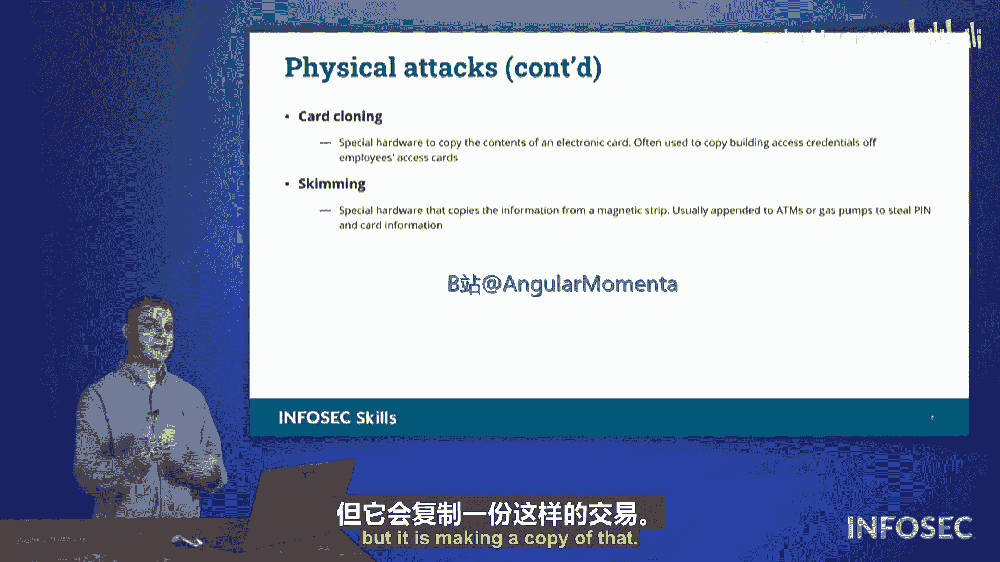

# 019：硬件攻击剖析 🛡️

在本节课中，我们将要学习CompTIA Security+ 701认证考试中需要了解的几种硬件攻击。我们将深入探讨这些攻击是什么、它们如何运作，以及它们可能对我们造成的影响。

## 恶意USB线缆 🔌

上一节我们介绍了硬件攻击的概述，本节中我们来看看第一种具体形式：恶意USB线缆。这是一种内部含有特殊电路的USB线缆。它允许数据正常通过，提供你期望的常规功能，但同时会**复制你的数据**或向连接的计算机**注入恶意代码**，其行为类似于一个可移动的U盘。

## 恶意USB驱动器 💾

除了线缆，另一种需要警惕的硬件威胁是恶意USB驱动器。以下是其工作原理：

当你将其插入计算机时，它会直接向计算机注入代码。它可能表现得像一个正常的U盘，但事实上携带着用于发起各种攻击的恶意软件。

一个提供此类设备的知名零售商是HaCC5组织。他们制造渗透测试工具，包括恶意USB线缆和恶意闪存驱动器。当这些设备被载入脚本并插入计算机时，它们会自动在系统上运行这些脚本，执行各种恶意载荷，从而获取对计算机的访问权限。市场上还有许多其他类型的此类设备，但HaCC5是其中较为知名的供应商之一。

## 卡片克隆与侧录 💳

我们还需要关注各种卡片如何被滥用，这就引出了卡片克隆和侧录攻击。

卡片克隆是指攻击者复制你的RFID卡（例如门禁卡）。他们使用读卡器接近你（例如在你的笔记本电脑包或钱包附近），读取你RFID卡上的唯一标识符并复制它。随后，攻击者可以利用这个复制的唯一ID，在你通常进入的设施重放该信号，从而伪装和冒充你的身份。

另一种设备被称为侧录器。侧录发生在你使用信用卡或借记卡等支付卡进行支付时。当你将卡片划过磁条阅读器或插入（例如加油泵的）读卡器时，攻击设备实际上在进行中间人攻击或从卡片上侧录信息。它允许正常操作流程继续进行（你仍然能成功支付），但同时会复制你的卡片信息。

这里有几个视觉示例，这些图片来自安全研究员Brian Krebs，他收集了大量在国际上发现的不同卡片侧录器的案例。下图是执法部门在不同支付卡设备上发现这些设备后拍摄的照片。

*   左边的设备是一个ATM读卡器侧录器。当你插入银行卡时，它会复制你借记卡磁条上的所有磁数据。数据存储在此设备上，攻击者之后可以利用这些信息冒充你访问银行账户。
*   右边的设备是一个中间人信用卡侧录器。当支付卡插入机器时，正常的读卡器会读取它，数据会经过此设备并继续传递以完成正常交易，允许你支付油费，但设备内部会存储这些信息。之后，攻击者可以在夜间无人注意时接近加油泵，通过手机蓝牙连接到设备，下载当天所有的信用卡号，然后消失无踪。

本节课中我们一起学习了几种关键的硬件攻击方式，包括恶意USB线缆、恶意USB驱动器，以及卡片克隆与侧录技术。了解这些攻击的原理和表现形式，对于识别和防范物理层面的安全威胁至关重要。