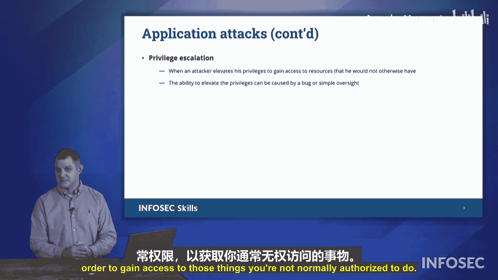

# 020：网络与应用攻击

## 概述
在本节课中，我们将学习几种基本的网络攻击和应用攻击。这些攻击是网络安全领域的常见威胁，了解它们对于通过CompTIA Security+ 701认证考试至关重要。

---

## 路径攻击

上一节我们介绍了课程概述，本节中我们来看看第一种攻击类型：路径攻击。

在CompTIA Security+资料中，这种攻击被称为**路径攻击**。它以前被称为**中间人攻击**。在这种攻击中，攻击者会介入用户与其连接的服务之间的通信路径。

攻击者会中断用户与服务之间的原始通信，然后让信息流经自己控制的设备。这样，攻击者就能查看和分析所有流经其设备的数据流量。如果数据未加密，攻击者可能看到诸如社会安全号码、电话号码、信用卡号、用户名和密码等各种信息，并可以复制这些信息供后续使用。

路径攻击这个名称更贴切，因为攻击者不一定处于连接的“中间”，也可能不是一个具体的人，而可能只是一个运行特定软件的系统。其核心是攻击者介入通信的两个端点之间。

---

## 域名系统投毒攻击

了解了路径攻击后，我们来看另一种可能出现在考试中的攻击：**DNS投毒攻击**。

这种攻击的目标是DNS服务器。DNS是一个将域名转换为IP地址的系统。例如，当你输入“google.com”时，DNS服务器会返回对应的IP地址。

在DNS投毒攻击中，攻击者会介入这个查询过程。当你请求某个域名的IP地址时，攻击者会快速返回一个伪造的IP地址，伪装成合法的DNS服务器。你的计算机会连接到攻击者提供的IP地址，而不是真正的DNS服务器返回的地址。

你的计算机会发送域名查询请求，期望从服务器获得IP地址回复。攻击者通过提供一个伪造的IP地址，将你引导到他们控制的地址。你的计算机会相信这个地址是合法的，因为“DNS服务器”是这么说的。通过这种方式，攻击者“毒害”了你与DNS服务器之间的通信。

---

## 地址解析协议投毒攻击

另一种投毒攻击是**ARP投毒攻击**。

在这种攻击中，攻击者利用地址解析协议，使网络上的另一台主机能够伪装成不同的主机。例如，网络上的攻击者可能会发布路由器的MAC地址，并声称“那也是我”或“我就是那台主机”。

结果，路由器和攻击者都会收到数据的副本。因此，任何发送到路由器的数据帧也会发送给攻击者。攻击者就能读取所有这些数据，实质上是在执行一次路径攻击或中间人攻击。这就是所谓的ARP投毒攻击。

---

## 拒绝服务攻击

另一种非常流行的网络攻击是**拒绝服务攻击**。

拒绝服务攻击是指向接收者发送过多信息，使其不堪重负。这就像多人同时对你说话，你的大脑无法处理所有信息，导致你无法理解任何内容，最终“死机”。

拒绝服务攻击也称为**资源耗尽攻击**。它会耗尽目标服务器或主机网络上的所有可用资源。

攻击者甚至可以不发送大量信息来压垮主机，而只需发送足够的信息，缓慢地进行，并从同一主机建立多个不同的连接。这种特定的攻击称为**慢速攻击**。

例如，一个系统可以攻击远程的Apache网络服务器。这种攻击会耗尽该网络主机所有可用的连接。攻击者只需极其缓慢地发送单个字符，让网络服务器一直等待。如果同时进行成千上万次这样的连接，网络服务器就无法处理任何外部连接了。这是一种不仅消耗带宽，更耗尽网络服务器所有资源的拒绝服务攻击。

---

## 分布式拒绝服务攻击

拒绝服务攻击的一种扩展形式是**分布式拒绝服务攻击**，这也是目前新闻中最常见的一种。

在分布式拒绝服务攻击中，攻击者控制着许多不同的主机，所有这些主机同时向一个特定目标发送大量信息。屏幕上显示的图形展示了我们控制下的三台不同主机，它们同时向一台主机发送信息，导致该主机“死机”，从而拒绝为合法用户提供服务。

在实际中，这可能是数百、数千甚至数十万台主机同时连接到一个特定目标，一波接一波地向目标发送大量未经请求的流量。

---

## 放大攻击

我们可以使用应用攻击来压垮主机，这就是**放大攻击**。

放大攻击发送少量流量，却能收到大量的响应。例如，发送一个查询“google.com”所有DNS记录的小请求。作为响应，你会得到不止一个IP地址，而是一大堆不同的回复。一个小的出站请求和一个超大的返回响应，就构成了放大攻击。

攻击者可以放大从其网络发出的带宽量，让大量流量涌向目标。如果攻击者控制着数十、数百或数千台主机，他可以从所有设备向互联网上的DNS服务器发送查询，让这些服务器的响应流量压垮目标。这就是**DNS放大攻击**。

我们还可以利用其他协议，例如**网络时间协议**，来执行放大攻击。我们需要防范任何未经请求的返回响应，这是阻止分布式拒绝服务攻击的方法。

---

## 缓冲区溢出攻击

另一种我们必须讨论的放大攻击是**缓冲区溢出**。

在计算中，**缓冲区**是一块内存，用于存储来自用户的输入信息。任何输入进来，我们都会将其保存在缓冲区中进行处理。缓冲区的大小是预设的，我们需要编程确定要存储多少信息。

在缓冲区溢出攻击中，如果你发送的信息过多，它实际上会溢出到其余的内存中。我们的缓冲区内存是有限的，如果发送的信息过多，就会溢出，并可能覆盖计算机内存中其他位置的值。

通过适当的研究和工作，攻击者可以在许多不同的应用程序中引发缓冲区溢出，因此这在很大程度上是特定于应用程序的。

在接下来的图示中，我们看到了一个我在家庭度假时遇到的缓冲区溢出例子。那是一个老式的模拟汽油泵，其显示表盘有数字。想象一下，如果我加了999.9加仑汽油（或消费了999.90美元），显示表盘就满了。如果我再多加10美分，显示会变成0, 0, 0, 0吗？这意味着我得到免费汽油了吗？实际上，那个“1”没有空间在我们的模拟显示器上显示，所以它会溢出。

同样地，在计算机中，我们有一定数量的内存专用于某项任务。缓冲区溢出时，多出的数据可能会覆盖系统中的其他信息。这可能以更改用户凭据、或让我们访问原本无权访问的内容的形式出现。

例如，如果系统内存中存储着管理员用户的ID，我们实际上可以引发缓冲区溢出，向内存写入值，然后更改用户ID。如果我们恰好将其更改为我们自己的用户ID，这将允许我们执行**权限提升攻击**。我们能够将权限提升到超出最初分配的范围，这就是权限提升：超越正常权限以获得通常未经授权访问的权限。

---

## 总结
本节课中，我们一起学习了多种网络和应用攻击，包括路径攻击、DNS投毒、ARP投毒、拒绝服务攻击、分布式拒绝服务攻击、放大攻击以及缓冲区溢出攻击。理解这些攻击的原理是构建有效网络安全防御的基础，也是通过Security+ 701认证考试的关键。