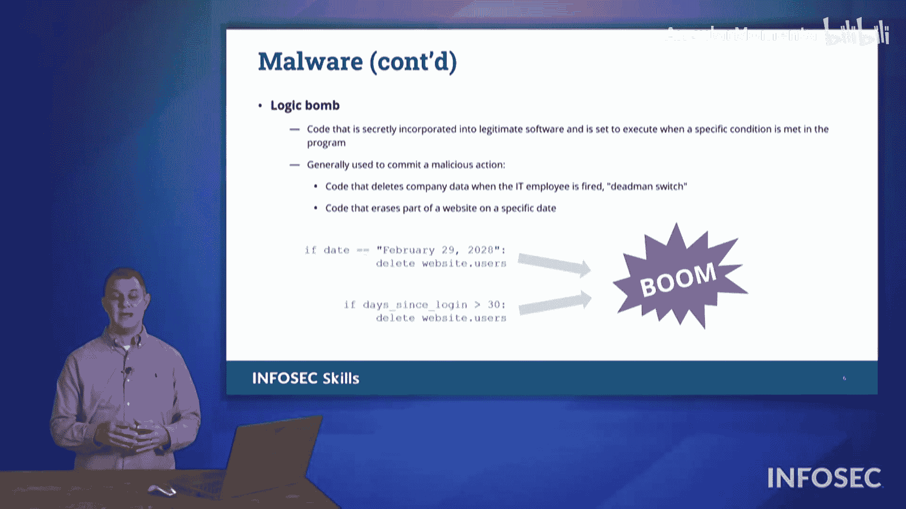

# 021：恶意软件类型详解 🦠

在本节课中，我们将学习网络安全领域中最核心的威胁之一：恶意软件。我们将详细介绍多种不同类型的恶意软件，理解它们的工作原理、传播方式以及潜在危害。这些知识对于通过CompTIA Security+ 701认证考试至关重要。

恶意软件是“恶意”与“软件”两个词的合成词，指任何设计用于对计算机、服务器或网络造成损害的软件。它是网络安全防御的主要对象。

## 病毒与蠕虫 🦠

上一节我们介绍了恶意软件的基本概念，本节中我们来看看两种最常见的类型：病毒和蠕虫。它们都具备自我复制和传播的能力，但关键区别在于传播方式。

*   **病毒**：类似于生物病毒，计算机病毒需要一个宿主。它依赖于用户交互来激活和传播。例如，需要用户点击链接、下载文件或依赖某个预定的系统进程来启动。其行为模式可概括为：**需要宿主 + 用户交互**。
*   **蠕虫**：与病毒不同，蠕虫不需要任何形式的人工交互。它能够独立地在网络中移动、传播、自我复制和自我执行。其行为模式可概括为：**自我传播 + 无需交互**。

## 木马与后门 🐴

了解了能够主动传播的恶意软件后，我们来看一些更隐蔽的类型。木马和后门都侧重于提供非授权的访问途径，而非自我复制。

以下是两种相关的恶意软件类型：

*   **木马**：名称来源于特洛伊木马。它是一种隐藏在合法软件内部的恶意程序，或者本身就是伪装成其他功能的软件。例如，一个看似正常的免费软件或破解版软件，可能内含木马。
*   **后门**：后门程序允许用户绕过正常的身份验证流程进入系统。它最初可能出于开发测试等非恶意目的被创建（例如，为了方便测试而绕过登录流程），但一旦被恶意攻击者发现，就会成为严重的安全漏洞。后门的核心是**提供非授权访问**。

## 远程访问木马与僵尸网络 🤖

上一节我们讨论了提供访问权限的恶意软件，本节中我们来看看一种能够实现远程控制的特定木马——远程访问木马，以及由其构成的庞大网络。

*   **远程访问木马**：这是一种安装在受害者系统上的木马。一旦运行，它会主动连接到互联网上的命令与控制服务器，接收攻击者下达的指令，并在本地系统上执行，仿佛攻击者直接登录了该系统一样。其工作流程为：`RAT本地运行 -> 连接C2服务器 -> 获取指令 -> 本地执行`。
*   **僵尸网络**：由大量被RAT或其他恶意软件感染的计算机（称为“僵尸”或“肉鸡”）组成的网络。控制这些僵尸的恶意软件作者被称为“僵尸主”。僵尸主可以指挥整个网络进行协同攻击，例如发动分布式拒绝服务攻击。其规模可达数千甚至数十万台设备。

## 键盘记录器与间谍软件 👁️

除了控制系统，恶意软件的另一大目的是窃取信息。接下来我们将探讨两种专门用于监视和窃取数据的恶意软件。

以下是两种信息窃取类恶意软件：

*   **键盘记录器**：这类恶意软件（可以是硬件或软件）会记录用户在计算机上的每一次击键。其目标是窃取用户名、密码、信用卡号、社会安全号码等所有通过键盘输入的敏感信息。记录的数据可能存储在本地，也可能发送到远程服务器。
*   **间谍软件**：间谍软件是键盘记录器的“增强版”。它除了记录击键，还可能进行屏幕截图、偷拍摄像头画面、监控网络流量和浏览历史等，全方位地监视用户的一切活动。

## 逻辑炸弹 💣

最后，我们来看一种特殊类型的恶意软件，它通常与内部威胁相关联，其破坏行为由特定条件触发。

**逻辑炸弹**是一种恶意代码，它会潜伏在系统中，等待一个或多个预设的逻辑条件被满足（例如，到达某个特定日期、某位员工离职后30天、某个文件被删除等）。一旦条件成立，它就会触发恶意操作，如删除数据、破坏系统功能等。

这种“条件触发”机制有时也被称为“死人开关”。历史上曾发生过真实的案例，例如某政府资助机构的内部员工因预感将被解雇，而植入了旨在删除大量抵押贷款数据的逻辑炸弹，所幸在引爆前被发现。

---

本节课中我们一起学习了多种主要的恶意软件类型，包括：
*   依赖宿主传播的**病毒**和可自我传播的**蠕虫**。
*   伪装成合法软件的**木马**和用于绕过验证的**后门**。
*   实现远程控制的**远程访问木马**及由其构成的**僵尸网络**。
*   窃取输入信息的**键盘记录器**和进行全方位监视的**间谍软件**。
*   由特定条件触发的**逻辑炸弹**。

理解这些恶意软件的区别和运作原理，是构建有效网络安全防御体系的基础，也是通过Security+认证考试的关键。