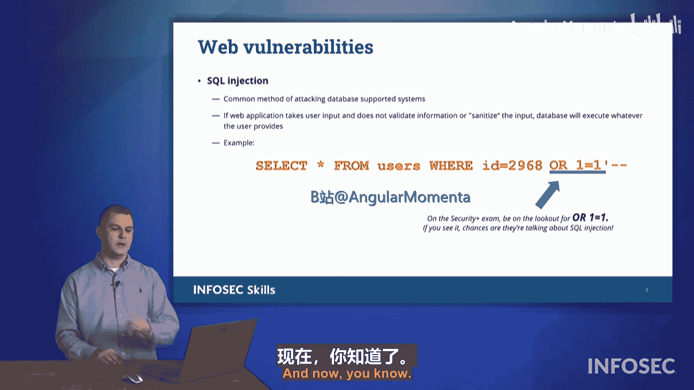

# 022：SQL注入攻击详解 🛡️

在本节课中，我们将学习一种非常常见且流行的攻击形式——SQL注入攻击。我们将从高层次了解SQL注入攻击的工作原理及其操作方式。

## 什么是SQL注入？

SQL是结构化查询语言。SQL注入攻击通过在标准的SQL查询中注入一小段逻辑来实施。例如，一个典型的查询可能是：`SELECT * FROM users WHERE id = 2968`。这个查询会从名为“users”的表中，选取所有ID等于2968的记录并返回结果。

## SQL注入如何运作？

SQL注入攻击会在这个标准查询的末尾附加额外的逻辑。例如，攻击者可能将 `OR 1=1` 附加到查询条件之后。SQL处理器会评估整个条件：如果 `id = 2968` 为真，则返回对应记录；**或者**，如果 `1=1` 为真，则返回当前正在考虑的数据。由于 `1=1` 永远为真，这会导致查询返回**所有**记录，而不仅仅是ID为2968的那一条。

**核心攻击模式公式：**
`SELECT * FROM table WHERE condition **OR 1=1**`

在CompTIA Security+考试中，如果你在SQL语句中看到 `OR 1=1`，这几乎可以肯定是SQL注入攻击的迹象。请务必记住这一点。

## 通过示例数据库理解影响

为了更清晰地理解，让我们通过一个简单的“products”产品表示例，看看 `OR 1=1` 如何彻底改变查询返回的结果。

以下是我们的产品表：

| ID | 产品名称 | 成本 | 售价 | 库存 |
| :--- | :--- | :--- | :--- | :--- |
| 1 | Thingy | $0.50 | $1.00 | 24 |
| 2 | Doohickey | $0.25 | $0.75 | 52 |
| 3 | Widget | $1.25 | $2.50 | 1915 |
| 4 | Dinglehopper | $0.50 | $6.00 | 10 |

### 正常查询过程

假设一个Web应用程序执行以下查询来获取ID为3的产品信息：
`SELECT * FROM products WHERE id = 3`

数据库系统会逐行检查表格：
1.  检查第一行：`id = 1`。条件 `1 = 3` 为**假**，不放入结果集。
2.  检查第二行：`id = 2`。条件 `2 = 3` 为**假**，不放入结果集。
3.  检查第三行：`id = 3`。条件 `3 = 3` 为**真**，**将整行数据放入结果集**。
4.  检查第四行：`id = 4`。条件 `4 = 3` 为**假**，不放入结果集。

查询结束，返回结果集，其中只包含ID为3的“Widget”产品记录。这正是用户期望看到的结果。

### 注入攻击后的查询过程

现在，如果攻击者将输入从“3”修改为“3 OR 1=1”，查询就变成了：
`SELECT * FROM products WHERE id = 3 OR 1=1`

数据库系统再次逐行检查，但逻辑条件改变了：
1.  检查第一行：条件是 `(id=1) OR (1=1)`。`id=1` 为假，但 `1=1` **永远为真**。整个条件为**真**，**将第一行放入结果集**。
2.  检查第二行：条件是 `(id=2) OR (1=1)`。同样，`1=1` 为真，**将第二行放入结果集**。
3.  检查第三行：条件是 `(id=3) OR (1=1)`。`id=3` 为真，**将第三行放入结果集**。
4.  检查第四行：条件是 `(id=4) OR (1=1)`。`1=1` 为真，**将第四行放入结果集**。

查询结束，返回的结果集包含了**产品表中的所有记录**。攻击者借此窃取了整个产品列表的机密信息，如成本价和库存量。

## SQL注入的危害与防护

通过这个例子，我们可以看到SQL注入的危害：攻击者能够绕过应用程序的正常逻辑，访问或篡改其无权查看的数据。泄露的成本等商业机密可能被对手在谈判中利用，给企业带来损失。

因此，防范SQL注入至关重要。开发人员应使用参数化查询等安全编码实践，对用户输入进行严格的验证和过滤。

## 总结

本节课我们一起学习了SQL注入攻击。我们了解到：
1.  SQL注入是通过在SQL查询中注入恶意逻辑（如 `OR 1=1`）来实施的攻击。
2.  攻击会导致数据库返回远超预期的数据，造成信息泄露。
3.  在CompTIA Security+考试中，`OR 1=1` 是识别SQL注入问题的关键标志。
4.  防范此类攻击需要采用安全的编程方法，如使用参数化查询。

理解SQL注入的基本原理是识别和防御此类威胁的第一步。