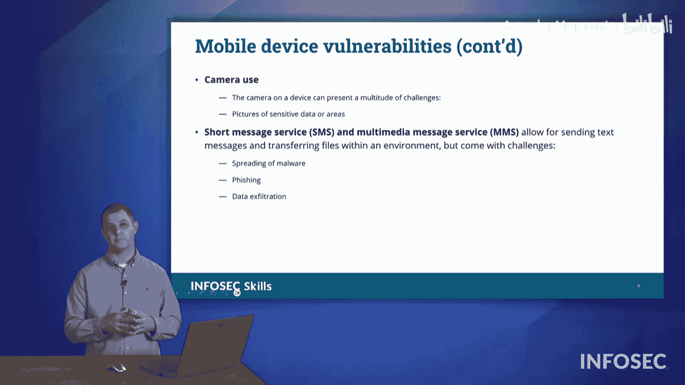

# 023：第4.1.6节 - 漏洞类型详解 🛡️

在本节课程中，我们将学习可能影响我们网络的各种漏洞。不同组织处理这些漏洞的方式各不相同，但在考试中，我们需要熟悉这些术语，以便能够识别它们。

## 零日漏洞

首先，我们将介绍一个在网络安全领域反复出现的术语：令人畏惧的**零日漏洞**。当一个漏洞被发现或被**披露**时，一个计时器就开始了。我们通常会讨论这个漏洞存在了多久。那些全新的、前所未见的漏洞，我们对其了解的天数是**零**，因此被称为“零日漏洞”。零日漏洞之所以令人担忧，是因为目前没有已知的解决方案可以阻止它。为了应对零日漏洞，我们尝试通过**分层防御**来堆叠尽可能多的缓解措施。

## 配置错误

接下来，我们来看看不同类型的配置或漏洞。首先要讨论的是**配置错误**，即系统或其某部分配置不正确，导致安全风险的情况。

以下是几种常见的配置错误：

*   **默认账户**：例如，出厂默认的用户名和密码都是 `admin`。如果未更改这些默认凭据，就属于配置错误。
*   **错误处理不当**：如果未妥善处理报告给用户的错误信息，可能会**过度分享**系统信息（如服务器类型、操作系统），攻击者可以利用这些信息。
*   **不必要的软件组件**：不需要的软件应卸载。每个软件都是潜在的漏洞，若无必要，应予以移除。

## 操作系统漏洞

上一节我们介绍了配置错误，本节中我们来看看操作系统层面的漏洞。操作系统漏洞主要分为两类：**恶意库**和**恶意驱动程序**。

首先，我们来理解什么是**库**。在编程中，库是一段可重用的代码块。开发者无需重复编写通用功能（如创建窗口），可以直接使用他人编写好的库。这就像通过阅读图书馆里的书籍来获取知识，而无需亲自去研究。

**恶意库**的问题在于，如果攻击者知道程序使用了某个库，他们可以篡改该库的代码。当程序调用这个被篡改的库时，就可能同时引入恶意软件。

与库类似的是**驱动程序**。驱动程序是操作系统与硬件通信的软件。**恶意驱动程序**可以在硬件信号传输过程中加入恶意行为。例如，一个恶意键盘驱动程序可以记录所有击键（即**键盘记录器**），并将数据发送出去。操作系统必须信任驱动程序，因此恶意驱动程序构成了严重的漏洞。我们通常通过**代码签名**等安全控制来保护驱动程序。

## 硬件漏洞

我们的硬件本身也可能成为漏洞来源。攻击者可以安装间谍硬件来监视我们。这通常需要攻击者获得对系统的**物理访问**权限。

为了保护系统免受此类威胁，尤其是通过USB设备等外设的攻击，常见的做法是**禁用系统上所有的USB端口**，以防止恶意软件注入或数据外泄，确保所有数据通信都通过网络进行，以便监控。

## 软件供应链漏洞

除了直接攻击，攻击者还可能采取迂回策略。如果目标组织的安全防护非常严密，攻击者可能会转而攻击其供应商或第三方服务提供商。这就是**软件供应链漏洞**。

我们需要确保与供应商、厂商和业务合作伙伴签订安全协议，以保障供应链安全，并对供应链攻击保持警惕。

## 加密漏洞

我们可能遇到的另一类漏洞是**加密漏洞**。这类漏洞的出现可能是因为加密算法本身存在缺陷或被破解。

例如，在使用哈希算法时，如果算法能产生**哈希碰撞**，就会形成漏洞。假设攻击者制作了一个带恶意软件的可执行文件，并使其MD5哈希值与合法软件相同。当用户验证哈希值时，就会误以为该文件是合法的，从而安装并运行了恶意软件。

另一个相关概念是**传递哈希**攻击。如果哈希值在传输或存储过程中未被加密保护，攻击者就可能截获并利用它。因此，我们必须使用加密技术来保护传输中、存储中和使用中的数据。

## 移动设备漏洞

最后，我们来看看移动设备漏洞。移动设备带来了多种安全顾虑。

以下是几个关键的移动设备安全问题：

*   **第三方应用商店**：组织可能要求用户只使用官方应用商店，也可能禁止使用官方商店，而强制使用经过内部审核的私有应用商店。策略取决于具体情况。
*   **侧载**：指直接将应用从电脑安装到移动设备上。开发者常用此方法测试应用。但许多无法通过官方商店审核的应用也通过这种方式传播，带来了安全风险。
*   **Root/越狱**：**Root**指获取设备的根权限，从而可以禁用移动设备管理（MDM）等安全控制。**越狱**指解除设备限制，启用被策略禁用的功能（如摄像头）。
*   **摄像头与短信**：出于安全考虑，组织可能通过策略禁用设备摄像头。同时，短信（SMS/MMS）也可能成为安全威胁，例如用于数据外泄、传播恶意软件或社会工程学攻击。

## 总结

本节课中，我们一起学习了多种网络安全漏洞。我们从最令人担忧的**零日漏洞**开始，探讨了因设置不当导致的**配置错误**，深入分析了操作系统层面的**恶意库**和**恶意驱动程序**。我们还了解了攻击者如何利用**硬件**和**软件供应链**作为攻击入口，认识了因算法缺陷或使用不当产生的**加密漏洞**。最后，我们讨论了移动设备特有的安全风险，包括**第三方应用商店**、**侧载**、**Root/越狱**以及对**摄像头**和**短信**的管理。理解这些漏洞是构建有效防御体系的第一步。