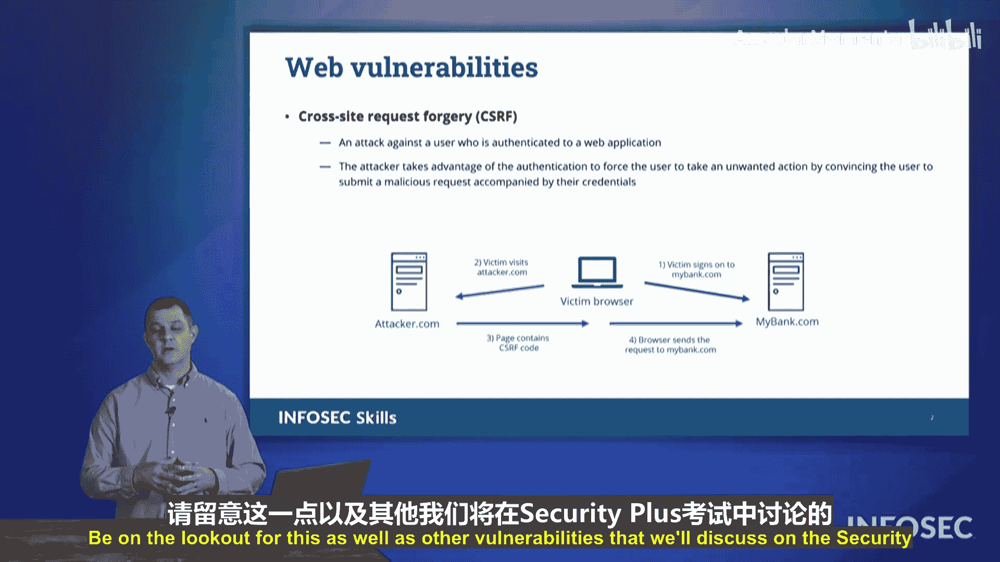

# 024：跨站请求伪造（CSRF）

在本节中，我们将探讨Security+考试中会涉及的一种漏洞：跨站请求伪造。我们将了解其运作原理，并学习如何识别它。

## 概述

跨站请求伪造是一种利用用户已认证会话来执行非授权操作的攻击方式。本节将详细解析攻击者、受害者与服务提供商之间的交互过程。

## CSRF攻击流程解析

上一节我们介绍了CSRF的基本概念，本节中我们来看看一个典型攻击场景的具体步骤。整个过程涉及三个角色：受害者、服务提供商（如银行网站）和攻击者。

以下是攻击发生的典型步骤：

1.  **受害者登录服务**：受害者登录其服务提供商（例如 `MyBank.com`）。在完成登录（可能包括多因素认证）后，服务提供商会向受害者的浏览器发送一个认证Cookie。
2.  **会话保持**：此时，受害者的浏览器持有该Cookie，这代表着一个已通过认证的有效登录会话。
3.  **诱导点击**：攻击者通过电子邮件或其他方式向受害者发送一个链接，诱使其点击。例如，一封伪装成银行发来的中奖邮件：“恭喜您成为今日六位幸运用户之一，将获得免费笔记本电脑！感谢您作为 `MyBank.com` 的忠实客户。”
4.  **访问攻击者站点**：受害者被诱导点击链接，访问了攻击者的网站（例如 `attacker.com`）。
5.  **触发恶意请求**：攻击者的网页中包含一个精心构造的请求（即CSRF攻击载荷）。这个请求会利用受害者浏览器中已存在的 `MyBank.com` 认证Cookie，自动向银行服务器发送一个操作请求。
6.  **执行非授权操作**：银行服务器收到来自受害者浏览器的请求，由于附带了有效的认证Cookie，便执行该操作。例如，攻击者构造的请求可能是：“将受害者账户中的所有资金转移到某个海外账户”。
7.  **攻击完成**：受害者对此操作毫不知情，而攻击者已利用其认证会话完成了非法操作。

## 核心机制与总结

通过上述流程可以看出，CSRF攻击的核心在于**利用受害者浏览器中已存在的认证凭证**。攻击者**伪造**一个指向目标站点的请求，并诱使受害者的浏览器代为发送。由于该请求是从受害者浏览器发出且携带合法Cookie，服务端难以区分这是用户的真实意图还是攻击。

其核心关系可以用以下简单逻辑表示：
**攻击成功条件 = 受害者已登录目标网站 + 受害者访问了恶意页面 + 目标网站仅依赖Cookie进行会话验证**

本节课中我们一起学习了跨站请求伪造的攻击原理和完整流程。关键点在于理解攻击者如何通过诱导用户点击，利用用户已有的登录状态来“借刀杀人”。在Security+考试中，需要对此类漏洞保持警惕。

