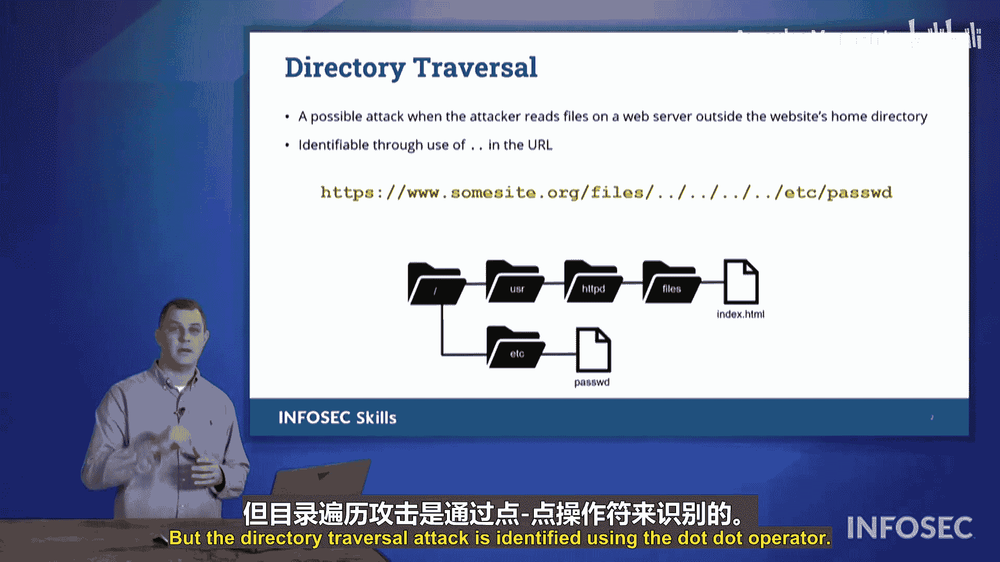

# 025：目录遍历攻击

在本节中，我们将探讨一个可能在Security+考试中出现的漏洞，这个漏洞被称为目录遍历。

目录遍历攻击的工作原理是，它能够访问Web服务器文件系统上的文件，而这些文件通常不属于Web服务器提供的文件范围。

## 目录遍历攻击原理 🔍

如上图所示，在最顶层，我们看到的是应用程序（即Web服务器软件）可以访问的文件列表。

Web服务器软件有一个名为`HTTPD`的目录。其内部有一个名为`files`的目录。在这个目录里，可能有一个文件，例如我们看到的`index.htm`。

然而，通过目录遍历攻击，攻击者可能能够浏览Web服务器的主机操作系统，以访问通常不属于Web服务器提供的文件。在本例中，这个文件是`/etc/passwd`。

## 攻击手法：使用`..`操作符 🛠️

攻击者执行目录遍历攻击的方式是使用`..`操作符。

在Linux甚至DOS/Windows的命令行中，都有`..`操作符。`..`意味着返回上一级目录。`.`表示当前目录，`..`则表示返回上级目录。

观察我们幻灯片上的URL：`www.somesite.org/files/`。然后，`..`使我们从`files`目录返回上一级。在本例中，这使我们返回到主网站`somesite.org`的根目录。

接着，`..`使我们从该目录退出，进入`user`目录。然后，`..`再次使我们从`user`目录退出，回到主根目录。从那里，我们现在可以导航进入`/etc`目录，并最终访问`passwd`文件。

## 潜在风险与后果 ⚠️

如果Web服务器没有配置防御此类攻击，它可能会被欺骗，从而提供`passwd`文件。该文件将包含基于Linux或Unix系统上所有用户的列表。

这将带来严重问题，因为攻击者现在拥有了系统上授权用户的列表。随后，攻击者可以发起密码攻击或其他授权攻击。

## 识别与考试要点 📝

目录遍历攻击是通过使用`..`操作符来识别的。在Security+考试中，请留意这一点，它很可能会出现在考题中。

## 总结

本节课我们一起学习了目录遍历攻击。我们了解了其基本原理，即攻击者利用`..`操作符遍历服务器目录结构，访问本不应公开的系统文件（如`/etc/passwd`）。我们还探讨了这种攻击带来的风险，以及如何在考试中识别它。理解此漏洞是构建安全Web应用的重要一步。