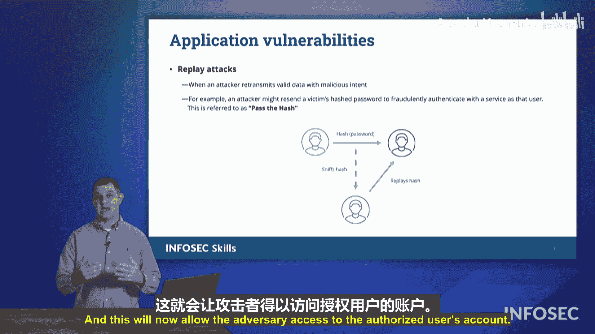

# 026：04_01_09 哈希传递攻击 🔑

在本节课程中，我们将探讨一个可能在Security+考试中出现的漏洞类型。这种漏洞被称为“哈希传递”攻击。这是一种重放攻击的形式。首先，让我们了解什么是重放攻击。

## 什么是重放攻击？🔄

重放攻击是指攻击者能够监听并窃听你的通信过程。当你尝试向一个系统进行身份验证时，系统可能会询问“密码是什么？”，然后你将传输你的秘密密码。攻击者可以窃听到这个密码。他们只需要监听这个密码是什么，之后就可以在任意时间连接到该系统进行身份验证。系统会说：“发送你的密码”，而攻击者只需回复：“这是上次的密码”。

作为人类，我们可能会想，计算机会听出声音的不同，因为不同用户的声音不会一样。但请记住，计算机都使用同一种语言——全是0和1。没有音调、口音或声音的变化，一切都是0和1。因此，通过重放任何身份验证信息，服务器将像对待授权用户一样，授予攻击者访问权限。这就是所谓的重放攻击。

## 哈希传递攻击详解 🛡️

在哈希传递攻击中，我们有一个用户正在向服务器传输其登录凭据，例如密码。服务器不会要求直接发送明文密码，为了更安全，它会要求：“哈希你的密码然后发给我”。于是用户对自己的密码进行哈希运算，然后将哈希值发送给服务器。

服务器端存有该密码的正确哈希摘要。服务器会比较收到的哈希值和存储的哈希摘要。如果两者相同，服务器就会说：“是的，是这位用户，请进。”

然而，在整个过程中，位于底层的攻击者一直在监听用户和服务器之间的对话。攻击者复制了用户使用的凭据（即密码哈希值）。当用户断开连接后，攻击者便可以连接到服务器。

服务器说：“发送你的密码。”攻击者回答：“当然，这是我的密码。”他们只需要发送之前截获的那个密码哈希值即可。

那么，攻击者知道这个密码的明文是什么吗？**不知道**。他们在乎吗？**不在乎**。他们只需要该密码的哈希形式。

攻击者将这些数据发送给服务器，服务器验证后说：“是的，这和上次登录的哈希值相同，请进。”这样，攻击者就获得了授权用户账户的访问权限。这就是所谓的“哈希传递”攻击，它是我们可能在Security+考试中遇到的漏洞类型之一。

## 核心概念总结 📝

*   **重放攻击**：攻击者截获并重新发送有效的身份验证数据以获取未授权访问。
*   **哈希传递**：一种特殊类型的重放攻击，攻击者截获并重用的是密码的**哈希值**，而非明文密码。
*   **攻击流程**：
    1.  用户哈希密码并发送至服务器。
    2.  攻击者窃听并捕获该哈希值。
    3.  用户会话结束。
    4.  攻击者使用捕获的哈希值直接向服务器进行身份验证。
    5.  服务器验证哈希值匹配，授予攻击者访问权限。

## 本节课总结

在本节课中，我们一起学习了哈希传递攻击的原理。我们首先了解了其基础——重放攻击的概念，即攻击者通过重复使用截获的凭据来冒充合法用户。接着，我们深入探讨了哈希传递攻击的具体过程：攻击者窃取的是密码的哈希值，并利用这个哈希值，在不知道原始明文密码的情况下，成功通过服务器的身份验证。理解这种攻击方式对于识别和防范相关安全风险至关重要。