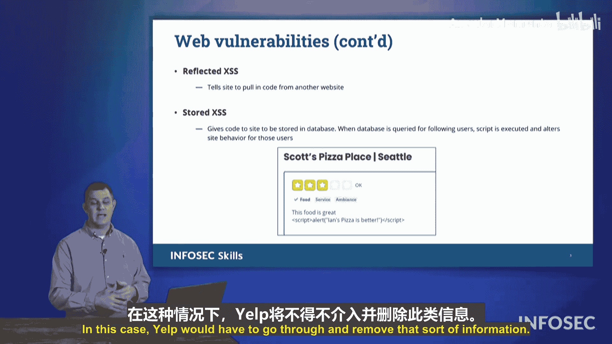

# 027：跨站脚本攻击（XSS） 🛡️


在本节中，我们将学习一个可能在Security+考试中出现的漏洞。这个漏洞被称为跨站脚本攻击，简称XSS。

跨站脚本攻击是指攻击者向Web服务器或Web应用程序发送恶意代码，意图造成数据错误表示或导致Web应用程序本身功能失常。这是一种注入攻击形式，其有效载荷通常是JavaScript代码。

## XSS攻击原理

上一节我们介绍了XSS的基本概念，本节中我们来看看它的工作原理。

攻击过程如下：当Web应用请求用户输入信息时（例如“您想购买多少个小部件？”、“您想查看多少件商品？”、“您要搜索什么？”或“您想查看哪家餐厅的评论？”），攻击者并不直接回答问题。例如，对于“您想购买多少个小部件？”这个问题，攻击者不是输入数字“2”，而是在“2”后面附加了其他代码。这段代码本身也可能就是答案。

当Web服务器处理这段输入时，就会落入陷阱。这种情况的发生，是因为Web应用程序或服务器没有对输入进行**净化**。它没有确保：如果我需要一个数字，用户就必须发送一个数字，我必须确认用户提交的是数字。同时，我还需要确保在用户提交响应时，**过滤掉**所有可能的代码操作符，例如分号、斜杠、花括号等任何可能引发跨站脚本攻击的字符。

## XSS攻击类型

了解了基本原理后，以下是Security+考试中需要了解的两种主要XSS攻击类型：

### 反射型XSS攻击

在反射型XSS攻击中，Web服务器可能会问“您想购买多少个小部件？”，攻击者不直接提供答案，而是说“实际上，我想让你去那边的那个网站，那里的代码会告诉你我想要多少件商品”。Web服务器会照做，从其他地方获取并运行那段代码，从而触发陷阱，导致Web应用程序崩溃或出现其他问题。攻击之所以成功，是因为对“您想购买多少个小部件？”这个问题的回答，实际上是指向了另一个Web服务器，并从那里获取、接收并运行了恶意代码。陷阱在此时触发，因为它将答案“反射”到了另一个站点。

### 存储型XSS攻击

另一种类型是存储型XSS攻击。在这种攻击中，攻击目标通常是存储用户评论、论坛帖子或其他文本输入的数据信，常见于社交媒体或社区讨论平台。当系统读取所有最新的用户评论或论坛消息时，存储的恶意代码就会被执行。

以下是存储型XSS攻击的过程：
1.  攻击者将恶意代码注入到网站评论、帖子或餐厅评论中。
2.  每当有用户访问并加载这些评论或帖子时，攻击者注入的JavaScript代码就会随之一起被加载，并在每一位访问该页面的用户浏览器上执行。

这被称为存储型XSS攻击，因为提交给系统的JavaScript代码实际上被存储在了数据库中，并且每次有访客阅读那些产品评论、餐厅评论等信息时，都会被提供并执行。

## 攻击示例分析

为了更直观地理解存储型XSS，我们来看一个具体场景。

假设我们访问“Scott's Pizza”的页面，这是西雅图一家不错的披萨店。但我们实际上经营着“Ian's Pizza”，我们希望吸引更多顾客来“Ian's Pizza”，而不是“Scott's Pizza”。

于是，我们到“Scott's Pizza”的页面下留下一条评论。我们可能会说：“食物还行，服务不错。”但在评论的末尾，我们插入了一段JavaScript代码。这是一个**alert**语句，它的作用是：当浏览器遇到这段JavaScript代码块时，会执行alert命令，弹出一个窗口。

我们来看一下这段示例代码：
```javascript
alert("Ian's pizza is better.");
```
在实际中，用户会看到一个弹出窗口，上面写着“Ian's pizza is better.”。用户本想了解关于“Scott's Pizza”的信息，现在却收到了关于“Ian's Pizza”的弹窗。这可能会在用户心中植入一个想法：“也许我应该去试试Ian's Pizza，它可能更好。”从而将一些顾客引导至我们的披萨店。

这是一小段被放入评论字段的JavaScript代码，它被存储在了存放所有餐厅评论的数据库中。在这种情况下，Yelp（评论平台）需要审查并移除这类信息，必须净化其代码，过滤掉我们插入的那些尖括号、圆括号等。平台需要阻止某些内容被写入评论，以屏蔽任何JavaScript代码。这正是一个存储型XSS攻击的例子，因为我们将恶意活动代码作为一条记录存储在了数据库中。

## 总结



本节课中我们一起学习了跨站脚本攻击。我们了解了XSS是一种向Web应用注入恶意代码的注入攻击。我们探讨了其核心原理在于输入未经过滤和净化。我们重点分析了两种主要类型：**反射型XSS**（恶意代码通过用户输入“反射”回浏览器执行）和**存储型XSS**（恶意代码存储在服务器数据库，在用户访问时执行）。最后，我们通过一个餐厅评论的示例，直观地看到了存储型XSS如何被用于误导用户。在Security+考试中，请注意识别这两种XSS攻击。