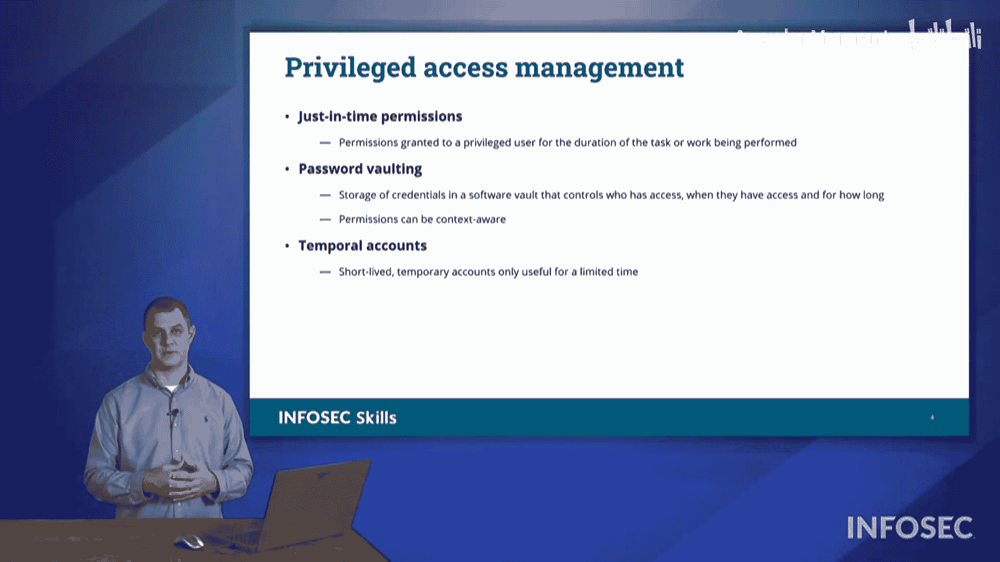

# 028：特权访问管理 🛡️

在本节课中，我们将学习组织数据保护的基础——特权访问管理。我们将探讨如何通过控制用户对数据的访问权限来保护组织资产，并详细介绍三种核心的管理技术。

保护组织数据始于对用户访问权限的控制。在本节中，我们将讨论特权访问。通过管理特权访问，我们可以精确控制用户能够访问哪些数据。

## 最小权限原则 🔐

上一节我们提到了访问控制的基础，本节中我们首先来看看一个核心原则：最小权限。最小权限原则要求确保用户仅拥有完成其本职工作所必需的数据访问权限和特权。我们不希望给予用户过多权限，因为这可能对组织和用户本人都构成风险。

最小权限原则主张：只提供完成工作所需的信息，绝不多给。

以下是遵循此原则的重要性：
*   **降低勒索风险**：如果用户拥有过多访问权限，他们可能因这些信息访问权而受到勒索。通过最小权限原则保护用户，他们根本接触不到某些数据，从而降低了因此被勒索和敲诈的可能性。
*   **保护个人与组织**：最小权限原则既保护个人免受此类勒索，也保护组织免受用户窃取数据并将其外泄到其他网络的风险。
*   **访问管理核心**：最小权限是访问管理中至关重要的一部分。

## 特权访问管理（PAM） 🧑‍💼

理解了基本原则后，我们来看看如何具体管理高权限账户。我们拥有管理谁可以访问特权账户的方法。特权访问是指超越普通用户所拥有的访问级别，能够使用此级别权限的用户被称为特权用户。

特权用户通常是我们的系统管理员、网络管理员和安全管理员。他们拥有超越典型用户的权限，以便为他人授予权限并控制不同的服务器和系统。

我们通过不同的特权访问管理技术来控制特权用户的访问级别。以下是三种主要的解决方案：

### 1. 即时权限（JIT）

第一种管理技术是即时权限。采用即时权限时，用户仅在需要时才被授予信息访问权。

其工作流程如下：
1.  用户提出特权访问权限申请。
2.  用户需说明正在处理的工作订单或故障单。
3.  系统会询问需要多长时间，用户可能回答“大约10分钟”。
4.  系统随后授予他们15分钟的权限。从用户登录该系统的那一刻起，计时开始。到他们注销时，这些权限将被自动撤销。

这种方法可以保护用户，避免因持续拥有特权访问权限而意外对系统造成损害，或意外落入某些陷阱。例如，如果一个拥有特权访问权限的用户遭到鱼叉式网络钓鱼攻击，攻击者就可能利用此权限。采用即时权限等技术有助于防止此类事件发生。

### 2. 密码托管

接下来要讨论的是密码托管。在密码托管方案中，管理账户的密码保存在一个所谓的“保险库”中。

其流程如下：
1.  用户请求访问权限。
2.  用户需陈述使用此权限的原因和计划执行的操作。
3.  用户需说明需要此权限的时长。
4.  系统根据请求的具体情境批准或拒绝该权限。

密码托管是保护特权访问的另一种方法。

### 3. 临时账户

第三种方法是使用临时账户。临时账户即我们设置的临时性账户。

假设我们有一个服务提供商或供应商需要现场为我们执行某些活动，他们需要登录某个系统进行配置或维修。在这种情况下，我们可以采取以下措施：
*   **限定位置**：安排他们在指定工位，使用特定电脑进行连接。
*   **限定目标**：只允许他们连接到那台需要操作的远程设备。
*   **限定权限**：他们只拥有与那台设备交互的权限。
*   **限定时间**：该账户仅在特定时间段内有效（例如上午8点到下午4点），到期必须完成操作。
*   **限定来源**：如果远程登录，只允许从特定的IP地址或IP段连接，并且只能访问指定的、直接面向工作设备的虚拟机。
*   **全程监控**：我们会监视、记录和监控他们的所有操作。

如果需要延长时间，我们可以酌情批准，但这本质上是一个临时账户。这种方法被称为特权访问管理中的临时账户。

请注意这三种特权访问管理类型以及围绕特权访问的整体理念，这些是可能在我们的Security+考试中出现的术语。

## 总结 📝

本节课中，我们一起学习了特权访问管理。我们首先介绍了**最小权限原则**，即只授予用户完成工作所必需的最低权限。接着，我们深入探讨了三种关键的特权访问管理技术：**即时权限（JIT）** 实现了按需、限时的权限授予；**密码托管** 将高权限密码集中管理，并基于上下文进行访问审批；**临时账户** 则为外部人员或临时任务创建了受严格限制（时间、地点、范围）的访问环境。掌握这些概念和技术对于构建安全的数据访问控制体系至关重要。