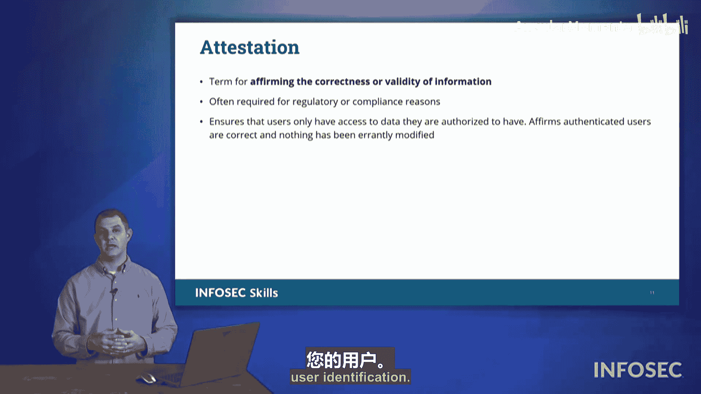

# 029：身份与访问管理（IAM）


在本节课程中，我们将学习身份与访问管理（IAM）的核心概念，重点关注用户账户的管理与保护。我们将探讨如何安全地创建和管理用户账户，以及各种用于验证用户身份和控制访问权限的技术与协议。

## 用户账户管理

身份与访问管理关注用户以及我们保护其账户的方式。首先，我们需要确保用户账户的创建过程是安全的。

我们不希望由组织内的单一个体负责创建所有用户账户。原因是，如果这项工作由一个人承担，此人可能成为鱼叉式网络钓鱼攻击或勒索的目标。一旦被攻破，攻击者可能强迫其违背意愿创建账户。此外，此人本身也可能成为内部威胁，私下为自己创建账户，以便在离职后仍能登录系统并制造问题。

因此，我们需要确保账户创建过程有适当的制衡与记录。

以下是保障账户创建过程安全的关键措施：

*   **职责分离**：账户的创建、激活和权限分配应由不同的人员或角色完成。
*   **流程文档化**：所有账户创建请求必须有正式的工单或授权记录。例如，只能根据人力资源部门或技术总监的请求来创建账户。
*   **基于角色的访问控制**：为用户分配的权限应与其工作任务和角色严格匹配。这通常通过**基于角色的访问控制**来实现，确保用户的访问权限与其职位相符。

## 身份验证与访问控制

上一节我们讨论了账户创建的安全流程，本节中我们来看看如何验证用户身份和控制其访问权限。

**身份验证**是确认用户声称身份的过程。例如，在新员工入职第一天，我们可能需要其提供出生证明和多种身份证明文件，以核实其身份，然后才发放访问卡。这样，该员工在组织内的所有活动都能追溯到其本人。这就是**身份验证**的概念。

在考试中可能遇到的另一种访问控制形式是**联合身份认证**。

**联合身份认证**是指两个或多个实体之间共享身份凭证。例如，大学A和大学B的学生可以互选课程。学生希望使用其本校的凭证登录到另一所大学的系统。这种场景就是**联合登录**，即使用另一个组织的资源来验证你所在组织的用户身份。

**单点登录**可以被视为联合身份认证的一种延伸。

**单点登录**允许用户通过一次安全的登录（可能需要用户名、密码及多因素认证）访问多个关联的应用系统，而无需为每个应用单独登录。其核心优势是用户只需记住一组强密码。

公式表示：`SSO 登录凭证 -> 访问所有授权应用`

## 目录服务与协议

在单点登录等系统中，我们通常依赖**LDAP**来管理用户信息和认证。

**LDAP**基于X.500标准构建，该标准定义了目录服务的结构。在考试中，你需要知道LDAP是一个我们提交登录凭证（用户名、密码等）以获取访问权限的系统。它负责存储权限信息，并在组织范围内提供访问控制。LDAP是Active Directory的前身，两者功能类似。

代码示例（概念性）：
```
# 用户尝试通过LDAP认证
用户提交 -> username: “alice”, password: “secret123”
LDAP服务器验证 -> 检查凭证是否与目录中的记录匹配
认证结果 -> 成功/失败，并返回用户权限属性
```

## 云与互联网身份管理

随着组织使用本地和云资源，账户同步成为挑战。**云访问安全代理**是一种软件解决方案，用于同步本地目录服务（如Active Directory）和云服务中的用户账户与权限，确保当员工离职时，其在所有系统的访问权限能被一致地撤销。

对于通过开放互联网进行的认证，我们使用**OAuth**和**OpenID Connect**等协议。

*   **OAuth**：一种开放的授权框架，允许用户让第三方应用访问其在某服务中的特定资源，而无需分享密码。例如，使用Twitter账户登录某个网站。
*   **OpenID Connect**：在OAuth 2.0之上构建的一个身份层，用于客户端验证用户身份。它简化了流程，速度更快。例如，使用Facebook或Google账户登录其他应用。

这些协议之间通过**SAML**交换认证信息。

**SAML**是一种基于XML的标准，用于在不同的安全域之间交换认证和授权数据。当您选择“使用Google账户登录”时，服务提供商会生成一个SAML请求，发送给Google（身份提供者）。Google验证您的身份后，会发回一个SAML断言，告知服务提供商“此用户已通过验证”。

代码示例（概念性）：
```xml
<!-- SAML断言示例片段 -->
<saml:Assertion>
  <saml:Subject>
    <saml:NameID>user@example.com</saml:NameID>
  </saml:Subject>
  <saml:Conditions>
    <saml:AudienceRestriction>
      <saml:Audience>https://service.provider.com</saml:Audience>
    </saml:AudienceRestriction>
  </saml:Conditions>
</saml:Assertion>
```

这些技术能够协同工作，得益于**互操作性**。因为它们是开放的、有文档记录的标准（如XML、JSON），允许不同的系统、服务提供者和身份提供者无缝协作。

## 证明

在身份与访问管理领域，最后要了解的概念是**证明**。

**证明**是确认信息正确性和有效性的行为。它相当于为数据盖上“批准”印章，声明“我特此证明这些凭证信息是正确且有效的”。证明可以通过某种用户标识形式追溯到特定用户。



## 总结


本节课中，我们一起学习了CompTIA Security+ 考试中身份与访问管理部分的核心内容。我们涵盖了：
1.  安全的用户账户创建与管理流程。
2.  身份验证、联合认证与单点登录。
3.  LDAP目录服务协议。
4.  云访问安全代理。
5.  用于互联网认证的OAuth、OpenID Connect和SAML协议。
6.  互操作性的重要性。
7.  信息证明的概念。

理解这些概念对于设计和维护安全的访问控制系统至关重要。在备考Security+时，请务必关注这些主题。