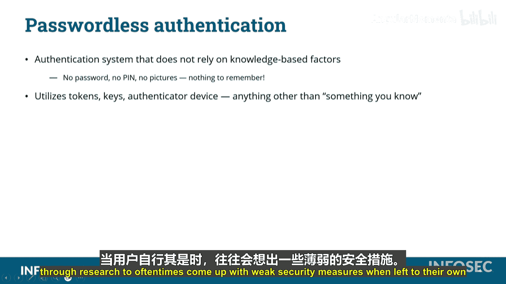

# 030：密码核心概念 🔐

在本节课程中，我们将学习密码学中的核心概念，这些是准备Security+认证考试必须掌握的基础知识。我们将探讨密码强度、复杂性、管理策略以及新兴的认证方式。

## 密码长度与强度

上一节我们介绍了密码的重要性，本节中我们来看看决定密码强度的首要因素：长度。

密码的长度直接关系到其强度。密码越长，通常就越强。这个概念在考虑密码由多少个字符组成时至关重要。

考虑一个三位数的PIN码，范围从`000`到`999`。要猜出这个PIN码，最多需要尝试多少次？从`000`开始到`999`结束，总共是1000次。这仅仅是1000次猜测。但如果增加一位数字，就变成了10,000次猜测；再增加一位，则是100,000次。因此，密码越长，破解它所需的猜测次数就越多。

## 密码复杂性

理解了长度的重要性后，我们接下来探讨另一个增强密码安全性的关键：复杂性。

复杂性是另一种增加密码潜在取值数量的方法。所谓复杂性，指的是在密码中混合使用不同类型字符。

以下是实现密码复杂性的关键要素：
*   **大写字母**：A-Z
*   **小写字母**：a-z
*   **数字**：0-9
*   **特殊字符**：例如 !, @, #, $ 等

我们不应只使用数字或只使用字母，而应混合使用大小写字母、数字和特殊字符。

再次以三位PIN码为例，从`000`到`999`，共有1000种可能，即 `10^3`（10个数字，3个位置）。如果密码由大写字母A-Z（26个）、小写字母a-z（26个）和数字0-9（10个）组成，那么每个位置就有62种潜在取值。对于一个三字符的密码，可能性就是 `62^3`，这远比仅由数字组成的三位PIN码强大得多。

当然，正如前面提到的，长度与复杂性结合效果更佳。使用这62种字符，密码每增加一位长度，指数值就增加一次。例如，一个8字符长的密码，其可能性就是 `62^8`。密码越长、越复杂，攻击者破解的难度就呈指数级增长。

## 密码管理策略

掌握了创建强密码的方法后，我们还需要了解如何妥善管理它们，避免安全漏洞。

你需要确保避免密码重用。不应在不同的系统上使用相同的密码，也不应重复使用旧密码。我们需要限制曾用密码的数量，因为一旦其他网络遭到入侵，攻击者窃取并存储了你的凭证，这些密码就可能被加入破解字典，从而变得容易被攻破。

同时，需要考虑密码的使用期限。不应过长时间使用同一个密码。如果密码遭到泄露，攻击者在你更改密码前可以多次登录并冒充你。因此，需要在更改密码的频率上找到平衡点：既不能使用过久，也不宜更换过频，因为频繁更改密码往往会导致用户选择弱密码。在密码使用过久与更换过频之间，存在一个最佳平衡点。

## 密码管理器

面对众多复杂密码的管理难题，密码管理器提供了一个高效的解决方案。

密码管理器是一种软件工具，用于管理极其长且复杂的密码。它们可以随机生成优质、长且强的密码。用户只需向密码管理器进行一次身份验证，之后它便会为你要登录的各个账户提供相应的密码。

密码管理器在管理大量复杂密码并按需更改密码方面非常有用。但你必须确保用于登录密码管理器本身的认证方案足够强大。将所有密码存放在一个密码管理器中，犹如将鸡蛋放在同一个篮子里。如果该密码管理器被黑客攻击，你所有的密码都可能泄露。因此，密码管理器虽是管理密码的好工具，但也存在一定的风险。

## 无密码认证

最后，我们来看一种正在兴起的、旨在从根本上解决密码问题的认证机制：无密码认证。

一些组织正在尝试另一种认证机制：无密码认证。在这种情况下，组织依赖的是“你知道的”因素（如密码）以外的其他因素组合。

这意味着无需记忆任何密码、PIN码、密码图片或口令。没有任何需要你记住（或可能忘记）的东西。研究表明，如果让用户自行决定安全措施，他们常常会设置出较弱的方案。因此，无密码认证不依赖用户创造和记忆信息。

在无密码认证中，我们将依赖“你拥有的”东西。例如，使用硬件令牌、软件令牌，或者向手机发送一次性PIN码等。任何不依赖于“你知道的”因素的组合认证方式，都属于我们所说的无密码认证范畴。

## 总结

本节课中我们一起学习了密码的核心概念。我们探讨了密码长度与强度的直接关系，理解了通过混合字符类型来增加复杂性的重要性。我们还讨论了避免密码重用、合理设置密码期限等管理策略，并介绍了密码管理器这一辅助工具及其利弊。最后，我们展望了无密码认证这一新兴趋势，它通过依赖“你拥有的”等因素，试图从根本上解决传统密码的弱点。这些概念是构建安全认证体系的基础，对于通过Security+考试至关重要。