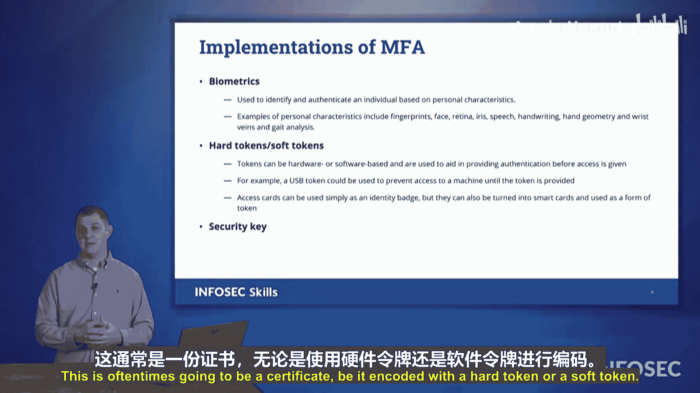

# 031：多因素身份验证（MFA）🔐

在本节课中，我们将学习多因素身份验证（MFA）的核心概念。MFA是一种通过结合多种不同类型的身份验证因素来增强系统安全性的方法。即使攻击者窃取了您的密码，他们仍然需要其他因素才能成功验证身份。

## 身份验证因素概述

上一节我们介绍了身份验证的基本概念，本节中我们来看看构成多因素身份验证的不同因素。理解这些因素对于通过Security+考试至关重要。

以下是考试中列出的主要身份验证因素：

*   **您知道的东西**：这是传统的身份验证方式，例如密码或PIN码。它依赖于只有您自己知道的信息。例如，一个只有您和特定亲友知道的共同记忆细节。
*   **您拥有的东西**：指您拥有的某种物理对象，例如您的手机、身份证、或物理密钥。这些东西是独一无二的，您拥有它即证明您的身份。例如，您的家门钥匙授权您进入自己的家。
*   **您固有的特征**：指您个人固有的生物特征，这些信息编码在您的基因中。例如，您的指纹、面部形状或声音。即使您试图改变外貌，这些根本的生物信息依然存在。
*   **您的行为特征**：指您做某事的方式，这是一种行为生物识别技术。例如，您签名的笔迹、在键盘上打字的节奏和模式，或者您走路时的步态（步幅长度、脚着地的方式）。
*   **您所在的位置**：指您连接系统时所处的网络或地理位置。例如，您的IP地址或GPS坐标。如果系统检测到您从一个从未连接过的陌生网络登录，可能会触发额外的身份验证。

## 多因素身份验证与相关术语

当您使用上述**两个或更多**因素进行身份验证时，即构成多因素身份验证。这显著提升了安全性。

在考试中，您还会遇到以下相关术语：

*   **生物识别技术**：这通常指“您固有的特征”和“您的行为特征”这两类因素，即基于个人生理或行为特征进行身份验证的技术。
*   **硬件令牌与软件令牌**：
    *   **硬件令牌**：指某种物理硬件设备，用于生成或存储身份验证凭据。
    *   **软件令牌**：指基于软件的虚拟身份，存储着某种唯一的身份验证信息。
*   **安全密钥**：这通常指一种证书，无论是编码在硬件令牌还是软件令牌中，都用于验证身份。

## 硬件令牌示例

了解了核心概念后，我们来看看一些具体的硬件令牌示例。在考试中遇到关于硬件令牌的问题时，请回想以下三种常见类型：

以下是三种常见的硬件令牌设备：

1.  **RSA令牌**：一种小型设备，通常每60秒生成一次变化的6位数字（滚动代码）。您持有的令牌与服务器保持同步，您需要提供当前显示的数字作为“您拥有的东西”这一因素。
2.  **智能手机（作为令牌）**：您的手机可以作为一种硬件令牌。通过安装特定的认证应用程序（如Google Authenticator、Microsoft Authenticator），手机可以生成动态验证码，实现“您拥有的东西”这一因素。
3.  **USB安全密钥/YubiKey**：一种插入计算机USB端口的物理设备，内含安全证书。插入时即可完成身份验证，是“您拥有的东西”这一因素的典型代表。
4.  **受控访问卡**：在政府（如美国联邦部门、国防部网络）中广泛使用。这种卡片嵌入了存储唯一证书的芯片，同时印有持卡人照片等信息。刷卡是进入系统的重要身份验证步骤。

## 总结

本节课中，我们一起学习了多因素身份验证（MFA）的五大核心因素：**您知道的东西**、**您拥有的东西**、**您固有的特征**、**您的行为特征**以及**您所在的位置**。MFA要求结合其中两个或更多因素，从而大幅提升账户安全性。我们还了解了相关的生物识别技术、硬件/软件令牌概念，并认识了RSA令牌、智能手机、USB安全密钥和受控访问卡等具体硬件令牌示例。掌握这些知识，将有助于您在Security+考试中准确识别和分析与MFA相关的场景。