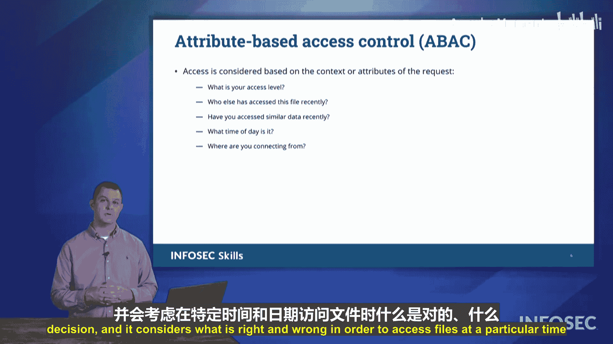

# 032：访问控制模型


## 概述

在本节课中，我们将学习组织用于保护数据的几种不同访问控制模型。理解这些模型是构建安全系统和通过Security+考试的关键。

访问控制模型主要分为两大类：**自主访问控制**和**基于规则的访问控制**。基于规则的访问控制又可细分为几种具体类型。

---

## 自主访问控制

上一节我们介绍了访问控制模型的基本分类，本节首先来看**自主访问控制**。

自主访问控制类似于您在家用电脑上的体验。当您在个人电脑上创建文件时，您可以自主决定该文件的访问权限。例如，您可以将其设置为只读，或使用密码保护。是否设置权限、如何设置权限，完全由您自行决定，没有强制性的规则必须遵守。

---

## 基于规则的访问控制

与自主访问控制相对的是**基于规则的访问控制**。在此类模型中，访问权限由预先定义的规则决定，用户必须遵守这些规则。基于规则的访问控制包含三种主要类型。

以下是三种主要的基于规则访问控制模型：

1.  **强制访问控制**
    *   这种模型的实施在组织内是**强制性的**，常见于联邦或国防部级别的系统。它遵循**Bell-LaPadula模型**，根据信息的密级（如绝密、机密）来决定访问权限。核心规则是：如果一份文件中包含任何绝密信息，那么整个文件都被视为绝密。用户必须遵守这一模型，无权自行更改。

2.  **基于角色的访问控制**
    *   这是一种基于规则的访问控制，其规则围绕组织内的**不同角色**制定。例如，经理可以查看下属的文件，但下属不能查看经理的文件。销售部门的员工可以访问销售共享文件夹，但可能无法访问工程部门的文件。您的访问权限取决于您在组织中被赋予的**角色**。

3.  **基于属性的访问控制**
    *   这种模型围绕一个决策引擎运行，该引擎会考虑访问请求的**多种属性**。其决策逻辑可以用一个简化的伪代码表示：
        ```python
        if (用户权限等级 >= 文件密级 and
            请求时间在允许范围内 and
            用户地理位置 == 安全区域 and
            ... # 其他属性条件):
            授予访问权限
        else:
            拒绝访问权限
        ```
    *   引擎会综合评估各种属性，例如：用户的访问级别、请求时间、连接来源的网络位置、用户近期的访问行为等。即使所有条件都看似满足，但若在错误的时间或从不被允许的国家/地区发起请求，访问仍会被拒绝。

---

## 其他访问控制考量

除了上述核心模型，还有一种常见的访问控制形式是基于时间的限制。

**时间限制**是一种访问控制形式，完全基于一天中的具体时间。根据组织结构，您可能只能在特定工作时间或轮班时段访问某些文件。这种限制定义了允许访问的“时间窗口”。

---

## 总结

本节课中，我们一起学习了CompTIA Security+考试中涉及的主要访问控制模型。



*   **自主访问控制**：权限由数据所有者自行决定。
*   **基于规则的访问控制**：权限由强制规则决定，包括：
    *   **强制访问控制**：基于信息密级的强制性模型（如Bell-LaPadula）。
    *   **基于角色的访问控制**：基于用户在组织中的角色分配权限。
    *   **基于属性的访问控制**：基于访问请求的多个动态属性（如时间、地点、用户行为）进行综合评估。

在准备Security+考试时，请务必牢记这些模型及其关键区别。