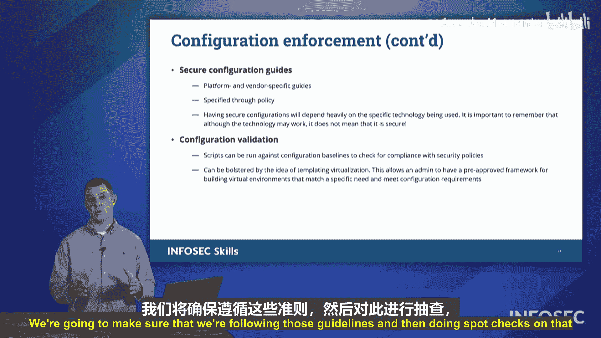

# 033：企业安全控制概述

在本节中，我们将学习保护组织数据时可用的多种不同安全控制技术。我们将探讨网络分段、隔离、访问控制、补丁管理、加密以及配置执行等核心概念，并了解它们如何共同构建一个强大的企业安全防御体系。

## 网络分段

上一节我们介绍了企业安全的基本目标，本节中我们来看看实现这些目标的具体技术。首先，网络分段是一种将整个企业网络划分为更小、更易管理的部分的方法。这样做可以限制恶意软件感染的影响范围。如果恶意软件在一个系统上扎根，它将不会蔓延到整个企业网络，而只会影响少数用户。

我们可以通过两种主要方式细分网络。

以下是两种网络分段方法：

*   **逻辑分段**：我们使用子网划分技术将企业网络划分为更小的部分。当数据通过网关从一个网段传输到下一个网段时，网关提供了一个检查点。我们能够检查从一个网络发送到下一个网络的数据类型，并据此决定是否允许该数据通过。我们可以在网络段之间安装防火墙。
*   **物理分段**：这是指我们拥有物理上完全独立的网络。在许多政府和国防部网络中，存在非安全网络和安全网络，分别称为NIPRNet和SIPRNet。这两个网络是物理上完全独立的网络。它们需要重复的硬件和布线，并且物理上是不同的。至少在较低的办公层级，没有流量可以从一个网络跳转到另一个网络。

另一种物理分段形式称为**空气间隙**。通过空气间隙，我们将一台主机与网络的其他部分物理断开连接。这意味着该设备完全脱离了互联网连接的网络，没有任何Wi-Fi或有线互联网连接。跨越这个间隙的唯一方式可能是通过可移动存储设备来向空气间隙系统传输文件。空气间隙适用于非互联网连接的设备，使其免受任何形式的入侵。

## 设备隔离

接下来，我们探讨如何隔离这些不同的设备。通过隔离，我们禁止一台设备将其受感染的通信传播到网络上的其他设备。我们阻止恶意软件连接到其他设备。隔离允许我们将该设备隔离起来，将其置于一个“虚拟监狱”中，成为一个“孤岛”，没有其他设备可以与之通信。我们是在遏制恶意软件，阻止其传播，这样其他设备就不会被感染。从那时起，我们可以进入调查模式，开始查看该设备发生了什么问题。这就是将隔离作为一种安全控制的用途。

## 访问控制

另一种我们可以采用的安全控制形式是访问控制，即控制谁有权访问什么。当我们查看这些关于我们向谁提供访问权限的不同控制列表时，我们可以开始确定谁将拥有访问权限、他们何时拥有访问权限、他们将被允许做什么等等。访问控制列表决定了允许和不允许进行何种活动，谁可以做，谁不可以做。我们还可以利用**文件系统权限**，控制谁有权读取、写入和执行单个文件。所有这些主题都包含在访问控制的概念之下，但其核心是描述谁有权访问什么。

我们还可以利用**允许列表**和**阻止列表**，它们有几种不同的形式。你可以有应用程序允许列表和应用程序阻止列表。当我们讨论防火墙时，也会看到防火墙允许列表和阻止列表。但在这里，对于应用程序允许列表，我们拥有的是一个允许的应用程序列表。这些是我们希望在系统上允许的程序。如果某个程序不在列表上，我们将阻止它。还有应用程序阻止列表，这是一个我们不希望在我们的操作系统上执行的应用程序列表。阻止列表会进行检查，并说明这些是可执行文件不允许执行，它们被禁止运行，其他一切都可以运行，只是这些不行，就像一个“禁飞名单”。与之相对的是允许列表，它更像一个“宾客名单”，如果你在宾客名单上，你就被允许进入。但如果你不在名单上，你就会被拒绝。因此，在这两种技术中，当你考虑名称时，思考一下会很有趣。**允许列表实际上限制性更强**，而**阻止列表实际上更宽松**。因为当你考虑阻止列表时，你只将其限制在少数应用程序上，所以阻止列表的限制性较低，而允许列表对你可以运行的应用程序数量限制更严格。要能够审视这两种不同的列表，并在讨论是允许其他应用程序运行还是拒绝其他应用程序运行时，考虑它们的权衡。

## 补丁管理

这里要看的另一个主题是**补丁管理**。补丁管理对于保持我们企业网络的安全性至关重要。通过补丁管理，如果发现漏洞，我们将从供应商或解决方案提供商那里寻找补丁，并确保该补丁能够解决该漏洞。如果不能，我们希望记录这一点，并继续研究其他方法来缓解该威胁。

## 加密技术

我们可以利用的另一种安全技术是**加密**。请记住，加密保护**机密性**。我们希望确保任何未经授权访问的人都不能访问我们系统上的任何文件。因此，为了实现这一点，我们可能会利用文件系统加密，例如**全盘加密**或**自加密驱动器**。这里列出了几个例子，分别是Windows的BitLocker和Mac的FileVault。这些文件系统加密技术旨在帮助保护存储在驱动器上的文件。如果该驱动器从机器上被物理移除，其内容是加密的，因此对任何拿走它的人来说都是无用的。

加密的另一种形式是保护**传输中的数据**。这是使用虚拟专用网络形式的加密。通过VPN，我们利用加密来保护在开放的公共网络上传输的数据，但它给了我们虚拟专用网络的概念。最后，当我们通过电子邮件在开放的互联网上发送数据时，重要的是要知道，除非采取其他安全措施，否则电子邮件本身是不安全的。因此，我们利用**电子邮件加密**。电子邮件加密可以加密通过电子邮件发送的消息内容。在这种情况下，我们可以利用**PGP**或**GPG**。或者，我们也可以加密在该电子邮件中发送的附件，形式是使用**S/MIME**。电子邮件加密是一种通过加密所有内容来保护未加密电子邮件安全的方法。

## 配置执行

我们可以利用的另一种安全技术是**配置执行**。这是确保我们部署的配置正在安全地运行。我们将创建安全基线，并将该通用的安全系统部署到我们引入网络的所有计算机上，确保我们所有的系统都同样准备好应对我们拥有的任何防御措施。我们还可以利用可能来自供应商或最佳实践机构的**安全配置指南**。这些机构会告诉我们，通过其他组织的经验，你应该如何配置这些不同的设备。我们将整合这些指南，并根据我们讨论的平台或是否来自特定供应商来选择我们将遵循哪些指南。因此，如果我们谈论的是思科、Palo Alto或Fortinet，这取决于制造我们所查看硬件的公司，我们将根据他们的最佳实践来配置我们的解决方案。

最后，为了检查并确保我们确实将事物配置得尽可能安全，我们将让其他人，比如同事，在我们之后跟进并验证我们已实施的安全更改。我们将确保我们遵循这些指南，然后对其进行抽查，以确保我们互相照应。

## 总结

在本节课中，我们一起学习了多种关键的企业安全控制技术。我们探讨了如何通过**逻辑分段**和**物理分段**来划分网络以限制威胁影响范围；了解了**设备隔离**如何遏制恶意软件传播；认识了**访问控制**、**允许列表**和**阻止列表**在管理资源访问权限中的作用；强调了**补丁管理**对于修复漏洞的重要性；介绍了**加密技术**（包括静态加密、传输加密和邮件加密）如何保护数据机密性；最后，学习了通过**配置执行**和遵循安全基线来确保系统安全设置的一致性。在准备Security+考试时，请牢记这些不同的安全解决方案。