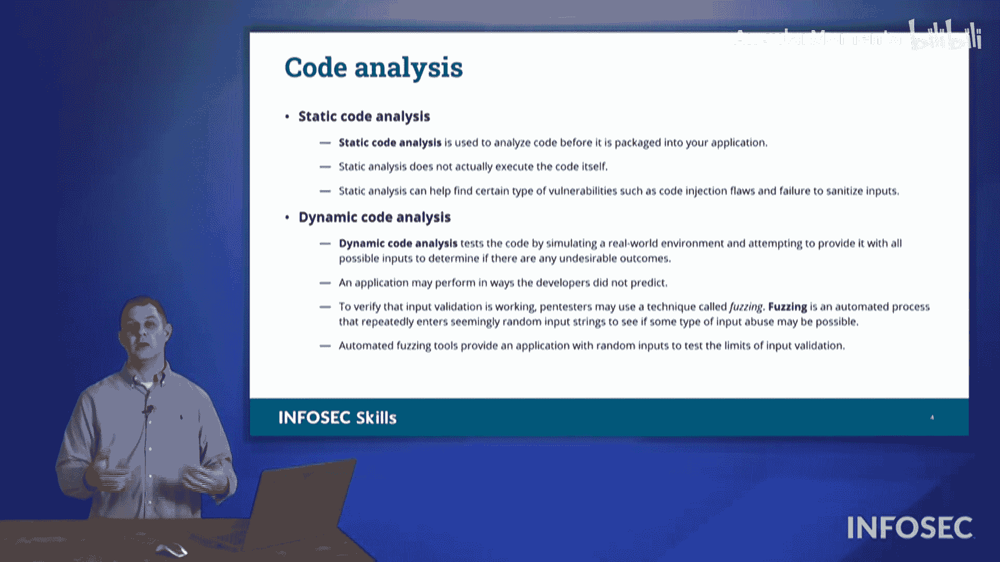

# 034：应用程序安全

在本节中，我们将探讨应用程序安全。我们将了解针对应用程序的各种软件攻击方式，以及如何防范这些攻击。

## 输入验证与净化

首先，我们来看输入验证。输入验证是指，当我们在某个字段中期望输入特定类型的数据时，我们只允许该类型的数据，并且只允许一个有效的数值范围。

例如，一个网络应用程序询问“您想购买多少个小部件？”。如果我们期望用户输入数字2，那么我们将只允许数字“2”被输入。我们不允许输入单词“TWO”，也不允许用户提交图片或输入可能用于跨站脚本攻击的恶意代码。我们只允许数字输入。

净化是指清除任何我们不希望允许的字符。如果用户输入了无效内容，我们要么完全丢弃它，要么不接受该输入。这被称为输入验证与净化。

这是一种保护应用程序的方法，因为从用户那里接收的任何信息都将存储在缓冲区中，这些信息可能对我们的系统造成潜在危害。如果我们的代码根据用户提供的值执行操作，可能会导致应用程序出现一些不期望的行为。因此，输入验证与净化非常重要。

## 安全Cookie

上一节我们介绍了输入验证，本节我们来看看另一种防护措施。如果我们使用安全Cookie，可以阻止跨站请求伪造和其他类型的恶意活动。

通过在Cookie中使用关键字“secure”，可以限制该Cookie只能通过超文本传输安全协议通道传输。它必须使用HTTPS，并且只能返回到设置该Cookie的主机。

Cookie永远不应被信任用于提供有关用户的输入信息。它通常只用于引用该用户的个人设置，例如背景颜色等。

因此，安全Cookie非常重要。我们不应在Cookie上存储任何敏感信息，因为这些信息可能在用户的系统上被泄露。我们也不应信任来自Cookie的任何数据，因为这些数据可能已被篡改。安全Cookie是保护应用程序和代码的另一种方式。

## 代码分析

接下来，我们转向开发过程中的防护。在查看开发过程时，我们有几种分析代码的方法，可以进行代码分析。CompTIA希望我们了解两种主要的通过代码分析来保护代码的方法：静态代码分析和动态代码分析。

静态代码分析是指有人提交一段代码，你查看该源代码，通读并理解它，然后判断代码是否良好。

例如，你可能会发现代码在某一行期望接收输入，但在后续的任何页面中都没有看到对这些输入进行净化或验证的步骤。你可以要求开发者回去修正这个问题。静态代码分析不需要执行代码，仅仅是阅读源代码。尽管我用手势比划像是在翻阅页面，但通常你只是在电脑屏幕上进行静态代码分析。

然而，动态代码分析需要我们执行代码。我们将运行代码，执行程序，观察其运行情况。如果我们看到一个输入框，例如“您想购买多少个小部件？”，我们将尝试输入各种疯狂的数值。

如果你打算输入值2，我会检查值2。如果我输入2.0，我会观察程序如何反应。如果我输入2.543.1415926，我可以输入许多不同的数字。我可以尝试负数，如果我输入数千呢？比如2000件商品，但你手头并没有2000件库存。我们会尝试各种疯狂、古怪的输入，不仅仅是数字。我会尝试字母、不同的代码、提交图片，尝试我能想到的每一种可能的输入。

这就是所谓的模糊测试。模糊测试是给它一些垃圾输入，并不断冲击该应用程序，以观察应用程序如何响应垃圾输入。我可能会尝试看看是否能使其以某种异常的新方式运行，从而可能泄露一些信息。

## 代码签名

最后，我们可以通过代码签名来保护我们的代码。我们在之前的另一个视频中讨论过这一点。

在这个例子中，代码签名是一种保护代码免受恶意第三方交互的方法，防止他们植入恶意软件，或者声称代码来自他们。通过代码签名，我们可以向客户和用户保证代码确实来自我们。

他们知道代码来自我们，是因为代码签名中包含了不可否认性。我们还可以保护代码的完整性，确保没有人恶意修改我们的代码，因为我们使用了代码签名算法中的哈希值。

因此，代码签名是另一种保护我们为客户开发的软件的方法。在Security+考试中，请注意这些保护应用程序的方法类型。

## 总结

本节课中，我们一起学习了保护应用程序安全的几种核心方法。我们首先探讨了**输入验证与净化**，这是防止恶意数据进入系统的第一道防线。接着，我们了解了使用**安全Cookie**来防止会话劫持和数据泄露。然后，我们分析了两种代码审查方式：**静态代码分析**和**动态代码分析**（包括模糊测试），它们分别在不运行和运行代码的情况下发现潜在漏洞。最后，我们回顾了**代码签名**，它通过数字证书确保软件来源的真实性和完整性。掌握这些概念对于构建和维护安全的应用程序至关重要。