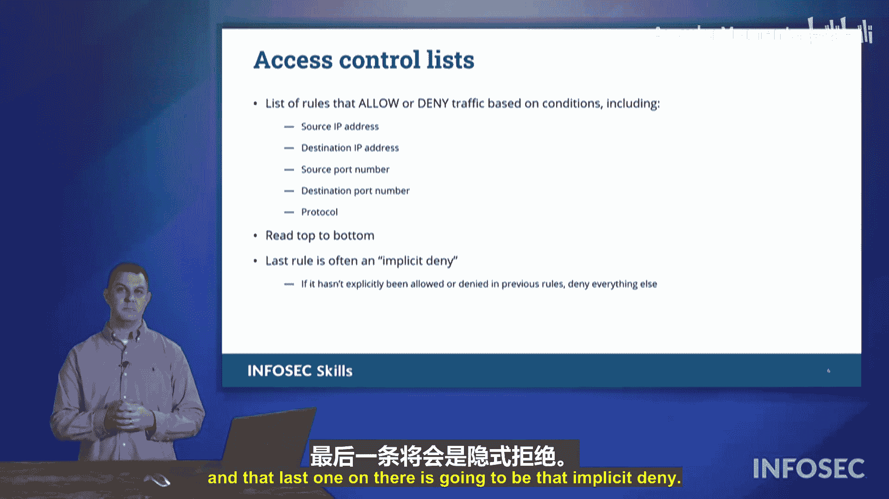

# 035：防火墙详解 🔥

在本节课中，我们将要学习防火墙的核心概念，这是保护组织与网络安全的关键技术。防火墙作为网络流量的过滤器，根据预设规则决定数据包的放行或阻止。我们将探讨不同类型的防火墙及其工作原理，并解析防火墙规则的构成与解读方式。

## 什么是防火墙？

防火墙本质上是一个过滤器。它根据一组规则，过滤来自互联网或本地网络中其他设备的流量。这是防火墙最基本的功能。

防火墙不仅存在于企业网络中，也可以安装在单个系统上，这类防火墙被称为**主机防火墙**。

## 为什么需要主机防火墙？

上一节我们介绍了网络防火墙，那么为什么还需要主机防火墙呢？主机防火墙为每个系统提供独立的保护。如果网络中某个系统爆发了恶意软件，主机防火墙可以保护其他设备免受其影响。这就是主机防火墙的价值所在。

## 其他类型的防火墙

除了主机防火墙，在Security+考试中可能还会遇到其他类型的防火墙。

### Web应用防火墙

**Web应用防火墙**也是一种过滤器。它的作用是过滤从互联网发往我们Web应用的网络流量，专门针对各种网络注入攻击进行过滤。

以下是它主要防范的攻击类型：
*   **SQL注入攻击**
*   **跨站脚本攻击**

它还可以过滤**拒绝服务攻击**。其工作原理是，将Web应用设置为只接受来自Web应用防火墙的流量。该防火墙会检查所有请求，寻找注入攻击、跨站脚本攻击或任何嵌入到Web应用请求中的恶意内容。

### 下一代防火墙

接下来我们看看**下一代防火墙**。这种防火墙内置了逻辑判断能力，能够识别传入网络的流量类型，并据此决定是否应该允许该流量通过。

例如，假设网络中有一个设备通过端口3000向外发送数据，目标是Web服务器的80端口。如果该流量从80端口发出，但下一代防火墙发现响应将通过端口3000返回，它就会临时开放端口3000并等待响应返回，响应到达后再关闭该端口。因此，下一代防火墙能够根据当前的网络活动，独立判断网络中应允许何种类型的活动。

## 防火墙规则解析

防火墙的核心驱动力是**防火墙规则**。正是这些规则让防火墙得以工作。

以下是一个防火墙规则集的示例。我们按从上到下的顺序读取这些规则，规则的顺序至关重要，这由最左侧的规则编号表示。

我们总是从上到下读取防火墙规则。在最底部，通常有一条“兜底”规则，称为**隐式拒绝**。这条规则的意思是：如果之前没有通过任何显式规则明确允许某种流量，那么我将拒绝它。

让我们分析屏幕上的规则：
1.  规则1：如果流量来自IP地址`192.168.0.64`，目的地是任意地址，并且通过端口22或3389连接，则允许该流量。
2.  规则2：如果流量来自任意地址，目的地是IP地址`192.168.0.32`，并且通过端口80或443（Web服务端口）连接，则允许该流量。

这两条规则明确指出了允许通过的流量类型。除此之外的所有其他流量都会被规则3（即隐式拒绝规则）捕获并阻止。它隐含的意思是：如果我没有明确允许，那么我就会阻止该流量。

因此，防火墙规则的一般结构包含以下元素：
*   **源IP地址**
*   **目的IP地址**
*   **源端口号**
*   **目的端口号**
*   可能还会指定**协议**（TCP或UDP）

请记住，我们从上到下读取规则，最后一条通常是至关重要的**隐式拒绝**规则。

## 常见端口号

在考试中，你会遇到许多不同的端口号示例。刚才我们提到了用于远程访问的端口22和3389，以及用于Web流量的端口80和443。

让我们深入了解一下考试中可能遇到的一些端口号。

本节课中我们一起学习了防火墙的基础知识，包括其作为过滤器的本质、主机防火墙的作用、Web应用防火墙和下一代防火墙的特点，以及防火墙规则的构成、读取顺序和隐式拒绝原则。理解这些概念对于构建有效的网络安全防御至关重要。