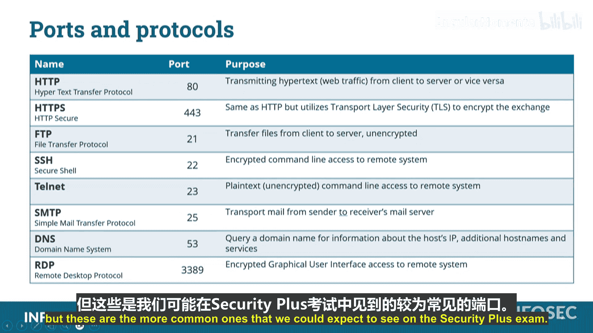

# 036：网络端口详解 🔌

在本节课中，我们将要学习CompTIA Security+ 701认证考试中需要了解的一系列关键网络端口。理解这些端口及其对应的服务是网络安全的基础。

## 概述 📋

网络端口是计算机上用于区分不同网络服务的逻辑端点。每个服务通常监听一个特定的端口号。掌握常见端口有助于进行网络配置、故障排查和安全分析。本节将介绍几个在Security+考试中常见的网络端口及其相关服务。

## 端口与服务详解

以下是几个关键的网络服务、其端口号及功能的列表。我们将逐一进行说明。

*   **HTTP (超文本传输协议)**
    *   **端口号：** `80`
    *   **描述：** 这是Web服务器监听的端口，用于处理未加密的网页浏览流量。

上一节我们介绍了基础的HTTP协议，本节中我们来看看其加密版本。

*   **HTTPS (超文本传输安全协议)**
    *   **端口号：** `443`
    *   **描述：** 这是HTTP的安全版本。最初称为“HTTP over SSL”，现在使用TLS（传输层安全）进行加密，确保客户端与服务器之间的通信安全。

接下来，我们转向文件传输相关的协议。

*   **FTP (文件传输协议)**
    *   **端口号：** `21`
    *   **描述：** 一种较旧的协议，用于在系统间传输文件。其问题在于数据以明文形式发送，未加密，因此现在已较少使用。

与FTP类似，以下也是一个以明文通信的旧协议。

*   **Telnet**
    *   **端口号：** `23`
    *   **描述：** 用于远程访问系统命令行界面的协议。它同样发送所有数据（包括登录凭证）且不加密，存在安全风险。

由于Telnet的不安全性，催生了一个安全的替代方案。

*   **SSH (安全外壳协议)**
    *   **端口号：** `22`
    *   **描述：** 提供加密的命令行远程访问功能。其创建者特意申请将端口号设置在FTP(`21`)和Telnet(`23`)之间，便于记忆。这三个端口是连续的：`21`(FTP), `22`(SSH), `23`(Telnet)。

下面我们看看电子邮件传输使用的协议。

*   **SMTP (简单邮件传输协议)**
    *   **端口号：** `25`
    *   **描述：** 用于在邮件服务器之间发送电子邮件的协议。

域名解析是互联网运作的核心，以下是其使用的端口。

*   **DNS (域名系统)**
    *   **端口号：** `53`
    *   **描述：** 用于将主机名（如 `www.example.com`）解析为IP地址的系统。DNS查询默认发送到服务器的53端口，且通常不加密（尽管存在加密选项）。

最后，我们介绍用于远程图形化桌面访问的协议。

*   **RDP (远程桌面协议)**
    *   **端口号：** `3389`
    *   **描述：** 由微软开发，允许用户远程连接并控制另一台计算机的图形化桌面界面（GUI）。

## 总结 🎯

本节课中我们一起学习了CompTIA Security+ 701考试中需要掌握的多个核心网络端口。我们了解了`80`（HTTP）、`443`（HTTPS）、`21`（FTP）、`23`（Telnet）、`22`（SSH）、`25`（SMTP）、`53`（DNS）和`3389`（RDP）这些端口分别对应的服务及其基本特性，特别是关注了通信是否加密这一关键安全区别。记住这些端口是构建网络安全知识体系的重要一步。