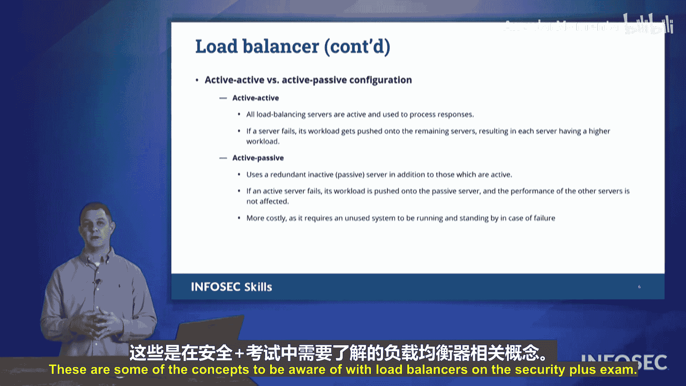

# 037：03 负载均衡器 🚦

在本节课中，我们将要学习负载均衡器。负载均衡器是确保网络服务高可用性的关键技术。我们将探讨其工作原理、核心概念以及不同的工作模式。

## 概述

为了确保我们的计算机和服务器对用户可用，我们需要维持高可用性。本节将介绍如何通过集群技术实现高可用性，并重点讲解负载均衡器在其中扮演的关键角色。

## 集群与高可用性

上一节我们介绍了高可用性的目标，本节中我们来看看实现它的常见方法。我们通常通过使用**集群**来实现高可用性。集群是指使用多台计算机来提供相同服务的能力。如果其中一台计算机发生故障，其他计算机可以接管其工作，这被称为集群。

然而，如果我们有一个Web服务器集群，用户如何知道应该连接到哪一台服务器呢？这时就需要使用**负载均衡器**。负载均衡器帮助将负载分散到我们所有的Web资源上。在下图中，我们只展示了三个系统，但在一个负载均衡器后面，可能有成百上千台不同的Web服务器。客户端将连接到负载均衡器，然后负载均衡器将流量分流到它所连接的系统之一。

## 负载均衡方法

负载均衡器可以使用不同的方法来分配负载。以下是考试中需要关注的几种方法：

以下是几种核心的负载均衡算法：

*   **轮询**：这种方法按顺序循环分配请求。每个系统依次获得下一个连接机会。其核心逻辑是：`当前服务器 = (当前服务器 + 1) % 服务器总数`。
*   **最少连接数**：负载均衡器会检查哪台服务器当前的活跃连接数最少，并将新连接分配给那台服务器。其决策基于：`目标服务器 = 连接数最少的服务器`。
*   **最快响应**：负载均衡器发出一个探测请求，响应最快的服务器将获得新的客户端连接。

## 会话亲和性

另一个在考试中可能遇到的术语是**亲和性**。亲和性是指每次连接都指向同一台服务器。

负载均衡器后面可能有三台不同的服务器，你连接到哪一台呢？第一次连接时，你可能会基于响应最快（例如地理上离你最近）或轮询算法被分配到其中一台服务器。但下次你回来重新连接时，你将被发送回完全相同的服务器。

这样做可能出于合规性原因。例如，你上传到该服务器的数据，我们不希望它被发送到其他服务器，因此你将信息存储在该服务器上，并且每次都会连接到该服务器。这可以出于多种不同的原因，通常是为了满足法规报告的要求。

## 主动/主动与主动/被动模式

接下来，我们想了解的关于负载均衡器的其他术语是**主动/主动**和**主动/被动**的概念。

在当今这个大量使用虚拟化和云计算的时代，我们几乎严格使用主动/主动模式。主动/主动是指所有服务器（无论两台、三台还是四台）都面向客户端提供服务，没有任何服务器被保留。

主动/被动模式则不同。假设我有两台服务器，一台面向客户，另一台作为备用保留。我保留一台备用的原因可能是，除非第一台服务器出现故障，否则我不希望它面向外网，然后我可以启动另一台。因此，我可以将这些备用服务器上线以维持高可用性。

然而，如今我们使用主动/主动模式，因为借助虚拟化，我们可以根据需要快速关闭系统并重新启动。我不想运行不需要的虚拟机，因为我不想为那些虚拟机付费，也不想为未使用的云计算资源付费。我可以根据需要快速启动它，也可以在不需要时关闭它，这样就不会产生任何费用。我可以保持一台服务器运行，如果需要，我可以再启动另一台、再一台、再一台，我可以不断将这些服务器上线，使它们可用。

因此，我可以扩展我的主动/主动集群，让它们全部面向外网。我不需要开启一台不可用的服务器，因为即使我保留它作为备用，我也要为那台服务器付费。那么主动/被动模式还有什么用呢？谁会使用它？

曾经有一段时间，计算机需要手动打开物理开关。你必须在数据中心打开那个系统的电源，因此无论你是否使用它们，你所有的系统都必须通电。所以我们会有一些系统一直开着，以防主系统出现故障，然后我们可以启用另一台，因为让人去数据中心拨动开关并非易事。所以我们让它们一直开着，但可能其中一些是断开的。它们不立即面向互联网，没有活动连接，不执行任何操作，只是闲置在那里。这就是一个被动系统。但再次强调，在当今这个云化和虚拟化如此普及的时代，我们不再真正使用主动/被动模式，而是主要围绕主动/主动模式进行。

## 总结

本节课中我们一起学习了负载均衡器。我们了解了它是如何通过将流量分发到后端服务器集群来确保服务高可用性的。我们探讨了轮询、最少连接和最快响应等核心调度算法，理解了会话亲和性的概念及其应用场景。最后，我们比较了主动/主动和主动/被动两种部署模式，并认识到在云和虚拟化环境下，主动/主动模式已成为主流。掌握这些概念对于构建 resilient 的网络架构至关重要。