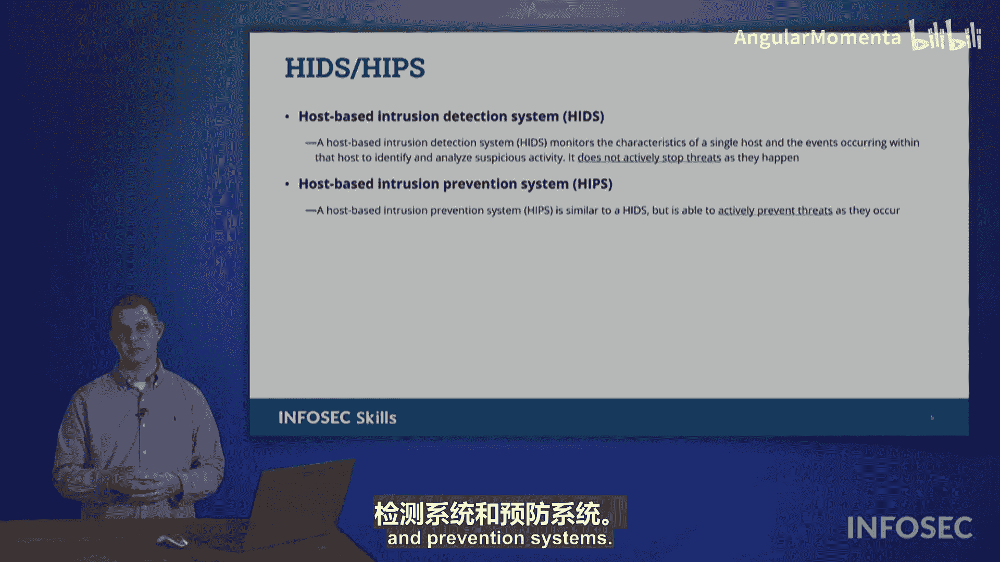

# 038：入侵检测与防御系统 🛡️

在本节课程中，我们将学习两种至关重要的网络安全工具：**入侵检测系统**和**入侵防御系统**。理解它们如何工作、有何区别以及各自的优缺点，对于保护企业网络免受恶意活动侵害至关重要。

## 检测模式：在线与被动 🔍

在深入了解具体系统之前，我们首先需要区分两种基本的检测模式。

*   **在线检测**：采用此模式的设备位于网络数据流中。数据从一个网络流向另一个网络时，必须**经过**该设备。因此，设备能够检查流经的每一个数据包。
*   **被动检测**：采用此模式的设备位于网络数据流之外。它不直接处理数据，数据也不流经该设备。它从“远处”监控网络，观察和分析网络上正在发生的情况。

## 入侵检测系统 👀

上一节我们介绍了检测模式，本节中我们来看看具体的系统。首先是被动的**入侵检测系统**。

IDS 位于数据流之外，被动地监控网络。它观察网络中传输的数据，并做出判断：这是否是可疑或恶意的活动？如果是，IDS 会发出警报，就像在说：“这里需要处理，有人来检查一下，我认为这不应该发生。”

IDS 除了发出警报外，不会采取任何行动。它允许安全团队随后采取纠正措施，或者判断这是一次误报，无需担心。

以下是 IDS 的核心特点：
*   **被动监控**：不干扰网络流量。
*   **仅告警**：发现威胁时发出警报，但不阻止。
*   **依赖人工响应**：需要安全分析师介入判断和处理。

## 入侵防御系统 ⚡

了解了被动的检测系统后，我们来看看更主动的**入侵防御系统**。

与 IDS 不同，IPS 是在线的，数据实际流经 IPS 设备。IPS 的关键定义在于：它内置了入侵检测功能，但它不呼叫帮助，而是直接**介入**网络活动，与威胁交战并执行纠正措施。

一个简单的类比是：
*   **IDS** 像一个夜班保安，看到停车场有人砸车，他会用对讲机报告：“好像有人在砸车，你们快来看看。”
*   **IPS** 则像一个更“冲动”的保安，看到同样情况，他会直接冲下去制止：“住手！不许砸车！”

IPS 的问题是，它有时可能过于“冲动”，会误判威胁。就像那个保安冲下去用枪指着正在往自己车里装 groceries 的顾客，这会对正常业务造成严重干扰。因此，部署 IPS 时，需要在它的攻击性之间找到平衡。这也正是为什么并非所有组织都只使用 IPS 的主要原因。

一些组织更倾向于使用 IDS，因为它更被动，不会跳出来造成一些误报或误警。IDS 发出警报后，人类可以回来判断并说：“那其实不是问题，可以解除警报。”而对于 IPS，它可能会说：“我已迅速行动，处理了威胁。”而你则可能回应：“你实际上导致我们一些用户的工作中断了，因为你误判了威胁。”因此，IPS 因其急于阻止任何潜在威胁的特性，可能会带来问题。

## 网络型与主机型 🖥️

你可能已经注意到，我们在前面提到了**网络入侵检测系统**和**网络入侵防御系统**。实际上，还有**基于主机的**版本。

我们可以利用这些技术来帮助加固和提高我们终端设备（我们的机器）上活动的安全级别。这是发生在你的**主机**上的事情。

需要了解的是，它们在概念上运作非常相似：
*   入侵检测系统更被动。
*   入侵防御系统更主动。
*   它们有相同的问题和缺点：IDS 可能看到威胁但无人及时响应；IPS 可能误判并中断用户活动，造成破坏。

因此，即使考试中提到 NIDS、NIPS、HIDS 或 HIPS，要知道它们讨论的就是**入侵检测系统**和**入侵防御系统**，只是部署的位置（网络或主机）不同。

---

**本节课总结**：我们一起学习了网络安全中两种核心的监控与防护技术。**入侵检测系统** 被动监控并告警，依赖人工响应；而 **入侵防御系统** 则主动在线拦截并阻止威胁，但存在误报风险。它们均可部署在网络层面或单个主机上。理解两者的区别与适用场景，是构建有效防御体系的关键一步。