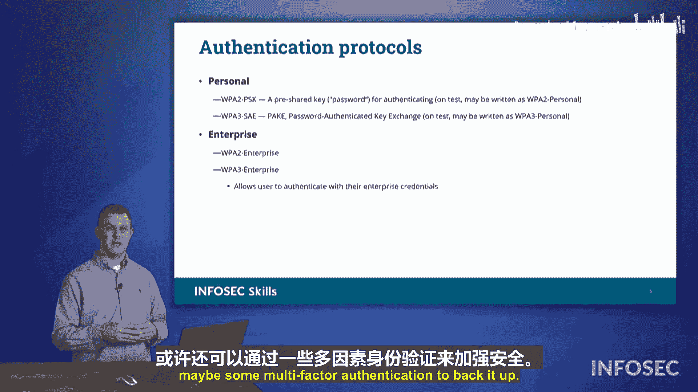

# 039：无线网络安全 🔐

在本节课中，我们将要学习无线网络中的安全协议与概念。无线网络使用共享的无线电波作为传输介质，因此对通信进行加密至关重要，以防止敏感信息被拦截。本节将介绍几种无线网络加密方法，并详细讲解在Security+考试中会遇到的协议类型。

## 有线等效保密协议

上一节我们介绍了无线网络安全的背景，本节中我们来看看最早被广泛使用的加密协议：有线等效保密协议。

WEP旨在为无线网络提供与有线网络相当的安全性。其名称暗示，使用WEP的无线网络在安全性上可与有线网络媲美，外部攻击者难以窃听网络流量。

然而，WEP存在固有的加密缺陷，其加密机制已被证明是脆弱的。因此，**破解一个使用WEP加密的无线网络相对容易**。鉴于其安全性不足，WEP已被更先进的协议所取代。

## Wi-Fi保护访问

为了替代WEP，我们引入了WPA。

WPA在一段时间内被认为是有效的，但随后也被发现了加密漏洞。因此，我们最终放弃了WPA，转而采用WPA2。

## WPA2

WPA2是目前最常使用的无线加密形式。在最新版Security+考试大纲发布前，WPA2被视为无线安全的最高标准。

WPA2的核心由两个组件构成：
*   **AES**：高级加密标准。
*   **CCMP**：计数器模式密码块链消息完整码协议。

对于考试，你需要记住以下关联：
**WPA2 = AES + CCMP**

考试中可能会给出这三个要素中的两个，要求你选出第三个。例如，题目可能问“WPA2在使用AES时，配合使用了以下哪一项？”，答案就是CCMP。或者直接问“哪种无线安全标准使用AES和CCMP？”，答案则是WPA2。

以下是一个帮助记忆的联想方法（尽管有些滑稽）：
*   将AES想象为“一台娱乐系统”。
*   一台娱乐系统就是“一台电脑”。
*   电脑的英文是“Computer”，取其首字母“C”，加上AES，就是“AES and C-CMP”，即WPA2。

## WPA3

我们提到WPA2曾是无线安全的标杆，但现在我们有了新的标准：WPA3。

WPA3的操作方式与WPA2略有不同，并内置了一些增强功能，例如支持通过扫描二维码自动加入并验证网络。如果你曾仅通过扫描二维码就连接上了无线网络，那很可能使用的是WPA3。

对于考试，你需要知道WPA3的核心构成：
**WPA3 = AES + GCMP**

同样，这里有一个记忆联想：
*   AES依然是“一台娱乐系统”。
*   这次是一台“游戏电脑”。
*   游戏电脑的英文是“Gaming Computer”，取其首字母“G”，所以是“AES and G-CMP”，即WPA3。

## 个人版与企业版

在讨论无线网络时，考试中还会提到一些特定的术语，即WPA2/WPA3的两种模式：个人版和企业版。

以下是两者的主要区别：

**WPA2/3 个人版**
*   使用**预共享密钥**。
*   PSK是“预共享密钥”的缩写。
*   这通常就是我们所说的“Wi-Fi密码”。所有用户使用同一个密码接入网络，常见于家庭或小型办公环境。

**WPA2/3 企业版**
*   使用基于用户的身份验证。
*   用户需要提供**用户名和密码**（可能还包括多因素认证）来接入网络。
*   这种方式允许网络管理员为不同用户分配独立的凭证，便于权限管理和访问控制，常见于企业或组织环境。

## 现场勘测与热图

最后，在专业环境中部署无线网络时，我们可能会进行现场勘测并生成热图。

**现场勘测**是指在实际办公环境中，通过移动设备测量各位置的无线信号强度。通常的做法是将一台笔记本电脑放在推车上，在办公室、隔间等所有区域移动，同时记录位置坐标和对应的信号强度数据。

完成勘测后，可以将收集到的数据输入专用软件，软件会生成一张**热图**。

热图能直观地展示无线网络在办公室各区域的覆盖情况。通过分析热图，网络管理员可以识别出信号覆盖薄弱或缺失的区域，从而优化无线接入点的摆放位置，确保为组织内的所有用户提供全面的无线网络覆盖。这是在Security+考试中需要掌握的关于无线网络规划的实用概念。

---

本节课中我们一起学习了无线网络安全的演进历程，从已被淘汰的WEP到目前主流的WPA2和更先进的WPA3。我们明确了WPA2使用AES+CCMP，而WPA3使用AES+GCMP的核心公式，并区分了个人版（使用预共享密钥）与企业版（使用独立用户认证）的应用场景。最后，我们还了解了通过现场勘测和热图来规划和优化无线网络覆盖的专业方法。掌握这些知识对于理解和实施无线网络安全至关重要。