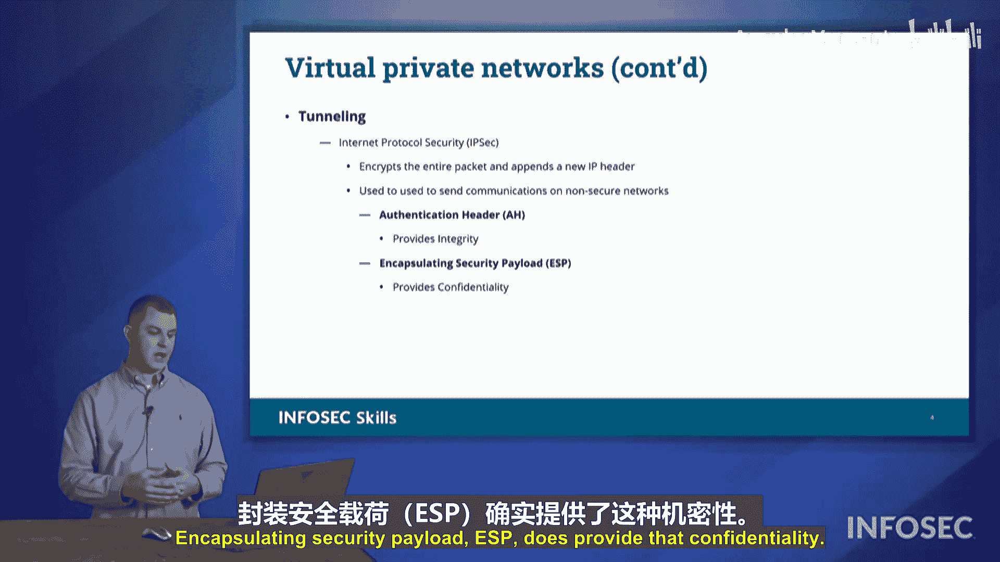

# 040：虚拟专用网络 (VPNs) 🛡️

在本节课中，我们将要学习虚拟专用网络。VPN是一种重要的安全技术，它允许我们在不安全的公共网络上建立安全的通信通道，保护数据在传输过程中的机密性和完整性。

## 概述

我们并非总在组织的主办公室工作，有时需要连接到远程的卫星办公室。因此，我们可以利用虚拟专用网络来保护数据从一个地点传输到另一个地点的通信安全。

## VPN的类型

VPN主要有两种类型：远程访问VPN和站点到站点VPN。以下是这两种VPN的详细介绍。

### 远程访问VPN

远程访问VPN可能是您讨论VPN时首先想到的类型。当您远程连接到网络时，会看到人们通过VPN进行连接。这个过程是：您在自己的系统上通过某个远程系统进行身份验证，然后您的系统通过公共开放的互联网进行连接。它会加密返回主办公室的数据，这样其他人虽然能看到您正在连接到网络，但无法理解在该通道上被加密的数据内容。之后，您就可以通过该VPN访问公司网络。

### 站点到站点VPN

站点到站点VPN用于连接两个不同的办公室。在这种情况下，两个办公室的所有流量都将通过同一个网络隧道进行传输。它们会利用所有连接性，通过VPN连接到另一个站点，然后在另一端“弹出”。与远程访问VPN不同，站点到站点VPN不需要用户手动进行身份验证来建立VPN链路。连接由两端设备自动建立，它们会使用预共享密钥、证书或其他认证措施，这个过程对用户是透明的，无需用户干预。

## VPN的核心技术：隧道技术

无论是远程访问还是站点到站点VPN，都依赖于相似的技术，它们可以使用隧道技术在数据从一个站点流向另一个站点时对其进行加密。

隧道技术使我们能够通过不受信任的网络进行连接，并保护其上的信息安全。关于隧道技术，我们主要讨论两种处理方式。

### 传输层安全

传输层安全是一种加密协议。它加密我们的信息，确保隐私，并且是之前广泛使用的安全套接字层的继任者。我们不再使用SSL，因为它被发现存在加密漏洞。TLS是我们保护VPN数据安全的一种方式。

### IP安全扩展

IP安全扩展是另一种方式。利用IPsec，我们可以加密所有数据，使得从您到我之间流动的所有数据都在这种隧道中被加密。其他人可以看到我们正在通信，但无法看到我们发送的内容。

IPsec结构的一部分是，您可以选择如何加密数据包。我们有两种主要的安全协议：认证头协议和封装安全载荷协议。

*   **认证头**：提供数据完整性，确保其中的数据不被更改，但它不一定提供机密性。
*   **封装安全载荷**：提供机密性。

## 理解AH和ESP：一个类比

为了帮助理解认证头和封装安全载荷的区别，我们可以考虑邮寄信件的两种方式：信封和明信片。

使用明信片时，正面可能是一张图片，背面写着“致奶奶”以及“天气很好，希望你在这里”之类的信息。任何人都能看到这个信息。如果有人用笔将“希望你在这里”改成“希望你不在这里”，信息就被篡改了。奶奶收到被篡改的明信片会感到难过。

如果您不想让任何人更改您的信息，可以采取保护措施。例如，用透明胶带覆盖信息。这并没有比之前提供更多的机密性，但至少没有人能够实际更改那条信息。这就是**认证头提供完整性**的例子。任何人都能看到您正在与主办公室通信，这没有机密性，但确保了信息未被篡改。

如果您通过邮件发送一封信，并将其密封在信封里，任何人都能看到有一封从A寄往B的通信，但无法打开信件，无法看到发送的内容。这就是**封装安全载荷**，它将所有内容封装起来，放入一个“信封”中，从而保护了信息。您可以通过不受信任的网络发送它，由于包装的安全性，没有人能够看到信息或对其进行篡改。

## 总结

本节课中，我们一起学习了虚拟专用网络。我们了解了VPN的两种主要类型：远程访问VPN和站点到站点VPN，并探讨了其核心技术——隧道技术。我们重点分析了TLS和IPsec两种安全协议，并通过类比深入理解了IPsec中认证头与封装安全载荷在提供**完整性**和**机密性**方面的不同作用。VPN正是通过这些方式，保护我们的数据在穿越不受信任的网络时安全无虞。