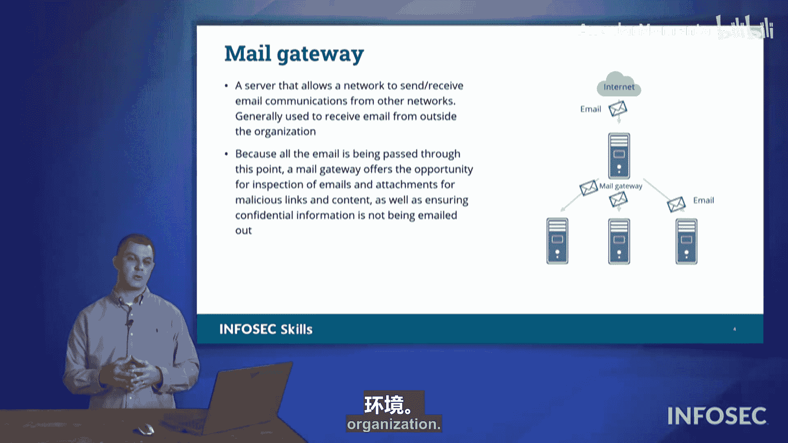

# 041：电子邮件安全 📧


## 概述

在本节课程中，我们将学习如何保护组织的电子邮件安全。核心目标是确保其他实体无法冒充我们的品牌，利用我们的良好声誉欺骗他人。我们将重点介绍自2024年初起在行业内广泛应用的DMARC框架，并解释其如何与DKIM和SPF技术协同工作，以验证电子邮件来源并抵御垃圾邮件和钓鱼攻击。

## DMARC框架简介

上一节我们讨论了电子邮件的基本安全威胁。本节中，我们来看看一个综合性的解决方案：**基于域的消息认证、报告与一致性**框架，即DMARC。

DMARC并非一项独立的技术，而是一个利用现有标准来提升电子邮件认证的框架。它主要整合了以下两项关键技术：

*   **DKIM**：**域名密钥识别邮件**。它使用非对称加密技术为外发邮件添加数字签名，以验证邮件在传输过程中未被篡改，并确认发送域的真实性。
*   **SPF**：**发件人策略框架**。它通过DNS记录明确列出被授权代表某个域发送邮件的邮件服务器列表。

## SPF记录详解

以下是SPF在DNS记录中的具体应用。假设你收到一封来自`comptia.org`的邮件，你的邮件接收服务器会查询该域的DNS记录，以验证发送服务器是否被授权。


如上图右侧高亮部分所示，这是一个SPF记录示例：
```
v=spf1 include:spf.protection.outlook.com -all
```
*   `include:spf.protection.outlook.com` 表示授权`outlook.com`的保护服务器可以代表`comptia.org`发送邮件。
*   `-all` 是策略指令，意思是对于**未**通过列出的服务器（即`spf.protection.outlook.com`）发送的邮件，应直接**拒绝**。

SPF策略主要包含三种处理方式：
*   `+all`：接受所有邮件（即使未通过验证）。
*   `-all`：拒绝所有未通过验证的邮件。
*   `~all`：将未通过验证的邮件标记为可疑（软失败），但可能仍会放入收件箱。

## DKIM与SPF协同工作流程

理解了SPF的基本规则后，我们通过一个具体场景来看看邮件服务器如何综合运用DKIM和SPF来判断邮件真伪，并决定是放行还是拒绝。



上图展示了整个验证流程：

1.  **DNS记录配置**：组织（例如`Sageage.com`）在其DNS中发布SPF记录和DKIM公钥。
2.  **攻击场景**：攻击者（`hacker.ru`）伪装成`Sageage.com`向你的邮箱发送欺诈邮件。
3.  **合法场景**：合法的`Sageage.com`邮件服务器也向你发送了一封真实邮件。
4.  **接收方验证**：你的邮件服务器收到两封声称来自`Sageage.com`的邮件后，会启动验证：
    *   它会向`Sageage.com`的DNS请求其**DKIM公钥**。
    *   对于合法邮件，它是用`Sageage.com`的**私钥**签名的。你的服务器使用对应的公钥能成功解密签名，从而通过**DKIM**验证，确认邮件来源真实且未被篡改。
    *   对于欺诈邮件，它没有也无法使用`Sageage.com`的私钥签名。因此，用`Sageage.com`的公钥无法验证通过，**DKIM**检查失败。
5.  **策略执行**：根据`Sageage.com`的SPF记录策略（例如`-all`），对于DKIM验证失败的邮件，你的服务器会执行**拒绝**操作。同时，它也会检查发送服务器的IP是否在SPF授权列表中，提供另一层验证。
6.  **结果**：合法邮件被送达你的收件箱；欺诈邮件被拦截或丢弃。这个过程实现了**不可否认性**，并利用公钥基础设施确保了邮件来源的可信度。

## 邮件网关的作用

除了在协议层面进行认证，我们还可以在网络边界部署硬件或软件设备来增强安全。

邮件网关为进入组织的电子邮件提供了一个集中检查点。所有从外部流入的邮件都会先经过邮件网关，在这里可以进行深度内容检查，扫描潜在的恶意软件、可疑链接或钓鱼企图。这样，各种威胁在到达内部邮件服务器之前就被过滤掉了。

以下是邮件网关的主要功能列表：
*   **病毒与恶意软件扫描**
*   **垃圾邮件过滤**
*   **内容策略执行**（如阻止特定附件类型）
*   **数据丢失防护**

## 总结

本节课中，我们一起学习了保护组织电子邮件安全的核心技术。
*   我们首先介绍了**DMARC**框架，它整合了DKIM和SPF来提供强大的邮件认证。
*   然后，我们详细分析了**SPF记录**的构成及其策略（`+all`， `-all`， `~all`）。
*   接着，通过一个对比图示，我们深入理解了**DKIM**如何利用公钥加密技术验证邮件完整性和发送方身份，并与SPF协同工作以区分合法邮件与欺诈邮件。
*   最后，我们了解了**邮件网关**作为一道附加防线，如何通过内容检查来拦截威胁。

这些安全技术层层叠加，共同为组织构建了一个安全可靠的电子邮件环境。


---
**备考提示：** 在Security+考试中，请密切关注这些术语和概念。