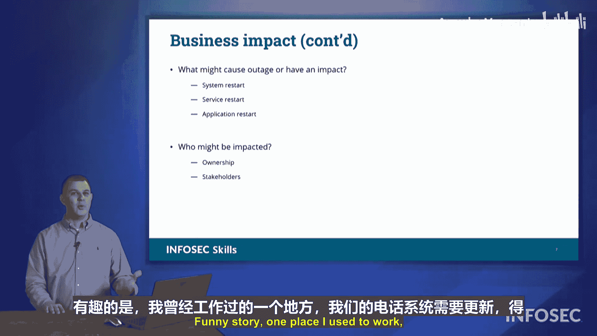

# 042：变更管理 🔄

在本节中，我们将学习**变更管理**的核心概念。变更管理是确保组织在引入新系统、更新或修改时，能够有序、安全地进行，并最小化业务中断的关键流程。我们将探讨其组成部分、重要性以及实施最佳实践。

---

## 概述

变更管理涉及对IT环境中的任何修改进行系统化的规划、测试、批准、实施和回顾。其目标是**降低风险**、**确保稳定性**并**维持业务连续性**。一个有效的变更管理流程能帮助组织避免因未经计划或测试的更改而导致的意外停机、安全漏洞或效率下降。

---

## 变更管理的核心组成部分

上一节我们介绍了变更管理的总体目标，本节中我们来看看支撑这一流程的具体组成部分。

### 版本控制

版本控制是跟踪软件、配置或文档从**一个版本到下一个版本**变化的过程。它允许团队清晰地了解当前部署的状态、历史修改记录，并在必要时回滚到之前的稳定版本。

以下是版本控制的关键作用：
*   **跟踪变更**：记录每次更新的具体内容。
*   **状态管理**：明确当前环境中安装的软件版本。
*   **回滚能力**：如果新版本出现问题，可以快速恢复到上一个已知的正常版本。其核心思想可以用一个简单的状态转换来描述：`稳定版本 -> 应用更新 -> 新版本 (测试) -> [成功则确认] / [失败则回滚]`。

### 文档记录

完整的文档是变更管理的基石。它确保每一次变更都有迹可循，明确责任归属。

一份完整的变更记录应包含以下要素：
*   **变更者**：谁执行了变更？
*   **变更内容**：具体修改了什么？
*   **变更时间**：何时进行的变更？
*   **变更原因**：为什么要进行这次变更？
*   **批准者**：谁授权了这次变更？

这不仅是为了保护组织，明确网络上的操作者，也是为了保护执行者个人，提供其操作经过审批和测试的证据。

### 图表与政策更新

技术和流程在不断发展，相关的支持文档也必须同步更新，以保持其参考价值。

需要保持更新的文档主要包括两类：
1.  **技术图表**：如网络拓扑图、业务流程图。确保它们反映最新的技术部署状态，避免因图表过时而增加维护的复杂性。
2.  **政策与流程**：当技术增减时，相关的操作政策和步骤手册必须修订。一个充满“例外”和过时步骤的政策无法被有效执行。

---

## 实施变更管理的最佳实践

了解了变更管理的基本组成部分后，我们接下来看看如何在实际操作中应用这些原则。

### 评估业务影响与维护窗口

在实施任何变更前，必须评估其对业务和用户的潜在影响。目标是**最小化停机时间**和**防止工作中断**。

关键考虑点包括：
*   **影响分析**：评估变更可能导致的用户生产力损失或服务中断。
*   **使用维护窗口**：在预先通知的、业务低峰时段（如下班后）执行变更，为用户设定明确的服务中断和恢复预期，从而将影响降至最低。

### 建立标准工作流程

一个清晰、标准化的操作流程能确保变更活动协调一致，如同一个润滑良好的机器。

一个健全的工作流程应包含以下步骤：
1.  **提出变更请求**。
2.  **规划与测试**：在非生产环境中充分测试变更。
3.  **审批流程**：获得相关负责人的正式批准。审批前应审查测试结果。
4.  **制定回滚计划**：这是安全网。如同在挑战游戏Boss前存档，在执行企业级变更（如更新路由器、防火墙）前，必须确保有可快速恢复的备份或还原点。
5.  **实施与验证**：在维护窗口内执行变更，并验证结果。
6.  **回顾与文档更新**：完成后，更新所有相关文档。

### 考虑连锁效应

变更，尤其是安全策略的变更，可能会产生意想不到的连锁反应，影响其他看似不相关的业务流程。

实施变更前，请思考以下问题：
*   **允许列表/拒绝列表变更**：允许某个新网站或应用，是否会引入安全风险？阻止某个地址，是否会阻断业务必需的合法软件或服务？
*   **限制活动变更**：例如，若全面禁止访问招聘网站，当人力资源部门需要从这些网站寻找候选人时，业务是否会受阻？
*   **对遗留系统的影响**：“遗留系统”是“老旧系统”的委婉说法。组织可能因成本、用户习惯或特定业务需求而保留它们。任何新技术或安全措施的变更，都必须评估其对仍在运行的遗留应用的影响，并制定应对方案（如升级、替换或隔离）。

---

## 总结

本节课中我们一起学习了**变更管理**的完整框架。我们认识到，有效的变更管理远不止是安装一个补丁或更新一个配置，它是一个包含**版本控制**、**详尽文档**、**影响评估**、**标准化流程**和**回滚准备**的系统性工程。核心在于**前瞻性的规划**与**责任化的跟踪**，以确保每一次变更都朝着提升组织安全性与稳定性的目标迈进，同时最大限度地保障业务连续运营。记住，在技术世界中，未经管理的变更本身就是一种重大风险。