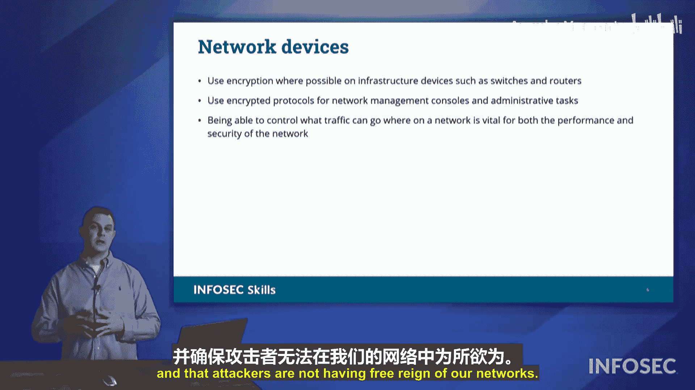

# 043：系统加固 🛡️

在本节中，我们将学习如何通过**系统加固**来提升组织计算系统的安全性。系统加固是一个识别并修复系统弱点和漏洞的过程，旨在增强系统的韧性和抵御攻击的能力。我们将探讨从端点安全到网络设备保护的一系列关键措施。

## 端点安全

上一节我们介绍了系统加固的概念，本节中我们来看看如何确保**端点**的安全。端点是指任何与数据进行交互的地方，包括服务器和本地工作站。我们需要确保这两类端点都得到妥善保护。

以下是确保端点安全的核心实践：

*   **遵循基线安全配置**：遵循组织设定或行业建议的基线安全配置。
*   **实施补丁管理**：确保及时应用可用的安全补丁，修复已知漏洞。
*   **执行定期备份**：对系统上的数据进行定期备份，以防数据丢失。
*   **部署防病毒软件**：使用防病毒程序检测和清除系统中的恶意软件。其工作原理是通过扫描网络或系统上已知的恶意软件**签名**来提供保护。
*   **采用端点检测与响应**：在端点上部署EDR解决方案，用于检测恶意活动并执行响应操作。
*   **应用数据防泄漏**：使用DLP软件防止敏感信息泄露。例如，可以设置监控关键词“蜂鸟项目”，当该词在通信中被使用时，系统会标记并交由安全团队审查上下文，以判断是否为违规泄露。

## 磁盘与文件保护

在保护了端点的基础运行环境后，我们还需要关注存储数据本身的安全。这主要涉及对磁盘和文件的加密与完整性监控。

以下是两种主要的磁盘加密方式：

*   **全盘加密**：一种**软件**加密解决方案。它使用软件（如Windows的BitLocker）和存储在设备**可信平台模块**中的密钥，对写入硬盘的所有数据进行加密。读取时，数据被解密后再交给操作系统。公式表示为：`加密数据 = 加密算法(原始数据, 密钥)`。其缺点是会对系统性能产生一定影响。
*   **自加密硬盘**：一种**硬件**加密解决方案。SED与TPM协同工作，除非同时获得硬盘和对应的TPM，否则即使物理窃取硬盘也无法解密数据。相比FDE，它对主机操作系统的性能影响更小。

除了加密，确保文件未被篡改也至关重要。

*   **文件完整性监控**：该技术基于**哈希**原理工作。系统为受保护的文件生成一个哈希摘要并存储。当文件被任何未授权方式修改后，其新生成的哈希值将与存储的原始值不匹配，从而触发警报。这能有效监控系统上文件的任何意外或恶意更改。

## 网络设备安全

最后，要完成全面的系统加固，我们必须确保连接各个端点的**网络设备**本身也是安全可靠的。

我们需要利用加密和加密协议来保护端点之间传输的数据。同时，通过部署**路由器**、**防火墙**和**访问控制列表**，我们可以控制数据的流向，确保网络高效运行，并防止攻击者在我们的网络中肆意妄为。

## 总结

本节课中，我们一起学习了系统加固的完整框架。我们从确保**端点安全**的基础实践开始，探讨了通过**磁盘加密**和**文件完整性监控**来保护静态与动态数据，最后强调了**网络设备安全**对于整体防御的重要性。综合运用这些措施，能够显著提升我们系统的整体安全性和韧性。