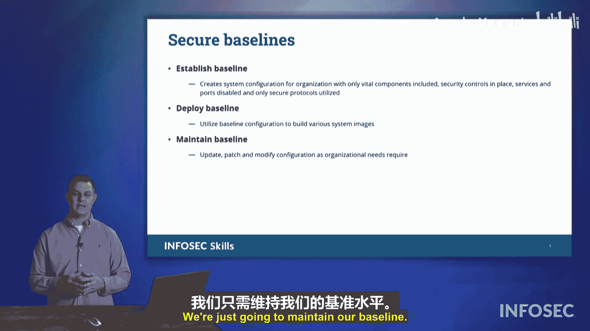

# 044：安全基线 🛡️

在本节课中，我们将要学习**安全基线**的概念。安全基线是确保企业网络中所有计算机和终端设备安全运行的基础。通过建立和实施安全基线，我们可以为系统创建一个统一、安全的操作环境。

## 什么是安全基线？📋

上一节我们介绍了安全的重要性，本节中我们来看看如何通过安全基线来实现它。一个安全基线为网络上的所有计算机定义了一个**共同的安全操作状态**。它本质上是一套标准化的安全配置。

在基线中，通常需要完成系统加固工作。以下是构成一个安全基线的核心操作：

以下是建立安全基线时需要执行的关键步骤：

*   **禁用不必要的网络服务或端口**：例如，对于一台普通的办公工作站，如果不需要运行Web服务器，就应关闭端口80和443。
*   **移除不必要的软件**：任何安装在系统上的软件都是潜在的攻击媒介。因此，应卸载对该设备工作非绝对必需的软件。代码示例：在策略中规定 `仅允许安装经批准的软件列表中的应用程序`。
*   **使用安全协议**：尽可能使用加密协议，避免使用任何明文协议（如FTP、HTTP），转而使用FTPS、HTTPS等。
*   **实施应用程序控制列表**：通过**允许列表**（仅允许列表内的程序运行）或**阻止列表**（明确禁止特定程序运行）来保护系统，防止未授权的应用程序被执行。

如果你要实施应用程序控制，最好将其纳入基线。这样，每当为新用户部署新计算机时，你安装的都是一个统一的、安全的系统镜像。通过这种方式，你可以确保所有设备从一开始就运行在安全的环境中。

## 如何实施与维护安全基线？🔄

每当使用安全基线时，你需要确保遵循以下三个步骤：

以下是实施和维护安全基线的三个循环步骤：

1.  **建立基线**：首先定义在自身环境中“安全”意味着什么。确定所有用户通用的软件、必需的软件以及不需要的软件。这是建立基线的部分。
2.  **创建并部署基线**：根据定义创建基线镜像，并将其部署到所有新入网的系统中。例如，我曾工作的大学每年夏天都会收到大量新电脑，我们会为所有新电脑部署这个统一的基线镜像。
3.  **维护基线**：基线不是一成不变的。偶尔我们需要调出用于这些系统的镜像（例如在学年中期）。我们需要维护这个基线，将自创建该基线以来发布的任何更新或补丁集成到镜像中。这样，当我们下次为一批新电脑或需要为教职员工更换电脑而部署该基线时，使用的就是已更新的镜像，无需在安装基线后再等待漫长的补丁更新过程。

## 总结 📝

本节课中我们一起学习了**安全基线**。安全基线有助于在企业网络中建立一个**统一、安全的操作环境**。我们了解了基线的构成要素，包括禁用非必需服务、移除多余软件、使用安全协议和实施应用程序控制。同时，我们也掌握了实施和维护基线的三个关键步骤：**建立、部署和维护**。通过持续维护更新的基线，可以确保网络中的设备始终保持最新的安全状态。