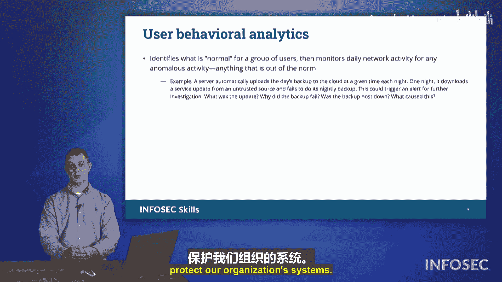

# 045：安全技术 🛡️

在本节课中，我们将探讨一系列用于保护组织及其网络连接安全的技术。我们将从网络过滤开始，逐步深入到操作系统保护、网络准入控制以及用户行为分析。

## 网络过滤技术

上一节我们介绍了安全技术的整体概念，本节中我们来看看如何通过网络过滤来保护我们的网络。网络过滤的核心目标是防止用户连接到可能有害的服务器、服务或网站。我们可以通过多种方式实现这一目标。

以下是几种主要的网络过滤方法：

*   **代理与代理服务器**：在计算机上安装代理客户端，或使用中央代理服务器。代理服务器会根据预设的阻止列表，阻止用户访问被列入黑名单的网页。
*   **URL扫描**：通过检查URL中是否包含特定的关键词来实施过滤。即使访问的域名本身是安全的，但如果URL路径中包含敏感关键词，访问也会被阻止。
*   **内容分类**：由第三方组织根据网站内容或运营类型（如游戏、成人内容、社交媒体、求职网站）对网站进行分类。管理员可以按类别批量阻止特定类型的网站。
*   **信誉工具**：例如AbuseIPDB。该服务的客户端会提交可疑IP地址。如果一个IP地址被多个来源报告为有害或恶意，它就会被标记并加入阻止列表，从而防止组织内的用户访问该IP地址。
*   **DNS过滤**：在DNS解析层面进行过滤。当用户请求访问一个网站时，如果该域名在阻止列表中，DNS服务器将不会返回正确的IP地址，从而阻止访问。例如，可以阻止所有对`facebook.com`的解析请求。一个著名的免费DNS过滤工具是**Pi-hole**。它可以运行在树莓派或虚拟机上，通过维护一个与广告相关的域名列表，在DNS层面阻止广告请求，使用户在浏览网页时看不到广告。

## 操作系统安全技术

除了网络层面的过滤，我们还可以利用操作系统内置的服务来保护用户和设备。

在Windows操作系统中，我们可以使用**组策略**来集中定义和强制执行系统上允许或禁止的操作。对于Linux系统，则有**安全增强型Linux**。SELinux实现了强制访问控制等众多安全机制，确保进程和用户必须获得明确授权才能访问系统资源或执行特定操作。虽然SELinux可能不适合作为日常桌面系统使用，但它非常适合用于需要高安全性的服务器环境。

## 网络准入控制

现在，让我们将焦点从单台设备转向整个网络的接入点。网络准入控制的核心思想是：在允许设备接入网络之前，先对其进行验证和控制。

### 802.1X 标准

首先，我们需要了解**802.1X**标准。这是一个由IEEE制定的技术规范，其核心原则是“未经认证，不得接入”。你可以把它想象成网络入口处的一道关卡，所有设备在获得网络访问权限前都必须先通过身份验证。

### 可扩展认证协议

那么，如何具体实现802.1X的“先认证，后接入”呢？这就要用到**可扩展认证协议**。EAP定义了一个实现认证的框架，它将802.1X的理念具体化为可操作的协议。EAP本身不规定具体的实现代码，因此衍生出了多种不同的实现方式。

以下是EAP的几种常见实现示例（了解即可，非考试重点）：
*   **EAP-TLS**：使用传输层安全隧道在用户设备和认证服务器之间建立安全连接来传递凭证。
*   **EAP-TTLS**：EAP隧道化TLS。
*   **PEAP**：受保护的EAP。
*   **EAP-FAST**：通过安全隧道灵活认证。

### RADIUS 与 AAA 服务器

在EAP认证过程中，用户提交的凭证最终会被发送到一个中心化的认证服务器进行校验。这个服务器通常就是**RADIUS**服务器。RADIUS代表“远程用户拨号认证服务”，这是一个历史悠久的协议，最初用于拨号上网的认证。在现代网络中，它依然是处理网络接入认证的核心。

在CompTIA考试中，你经常会看到**AAA服务器**这个术语。AAA代表认证、授权和记账。RADIUS服务器本质上就是一种AAA服务器。在考试语境下，**RADIUS**和**AAA**这两个术语经常互换使用，都需要留意。

### 主机健康检查

NAC不仅限于身份认证，还可以包含**主机健康检查**。在允许设备接入网络前，系统会检查该设备的安全状态，例如：
*   操作系统是否为最新版本？
*   是否安装了所有必要的补丁？
*   是否运行了反恶意软件和终端检测响应程序？
*   是否满足了所有必需的安全策略？

健康检查可以通过安装在设备上的**代理**来完成，也可以通过**无代理**的方式，由网络上的服务器远程扫描设备来实现。

### 永久性与临时性NAC代理

根据代理的驻留方式，NAC可以分为两种：
*   **临时性NAC代理**：用户在接入网络时临时下载一个代理程序。该程序完成主机健康检查，验证通过后即允许接入，随后代理程序自行删除。
*   **永久性NAC代理**：代理程序长期驻留在用户设备上，持续或定期进行主机健康检查，确保持续符合安全策略。只要设备需要保持网络连接，该代理就必须存在并运行。

## 用户行为分析

最后，我们来探讨一种更智能的安全监控技术：**用户行为分析**。人类是习惯性生物，日常行为通常具有规律性。UBA通过持续监控用户的活动，建立每个用户的“正常行为”基线。

一旦检测到某用户的行为明显偏离其正常模式（例如，在非工作时间登录、访问从未接触过的敏感数据），系统就会发出警报。这有助于安全团队及时发现潜在的内部威胁或账户被盗用的情况。

## 总结

本节课中我们一起学习了多种关键的安全技术。我们从基础的**网络过滤**（如代理、DNS过滤）开始，了解了如何控制网络流量。接着，我们探讨了**操作系统级的安全机制**，如Windows组策略和Linux SELinux。然后，我们深入研究了**网络准入控制**的完整流程，包括其核心标准**802.1X**、实现框架**EAP**、认证服务器**RADIUS/AAA**，以及增强安全性的**主机健康检查**。最后，我们介绍了**用户行为分析**，这是一种通过识别异常行为来发现潜在威胁的智能方法。这些技术共同构成了一个多层次、纵深防御的安全体系，用于保护现代组织的网络和系统。

在Security+考试中，请务必留意这些术语及其应用场景。