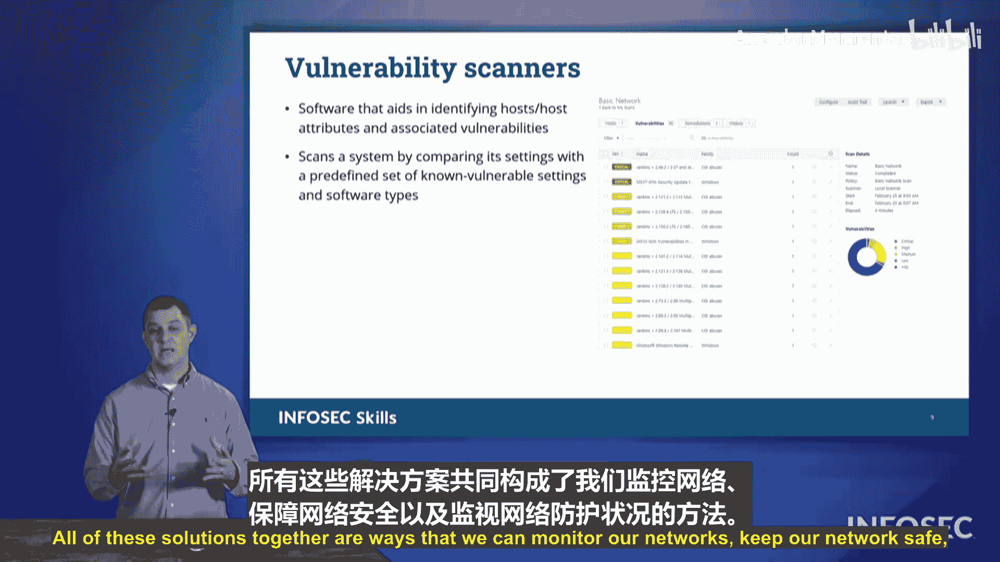

# 046：安全监控 🛡️

在本节课中，我们将要学习安全监控的核心概念与实践方法。安全监控是确保网络持续安全运行的关键环节，它涉及对系统、应用和基础设施的持续观察，以发现潜在的威胁与漏洞。

## 概述

确保网络的安全态势是保障业务安全运行的重中之重。在本节中，我们将探讨安全监控的各个方面，包括数据来源、分析方法和常用工具。

## 监控数据来源

为了有效监控，我们需要关注网络中各个组件产生的信息。以下是主要的数据来源：

*   **系统日志**：来自防火墙、终端设备、操作系统等。
*   **安全设备日志**：来自入侵检测系统（IDS）和入侵预防系统（IPS）。
*   **网络设备日志**：来自路由器、交换机等。
*   **元数据**：来自各类文件和数据，记录了文件的属性与使用情况。

所有这些日志汇集在一起，构成了调查事件和监控网络健康状况的信息源。

## 监控工具与方法

除了日志，我们还可以利用多种工具和技术来增强监控能力。

*   **漏洞扫描**：自动识别系统中的安全弱点。
*   **自动化报告**：提供系统整体健康状况的定期总结。
*   **仪表盘**：例如安全信息和事件管理（SIEM）系统，提供可视化视图。
*   **数据包捕获**：记录流经网络的全部原始数据。

## 日志聚合与分析

上一节我们介绍了监控数据的来源，本节中我们来看看如何处理这些海量数据。从所有系统、应用和基础设施中收集日志文件后，关键步骤是将它们聚合到一个统一的平台。

以下是聚合与分析的主要步骤：

1.  **统一格式**：将不同来源、不同格式的日志标准化，确保字段（如系统名、活动、时间）对齐，以便进行有效比较。
2.  **扫描与检测**：在统一平台上扫描日志文件，寻找可疑或恶意的活动模式。
3.  **告警与响应**：发现异常后，触发告警、创建故障工单、隔离系统或寻求协助。
4.  **报告与归档**：记录调查结果并生成报告，作为事后追溯的“检测性控制”。报告需要长期归档，以便进行历史趋势分析。

## 威胁情报共享

当我们从网络日志中发现可操作的情报时，可以将其打包并分享给其他组织。这样，其他组织也能将这些信息输入其安全基础设施，防范类似活动。这种共享所使用的标准格式称为**SCAP**。

**SCAP**（安全内容自动化协议）是用于在组织间交换安全威胁信息的标准化协议格式。考试中需要了解SCAP本身，但其下的具体XML格式（如OVAL、XCCDF）则无需记忆。

## 网络健康监控协议

除了日志分析，我们还可以使用专门的协议来监控设备状态。

**SNMP**（简单网络管理协议）用于查询网络设备的健康状况。通常，管理站会主动查询设备，设备将状态信息响应给**MIB**（管理信息库）。

然而，当设备发生紧急情况（如过热、断网）时，它不会等待查询，而是主动发送一个**SNMP Trap**告警信息，相当于在喊：“我这儿出问题了，需要立即处理！”

## 流量分析与数据包捕获

进一步，我们可以使用流量分析技术。**NetFlow**是思科开发的一种解决方案，它捕获的是通信的“本质”或元数据。

**NetFlow**记录的是通信结束后汇总的信息，例如：`主机A` 与 `主机B` 在 `X` 时间段内，使用 `Y` 协议，交换了 `Z` 量的数据。它是一种事后记录系统。

这与**数据包捕获**形成对比。数据包捕获是实时抓取流经网络设备的每一个数据包并完整存储。虽然信息详尽，但会消耗巨大的存储空间，可能不适合全网络长期实施。

那么，NetFlow这种事后记录的方式对监控有何用处呢？虽然通信已经发生，但NetFlow能以更高效的方式提供流量模式。例如，通过分析NetFlow记录，我们发现“每周二下午2:03，某内部主机都会与一个外部主机进行固定时长的数据交换”。虽然我们不知道具体内容，但这个模式足以引起警惕。于是，我们可以计划在“下周二”对该主机的出站通信进行**全量数据包捕获**，进行深入调查。因此，NetFlow常用于启动调查，而数据包捕获则用于深度挖掘。

## 漏洞扫描

最后，在持续关注网络安全的实践中，**漏洞扫描器**是一个重要工具。它能主动发现网络中出现的漏洞，并按严重程度列出，帮助我们按优先级进行修复。

## 总结

本节课中我们一起学习了安全监控的完整流程。我们从监控数据的多种来源（如各类日志）讲起，探讨了如何通过聚合、分析和告警来处理这些数据。我们还介绍了用于威胁情报共享的**SCAP**协议、用于设备健康监控的**SNMP**与**Trap**、用于流量模式分析的**NetFlow**与用于深度调查的**数据包捕获**，以及主动发现弱点的**漏洞扫描**。所有这些解决方案共同构成了我们监控网络、保障网络安全的有效手段，这些都是Security+考试中可能涉及的重要术语。