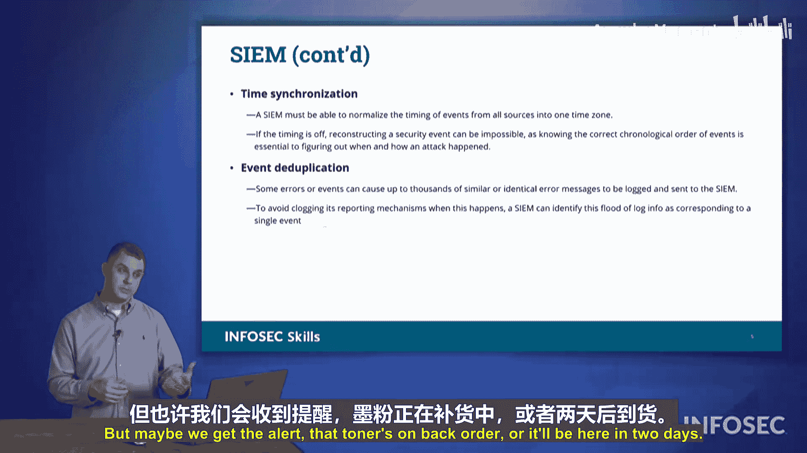

# 047：第08章第01节第06讲 - 安全信息与事件管理（SIEM）🔍

## 概述

在本节课程中，我们将学习**安全信息与事件管理**系统。SIEM 是组织安全运营的核心仪表盘，它能够持续监控网络活动，聚合与分析日志，并自动响应安全事件。理解 SIEM 的功能对于构建有效的安全监控体系至关重要。

---

## 什么是SIEM？

监控网络中发生的事件对组织而言至关重要。

本节我们将讨论**安全信息与事件管理**。它通常被视为安全运营的“一站式”仪表盘，是你安全态势的“全视之眼”。

这也被称为 **SIEM**。SIEM 即安全信息与事件管理。重申一次，它就是“全视之眼”。作为人类，我们很简单，会疲倦、会饥饿、需要休息、需要去洗手间。在监控网络时，会发生各种各样影响我们注意力的事情。

当我们开始查看不同的日志文件时，我们总会遗漏一些东西。而 SIEM 则不会疲倦，不需要休息，它将始终保持警惕。它会持续监控网络上的活动，因此能够收集来自网络上所有不同网络设备的数据，将它们集中起来，消化处理，并为我们提供有关网络运行状况的信息。

在接下来的内容中，我们将讨论 SIEM 具备的不同功能以及它为我们所执行的不同操作。

---

## SIEM的核心功能

上一节我们介绍了SIEM的基本概念，本节中我们来看看它的具体功能。SIEM主要执行以下几项关键操作。

### 日志聚合

SIEM 所做的第一件事是**日志聚合**。它会与网络上的不同设备通信，将所有日志集中到一个平台下。

它抓取这些日志文件，当它从路由器、交换机、服务器和终端系统摄取这些日志文件时，随着不同的文件和日志进入，它能够识别信息的各个列。

如果你查看过不同的日志文件，你可能注意到某些文件以“时分秒。月日年。事件内容。受影响的计算机”开头。另一些可能以“事件内容、受影响的计算机、然后是年月日时分秒”开头。还有一些可能有“年月日、受影响的系统、时间”。顺序是混乱的，对吧？因此，当你的 SIEM 摄取所有这些信息时，它可以开始识别：“好的，这是年份列，这是月份列，这是日期列”。无论它们在日志文件中的顺序如何，当它摄取这些信息时，它能够将它们全部对齐，并保持这些日志和报告的结构统一。

### 活动关联

一旦摄取了日志，SIEM 就能够对活动进行关联。当你登录系统时，你进行了登录，然后不同的活动会被视为：“好的，这是一个用户登录、检查电子邮件、下载这个文件、打印出来，然后他今天的工作就结束了”。这就是我们会看到的那种活动。

他们可能在这个过程中接触了十几个不同的系统，那些日志文件将会是12个不同的日志文件，并且它们都指向同一种活动。SIEM 能够看到所有这些并说：“是的，所有这些都是一个用户在做这件事。”

因此，我们能够全面了解正在发生的事情，而不是仅仅查看单个网络设备，我们通过 SIEM 看到了全局。

### 自动警报与响应

SIEM 可以做的另一件事是，一旦它关联了这些活动，并且发现其中某个活动可疑或恶意，我们就能够触发**自动警报**或启动某种响应活动。

它可以自动向你发送 Slack 消息或 Teams 消息，自动创建故障工单，或发出寻呼/短信。它可以通过多种不同方式提醒你的安全团队。

你还可以设置触发警报，因此它可以自动触发某个脚本，以响应某种活动。这有点像我们入侵防御系统的功能。入侵检测系统发现某些情况可能会引发警报，SIEM 看到后会说：“是的，我同意这是个问题”，并触发一个脚本来响应。

你的团队也能够接收这些警告和警报，并且你可以对其进行调整。你可以微调这个警报是否值得处理，你可以说“这不是问题”，或者说“是的，这是个问题，我绝对希望你每次都能捕捉到”。

### 隔离处置

本页幻灯片上的最后一点是，如果我们看到某种可疑或恶意活动，我们可以进行**隔离**。我们可以让该系统离线，可以“拔掉插线”这么说，切断该主机的访问权限，使其无法在网络其余部分传播恶意软件或进行恶意活动。

SIEM 能够完成所有这些操作。

---

## SIEM的高级特性

了解了SIEM的核心监控与响应功能后，我们再来看看它如何处理一些复杂场景，例如跨时区日志和重复事件。

### 时区归一化

SIEM 可以做的另一件事是，如果你的组织跨越多个时区，遍布全球，你的 SIEM 能够摄取这些日志文件，并调整其中发现的时间，以与单一时区关联。也许你将所有安全活动时间与**协调世界时**对齐。

以下是时区转换的一个概念性表示：
`事件本地时间 + 时区偏移量 = UTC时间`

这样我们就能比较这些事件是否同时发生，或者它们是否在不同时间发生。这也有帮助，因为世界各地的某些时区，并非每个时区都恰好相差整小时。在美国这很容易，他们是早一小时、早两小时、晚三小时、晚两小时。所以是简单的整数。

但在世界各地，有些时区相差半小时，我认为甚至有些时区相差15分钟。当你开始讨论时区时，事情会变得非常、非常古怪。对于 SIEM 来说，这不是问题，它只会调整所有这些时间，接收本地时间，然后将其与 UTC 对齐。

### 事件去重

你的 SIEM 能够做的另一件事是**事件去重**。

如果五楼的打印机缺墨粉，它可能会触发一个故障通知，SIEM 会看到：“嘿，我缺墨粉了”，然后有人可以为此下订单。但也许我们收到警报说墨粉缺货或两天后到货。与此同时，打印机不断报告：“嘿，我缺墨粉了。嘿，我缺墨粉了。”并且每五分钟报告一次。

（图示：一个卡通人物对着一台不断弹出“缺墨粉”警报的打印机说“闭嘴！”）

闭嘴，我们不需要每五分钟听到一次。你的 SIEM 能够抑制这种警报，就像：“好的，是的，你不断给我发送警报，以防有什么不对劲，但如果只是关于墨粉，我就把它收起来。”然后我们可以只增加我们收到了多少此类警报的计数，也许我们看到了一千个之类的。我们知道这件事，我们正在处理，但我们不需要一遍又一遍地收到那些警报。这就是我们谈论 SIEM 上的**事件去重**时的意思。

---

## 总结

本节课中我们一起学习了**安全信息与事件管理**系统。我们了解到SIEM作为安全运营的“全视之眼”，核心功能包括**日志聚合**、**活动关联**、**自动警报与响应**以及**隔离处置**。此外，它还具备**时区归一化**和**事件去重**等高级特性，以应对复杂的运维环境。这些关于SIEM的不同主题，是考试中可能会涉及的内容。掌握SIEM的工作原理，是构建自动化、智能化安全防御体系的基础。