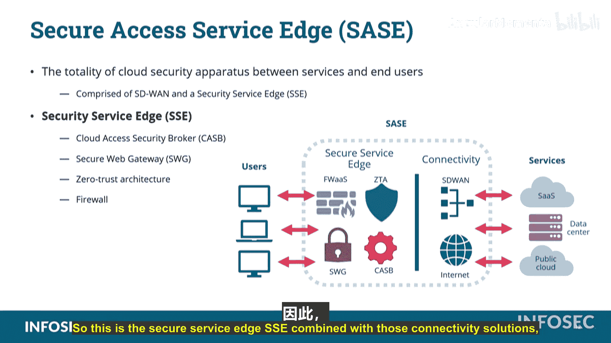

# 048：虚拟化技术概述 🖥️

在本节中，我们将学习虚拟化技术。虚拟化是IT行业的一项革命性技术，它允许在一台物理计算机上模拟运行多台虚拟计算机。我们将探讨其核心概念、优势以及相关的安全考量。

## 什么是虚拟化？

虚拟化是指使用一台物理计算机来模拟另一台计算机，从而能够在单个物理硬件上运行一个或多个虚拟机。

其核心思想可以追溯到20世纪60年代，但直到90年代中后期及21世纪初才真正成熟并成为IT行业的主导力量。

理解虚拟环境的一个好方法是联想游戏模拟器。模拟器在软件中重现游戏主机的硬件逻辑电路，让为原主机编写的软件能在模拟环境中运行。同样，在虚拟机中运行的操作系统并不知道自己不在真实的物理计算机上，它认为自己就在一台真实的计算机上运行。

## 虚拟化带来的挑战

尽管虚拟化带来了巨大便利，它也引入了一些特定的管理问题和安全风险。

### 虚拟机蔓延

虚拟机蔓延是指虚拟机的数量不受控制地增长，导致管理负担过重的问题。

以下是虚拟机蔓延的典型过程：
*   起初，组织开始部署少量虚拟机，成本低廉，管理简单。
*   随着其他部门得知可以轻松获取专属服务器，他们也开始申请虚拟机。
*   由于初期部署成本近乎为零，IT部门往往轻易批准。
*   虚拟机数量开始激增，很快超出了管理能力。
*   管理员需要跟踪、打补丁、监控所有这些系统，并进行合规性扫描和文档记录，工作量变得难以承受。

问题的核心在于组织未能预先认识到管理每台虚拟机的长期成本。最终，大量可能已不再使用的虚拟机仍在运行，导致资源浪费和安全风险。一旦尝试关闭某台机器，很可能立即有用户报告服务中断。

### 虚拟机逃逸

虚拟机逃逸是一种严重的安全威胁，指攻击者从一台虚拟机内部突破隔离，访问到宿主机或其他虚拟机。

这类似于电影《黑客帝国》中尼奥意识到自己生活在虚拟世界后，能够突破该世界的物理规则。在虚拟化环境中，如果攻击者发现自己身处虚拟机内，他们可能会尝试利用漏洞绕过虚拟层的隔离限制。例如，他们可能试图直接访问宿主机的内存或跳转到同一宿主机上的其他虚拟机，而不是通过常规的网络路径进行攻击。

因此，虚拟化软件的开发者必须持续修补漏洞，防止此类逃逸攻击的发生。

## 虚拟化的高级概念与应用

虚拟化技术不仅限于模拟完整的计算机，它已扩展到网络和应用程序层面。

### 软件定义网络

软件定义网络是将网络硬件设备的功能虚拟化，并通过软件进行集中控制和管理的技术。

其优势在于能够快速、灵活地调整网络配置。管理员可以通过点击鼠标来部署防火墙、路由器，或调整它们的策略和位置，而无需进行物理布线更改。虽然底层仍有物理电缆连接，但核心的网络功能都运行在虚拟环境中，实现了高度的敏捷性。

### 容器化

容器化是一种轻量级的虚拟化技术，用于将应用程序及其依赖环境打包在一个隔离的“容器”中运行。

容器有助于保护宿主机操作系统的完整性和数据安全。如果容器内的应用程序（或恶意软件）发生故障或试图耗尽资源，其影响通常会被限制在该容器内部。管理员可以简单地关闭并重启该容器，而不会影响系统上运行的其他服务。此外，容器化允许在单台服务器上高效运行同一应用程序的多个实例。

### 基础设施即代码

基础设施即代码是一种通过机器可读的定义文件来管理和配置基础设施的方法。

这意味着所有的后端基础设施（如服务器、网络、存储）的创建、部署和操作都像管理软件代码一样，可以通过脚本自动完成，确保了环境的一致性和可重复性。

### 无服务器架构

无服务器架构是一种云计算执行模型，开发者无需管理服务器即可构建和运行应用程序。

需要明确的是，“无服务器”并非指没有物理服务器，而是指服务器管理职责完全由云提供商承担。开发者只需关注代码和业务逻辑。计算资源会根据实际需求自动弹性伸缩，并且只在代码执行时计费，这非常适合间歇性或可变的工作负载。

### 微服务与API

微服务与API是构建和连接现代虚拟化应用的关键技术。

微服务是一种将应用程序构建为一套小型、独立服务的方法，每个服务运行在自己的进程中，并通过API进行通信。例如，一个查询IP信誉的微服务，可以按每月查询次数计费。

API是不同软件组件之间的预定义通信接口。可以将自动取款机类比为银行的API：ATM定义了用户与银行交互的有限且标准化的操作集（如查询、取款），用户无需直接与银行柜员交互即可完成这些操作。

### 软件定义广域网

软件定义广域网将SDN的概念扩展到广域网连接上。

SD-WAN利用软件智能地管理多个WAN链路（如MPLS、宽带、LTE），根据应用程序需求、链路成本、延迟和带宽状况，动态选择最佳路径来传输数据，从而优化连接性能和用户体验。

### 安全访问服务边缘

安全访问服务边缘是一种融合了网络和安全功能的云交付架构。

SASE将广域网能力与全面的网络安全功能（如防火墙即服务、零信任网络访问、安全Web网关等）结合，统一作为服务交付。无论用户位于何处（办公室、家中、路上），也无论应用程序托管在何处（数据中心、公有云、SaaS），SASE都能为其提供一致、安全的访问体验。

## 总结

本节课我们一起学习了虚拟化技术。我们首先了解了虚拟化的基本概念，即在一台物理硬件上模拟多台计算机。接着，我们探讨了虚拟机蔓延和虚拟机逃逸这两个主要的管理与安全挑战。然后，我们介绍了虚拟化的一系列高级应用，包括**软件定义网络**、**容器化**、**基础设施即代码**和**无服务器架构**。最后，我们学习了连接和构建这些现代应用的关键技术，如**微服务**、**API**、**软件定义广域网**以及整合性的**安全访问服务边缘**架构。虚拟化是一个热点话题，也是Security+考试中的重要考点。