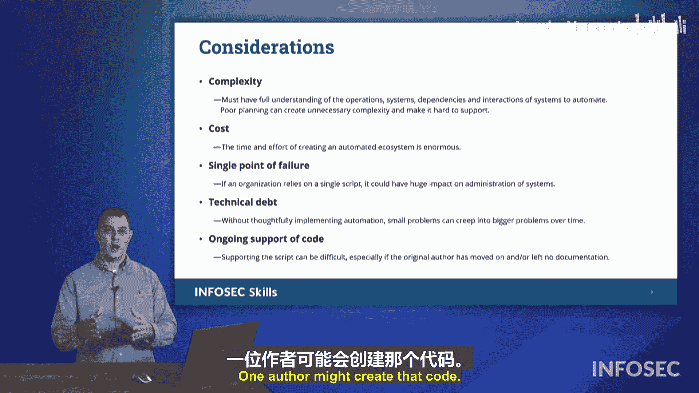

# 049：编排与自动化 🚀

在本节课中，我们将学习如何在大型复杂组织中管理众多系统。核心方法是利用**编排**与**自动化**。我们将探讨它们如何作为**劳动力倍增器**，确保操作一致性，并缩短安全响应时间。同时，我们也会审视引入自动化可能带来的复杂性、前期投资、单点故障风险以及**技术债务**等问题。

## 编排与自动化的核心价值

上一节我们介绍了管理大型系统的挑战，本节中我们来看看**编排**与**自动化**如何提供解决方案。它们主要指通过**脚本**和**自动化程序**来管理系统。

### 作为劳动力倍增器

当组织拥有数千个需要管理的系统时，自动化可以显著提升管理效率。以下是其作为劳动力倍增器的具体体现：

*   **提升管理效率**：通过编写脚本，少数人员即可管理大量系统。
*   **确保操作一致性**：自动化能确保在所有系统上执行完全相同的变更、安装相同的补丁、生成相同的报告。
*   **缩短安全响应时间**：一旦安全设备检测到网络异常，自动化脚本可以立即启动，在管理员介入前执行纠正措施。

## 实施自动化的潜在挑战

尽管自动化益处显著，但在考虑引入时，也必须认识到其伴随的复杂性与风险。

### 主要挑战与考量

以下是组织在部署自动化时需要面对的几个关键问题：

*   **系统复杂性**：创建自动化脚本需要深入理解所有系统及其相互关联性。对一个系统的改动可能对其他系统产生连锁影响。
*   **高昂的前期投入**：为大型复杂组织创建和维护全套自动化脚本，需要投入大量的时间和人力成本。
*   **单点故障风险**：如果所有脚本都依赖于某一种特定的脚本语言或某个核心脚本，一旦该依赖失效，整个自动化操作可能陷入停滞。
*   **技术债务积累**：**技术债务**是一个源自计算机编程的概念。它指的是一个小问题可能像滚雪球一样演变成更大的问题。随着在成百上千个系统上运行的脚本数量不断增加，技术债务也会随之增长。
*   **持续的代码支持**：脚本的原始作者可能早已离职。当需要修复或改进这些旧脚本时，必须确保有文档记录且现有人员经过培训，能够更新和创建新的脚本来替代旧版本。

## 总结

本节课中我们一起学习了**编排**与**自动化**在管理大型IT环境中的核心作用。它们通过**脚本**和**自动化程序**实现了**劳动力倍增**、**操作一致性**和**快速安全响应**。同时，我们也深入探讨了实施自动化时必须考虑的**系统复杂性**、**前期成本**、**单点故障**以及**技术债务**等挑战。成功部署自动化的关键在于权衡这些利弊，并做好充分的规划与文档工作。