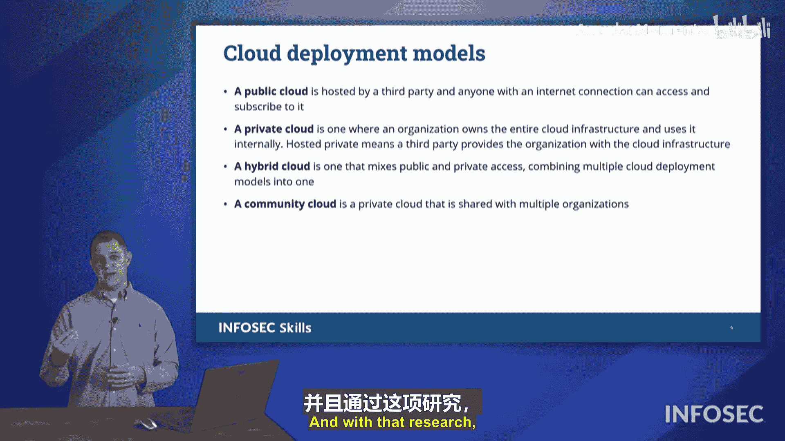

# 050：云服务模型 ☁️

在本节课中，我们将要学习云计算中的核心服务模型。理解这些模型对于区分云服务提供商和客户之间的责任至关重要，这也是CompTIA Security+ 701考试的重点内容。

在现代计算中，我们越来越依赖不同的云服务。每当我们从云运营商处购买服务，或者激活一个云账户并选择想要运行的服务类型时，我们都会在CompTIA Security+考试中列出的三种不同类型中进行选择。我们需要了解的三种模型是：软件即服务、平台即服务和基础设施即服务。

对于每一种模型，云运营商和客户（即你和我）之间的责任都会发生转移。这就是所谓的云责任矩阵。这种责任从一种模型到另一种模型的转移，以及我们系统所需的要求，决定了我们需要做什么来维护系统，以及云运营商需要做什么来维护系统。

在所有情况下，云运营商都将负责维护数据中心的物理结构。这包括冗余的互联网链路、冗余电源和备用电源解决方案、暖通空调系统、物理安全以及实际的物理计算机硬件本身。这些是云运营商的责任。除此之外，就进入了我们在这三种服务模型中看到的云责任矩阵的范围。这三种模型再次是：软件即服务、平台即服务和基础设施即服务。

让我们深入了解每一种模型的具体内容。

## 软件即服务 (SaaS) 💻

首先讨论的是软件即服务。这可能是最容易理解的一个，因为我们已经体验过使用各种类型的软件即服务。

我常用的例子是像Google Docs这样的服务。Google Docs不是你在系统上安装的东西，它只是你使用的软件，但并非需要安装，而是作为一种服务来使用。因此，Google Docs是谷歌提供的一种软件即服务解决方案。

## 平台即服务 (PaaS) 🛠️

接下来我们要看的是平台即服务。如果你要构建一个Web应用程序，你可能会获得的平台即服务是一个Web服务器或数据库服务器。他们为你提供了一个平台，你可以在其上构建你的解决方案。然后，你需要去填充该Web服务器的内容或该数据库的内容。你提供内容，他们提供平台。

## 基础设施即服务 (IaaS) 🖥️

我们这里的第三个选项是基础设施即服务。有时人们会对平台即服务和基础设施即服务感到有些困惑。所以，当你看到IaaS时，我希望你这样想：把它想成HaaS。记住，字母H和I在字母表中是相邻的。所以，字母H代表硬件即服务。当你看到基础设施时，就想到硬件。

基础设施即服务是指云运营商为你提供一台计算机。他们提供一个操作系统。仅此而已，其他一切都取决于你。他们给你可以使用的硬件。但该操作系统的所有内部运作都由你负责。你将安装Web服务器，你将负责该Web服务器的安全和打补丁。你将安装数据库服务器，你将负责其安全和打补丁。无论你要安装什么应用程序，无论你想使用什么安全解决方案，都由你负责。你只是在以服务的形式使用他们的硬件。

在考试中，我们会看到它被列为IaaS，但你可以把它想成HaaS，即硬件即服务。

---

上一节我们介绍了三种核心的云服务模型，本节中我们来看看云的不同部署方式。

从另一个角度来看，我们可以看到云运营商如何提供不同类型的云。首先要看的是公共云、私有云，以及某种混合云。

对于公共云，这就是每当我谈论云运营商时你所想到的。大多数时候，人们会想到AWS、Google Azure（应为Microsoft Azure）、Google Cloud等。这些是不同的云部署模型。这些不同的云运营商为我们提供公共云。你刷一下信用卡，说“来一份云服务”，他们就会提供服务。这就是公共云。

也有组织运行私有云。这些云由他们的团队、他们的员工运营和维护，供内部公司使用。研究机构可能有这种大型计算能力，事实上，即使是亚马逊AWS也有自己的私有云。AWS源于亚马逊自身对这些计算资源的需求，但在这个过程中，有人说：“如果我们抽象出所有这些，并将其提供给其他人使用，那将是一个好主意。如果我们有这种需求，他们肯定也有。”于是，AWS从他们自己内部的私有云需求中诞生了。然后他们将其转变为公共云，但他们也维护着自己的私有云。你不能走进去刷信用卡说“来一份云服务”，他们会说：“还你卡，我们不这样做，我们没有向你收费的方式，这不是我们这里做的。”因此，私有云是你无法访问的，由该组织为该组织运营和维护。

接下来是混合云。混合云是指一个私有组织说我们想运行一个私有云，但我们实际上没有工具、硬件、专业知识或人员来自己运行这个私有云。那么，我们让一个公共云运营商为我们运行这个私有云。每当你有一个云账户时，如果你拥有的是公共云，你的数据会与云中那些虚拟机上运行的其他一堆系统混合在一起。如果你希望你的数据不与他人混合，你需要一个私有云。但如果运行云不是你的技能范围，你可能会告诉公共云运营商：“嘿，你能为我运行一个混合云吗？即使你是公共运营商，你能为我运行这个私有云吗？”于是，他们会收费为你这样做。过去几年新闻中出现的最佳案例是美国国防部建立了各种云账户，他们与公共云运营商签订了合同，这些运营商擅长运行这些不同的系统。他们将为国防部运行这套隔离的计算资源，这被认为是混合云。它是私有的，但由公共云提供商运行。

最后我们在这里看到的是社区云。这并不意味着你的城市或城镇聚集在一起说“嘿，让我们建立一个云”。相反，这可能是一个志同道合者的社区。我的例子是，每当不同学术机构的教职研究人员在进行一些资助研究时，他们可能需要一些云计算能力，他们会与不同的公共云提供商签订合同。一位研究人员建立了他们的服务，使其运行起来，但也许他们需要雇佣一个助手来帮助运行自己的计算需求。然后，他们机构的一位同事过来说：“嘿，我真的很喜欢你在做的事情，我能搭你的便车吗？我能使用你已有的相同云计算资源吗？我会出资分担费用。”然后，来自另一个机构的研究人员加入进来，接着又一个，又一个。很快，就形成了一个研究相同类型工作的研究人员社区，他们都投入资金来资助云运营，帮助支付运行该云的助手或助手们的费用。但他们不属于任何一个机构，他们的资金来源也不相同，比如国家科学基金会。相反，他们将汇集所有的资金和资源来运行这个云，以便他们可以共享数据和研究成果，无论他们各自具体的研究兴趣是什么。这就是社区云的一个例子。

---

本节课中我们一起学习了云计算的核心概念。我们探讨了三种主要的云服务模型：**软件即服务 (SaaS)**、**平台即服务 (PaaS)** 和 **基础设施即服务 (IaaS)**。对于IaaS，我们可以将其理解为 **硬件即服务 (HaaS)**。此外，我们还了解了不同的云部署模型：**公共云**、**私有云**、**混合云** 和 **社区云**。理解这些模型和责任划分对于通过Security+考试和在实际工作中管理云安全至关重要。