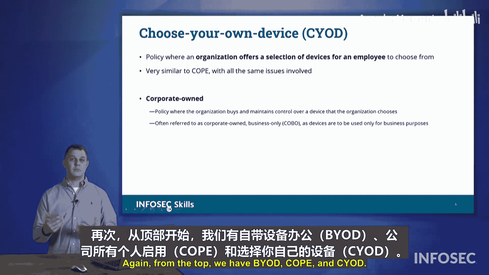

# 051：移动设备部署模型 📱

## 概述
在本节课程中，我们将学习组织内部移动设备部署的不同模型。理解设备所有权、数据所有权以及服务连接方式对于制定有效的安全策略至关重要。我们将探讨三种主要的部署模型，并分析它们各自的优缺点。

---

## 移动设备部署的考量因素
如今，许多组织内部都在大量使用移动设备。在审视不同的移动设备时，我们需要考虑数据所有权和设备所有权的问题。

上一节我们介绍了移动设备安全的整体背景，本节中我们将深入探讨具体的部署模型。首先，我们需要审视设备本身的归属问题。这与设备上的数据所有权是独立的，也与为该设备提供的服务是分开的。因此，许多组织会对以下方面存在所有权担忧，随之而来的是需要考虑的法律问题。

你必须思考：谁拥有这台设备？进而，谁拥有其中的数据？例如，如果你使用个人手机处理工作，之后又离开了雇主，那么这些数据归谁所有？如果数据在你的设备上，当你不再是该组织的一员时，雇主实际上无法强制你做任何事情。这些来回拉扯的法律顾虑，是许多组织在涉及移动设备使用时都会面临的问题。

---

## 移动设备的连接方式
认证目标中提到的一个概念是“连接性”。虽然这听起来可能不言自明，但当我们查看蜂窝手机的不同连接类型列表时，其重要性便凸显出来。

以下是移动设备的主要连接方式：
*   **蜂窝网络**：移动设备可以通过蜂窝网络连接。这一点被特别提及，是因为许多组织可能投入大量心思、努力和资金来保护其无线网络，防范可能针对移动设备的无线网络攻击。但请记住，移动设备可以随时关闭Wi-Fi并开启蜂窝数据，从而使用其蜂窝连接来绕过组织网络上的所有安全措施。
*   **Wi-Fi**：移动设备也通过Wi-Fi连接。
*   **蓝牙**：移动设备具备蓝牙连接功能。请记住，蓝牙会广播其唯一标识，寻找与其他设备建立连接。因此，蓝牙可能成为针对移动设备各种攻击的媒介。

这些连接方式都内置于我们的移动设备中。不过，在本节中，我们将重点探讨这些移动设备的所有权结构。

---

## 三种移动设备部署模型
在本节中，我们需要考虑三种不同的移动设备部署模型。

以下是三种主要的移动设备部署模型：
1.  **自带设备**：也称为 **BYOD**。
2.  **公司所有，个人启用**：即 **COPE**。
3.  **选择你的设备**：即 **CYOD**，也称为公司所有且仅限商务使用。

这三种模型是CompTIA Security+考试要求我们掌握的内容。让我们逐一深入探讨。

---

### 1. 自带设备
大多数组织采用BYOD模式。很多组织只是简单地表示，他们与员工在使用手机方面没有正式的协议。如果你有手机，你可以连接工作邮箱，可以连接Teams或Slack等专业网络应用，可以通过这些移动设备与同事交流。如果你想这样使用，那是你的事，我们对此没有正式的期望。

对于一些组织来说，BYOD模式的问题在于：如果你的移动设备上存储了公司数据，当你离开该组织时，你将保留这些数据。因此，他们可能会说，我们不希望你使用个人移动设备处理任何工作，不要用手机进行工作相关活动，因为信息可能泄露，存在隐私担忧和数据所有权问题。如果你的手机上有某些数据，除非是非法内容，否则没有人能强迫你删除。他们能做的最极端的事情就是与你解除劳动关系，但这可能引发法律诉讼。组织意识到这一点，并认为如果让员工使用自己的手机，他们真的无法控制员工如何处理那些数据。BYOD的一个核心问题是：**员工拥有手机，因此员工拥有数据**。无论组织是否希望他们访问这些数据，组织最多只能解雇该员工，但这仍然无法取回数据。因此，对于安全性要求极高的组织，BYOD模式是远远不够的。

---

### 2. 公司所有，个人启用
鉴于BYOD的局限性，组织会转向下一个可用选项：**公司所有，个人启用** 模式。

在这种模式下，设备上的数据以及设备本身都属于公司。如果你离开组织，那台设备是我们的，我们期望你归还设备，你不能带走它，因为上面有所有信息，那是我们的设备。一些组织会考虑不同员工如何访问信息，因此有了“个人启用”这一面。“个人启用”是指，我们不知道员工具体住在全国哪个地方，目前全国范围内正流行远程办公趋势。通过这种“个人启用”方式，我们会给你一笔津贴。你必须有一部用于工作的手机，我们拥有这部手机。但我们不知道哪个运营商在你家所在区域信号最好，所以我们会每月给你一笔津贴，以帮助抵消启用该手机的费用，你可以选择任何你想要的运营商，选择在你居住或旅行的地方服务最好的那个。

然而，COPE模式中“个人启用”方面也存在法律问题：是的，手机设备本身属于组织，其上的数据属于组织，你必须归还。但是，该设备的位置信息、任何通话记录、短信等，都存在于电话记录中。如果你是签订手机服务协议的人，这些信息就追溯到你。因此，那是你的信息。尽管组织支付了每月津贴，我们想获取那些信息，但那些信息在法律上属于签订合同的人。所以，即使有津贴来帮助抵消成本，它仍然在法律上是那个人的名义，那是他们的数据。

---

### 3. 选择你的设备
为了规避上述所有问题，我们有了第三个选项。许多安全性最敏感的组织都采用这种模式，即 **选择你的设备**。

在CYOD模式下，组织会说：我们知道iPhone用户忠于那个平台，那是他们想使用的界面；Android用户忠于那个平台。选择你想要的任何一个。但通常，组织提供的可能是两款老旧、磨损的手机。如果你曾经不得不从中选择，你会知道这些手机不是最新、最好的，它们可能已经传用了一段时间。但你选择你想使用的手机。这是一台公司所有的设备，公司或组织拥有这台设备，并且由他们来开通服务。他们与主要运营商洽谈，协商出能为所有用户提供服务的最佳服务合同。通过这种方式，组织同时控制了**设备本身、服务以及与之相关的所有数据**。这就是“选择你的设备”模式，有时也被称为“仅限公司使用”或“公司所有且仅限商务使用”。

---

## 总结
本节课中，我们一起学习了三种主要的移动设备部署模型。我们首先探讨了**自带设备**，其特点是员工拥有设备，但也带来了数据所有权的挑战。接着，我们分析了**公司所有，个人启用**模式，该模式解决了设备所有权问题，但在服务合同和个人数据方面仍存在复杂性。最后，我们介绍了**选择你的设备**模式，这是安全性要求高的组织的常见选择，它让组织能够完全控制设备、服务和数据。在Security+考试中，请留意BYOD、COPE和CYOD这些模型，并能够区分它们。