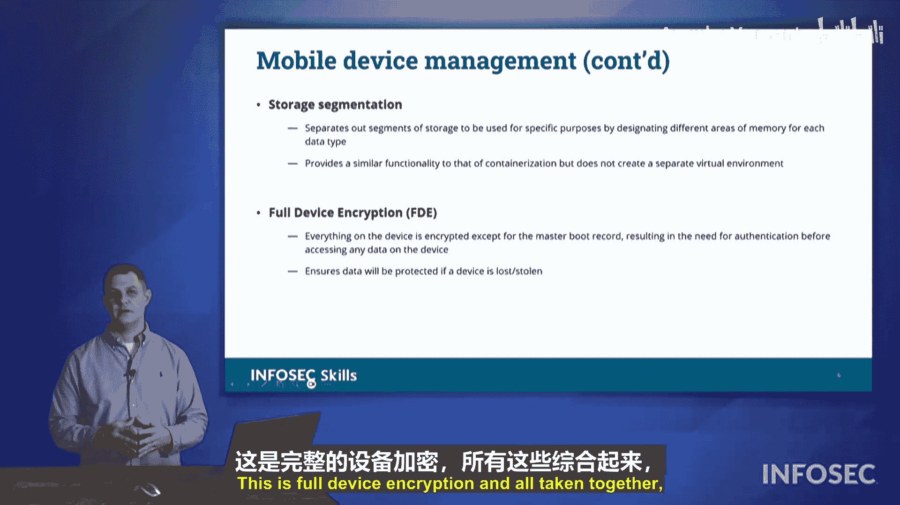

# 052：移动设备管理 (MDM) 核心概念 🛡️

在本节课程中，我们将学习移动设备管理。随着移动设备在工作场所的普及，保护存储在设备上的数据安全变得至关重要。我们将探讨如何通过移动设备管理软件来实现这一目标。

## 概述

许多组织在工作场所使用移动设备。雇主通常会为员工配备用于工作的移动设备。本节将讨论移动设备管理，重点是如何保护这些移动设备上存储的数据安全。我们利用一种称为移动设备管理的软件技术来实现这一目标。

通过MDM，我们可以在设备本身上实施多种安全策略来保护信息。例如，我们可以分离个人活动与专业或业务活动，从而对移动设备上的数据进行分段管理。我们还能确保设备上的应用程序安全，确保它们来自可信来源且不会破坏设备安全。此外，我们可以通过加密数据或强制使用加密来保护数据安全，甚至在必要时销毁数据。

## 核心概念与实施方式

接下来，我们看看实施移动设备管理的一些具体方式。以下是本部分涉及的关键术语和功能。

### 地理围栏

通过移动设备管理，我们可以利用地理围栏来强制执行策略。您所在的位置可能会影响您拥有的权限。例如，如果移动设备带有摄像头，我们可能不希望摄像头进入研发设施，因为这可能导致数据泄露。因此，当员工进入我们的设施时，我们可以通过MDM软件禁用其移动设备上的摄像头。我们会在物业周边设置地理围栏路径点，一旦设备进入该区域，摄像头功能即被禁用。或者，我们可以设定摄像头仅在工作场所启用，禁止员工使用工作设备拍摄家庭照片等活动。

### 推送通知

我们也可以要求使用推送通知。例如，我们可以将包含一次性PIN码的消息推送到您的移动设备，用作多因素认证的登录凭证。同时，我们会保护这些通知的安全。默认情况下，除非设备已解锁，否则大多数移动设备不会显示通知或消息的内容。您可能看到通知来自哪个应用，但无法查看具体内容。这样设计是为了防止攻击者拿到手机后直接看到弹出的PIN码，从而绕过多因素认证。要求解锁设备才能查看消息内容，有助于保障设备安全。

### 远程擦除

如果包含公司数据的移动设备被盗或丢失，您可以向支持人员报告，然后我们可以发出远程擦除命令。这将清除移动设备上的所有数据，防止数据落入竞争对手或恶意攻击者手中。

### 屏幕锁定

我们可以强制使用屏幕锁定功能。如果您离开移动设备一段时间，手机可以自动锁定。对于个人设备，您可能可以控制此设置，但对于工作设备，我们会要求设备在闲置10秒或30秒后自动锁定。我们不希望您放下手机离开时，设备处于未锁定状态。

### 身份验证方式

我们可以要求使用密码、PIN码或生物识别技术来解锁设备，例如指纹识别或日益普及的面部识别。这些都是可以通过移动设备管理强制执行的安全控制措施。

### 上下文感知认证

我们还有一个概念叫上下文感知认证。当您请求访问某些资源时，它会考虑请求的上下文。它会评估用户的访问级别、试图访问的数据、时间、位置、设备是否具备适当的安全控制措施以及设备是否以安全模式运行等。所有这些因素构成了认证请求的上下文。请注意，这与多因素认证不同。上下文感知认证考虑的是整个请求环境，而不仅仅是“您拥有什么”或“您知道什么”。它会整合软件安全控制、地理位置信息等来形成认证请求的上下文。

### 容器化

在移动设备管理中，我们还有容器化的概念。容器化允许我们创建一个容器，即一个虚拟执行环境，我们可以在其中对数据实施特定的安全控制。如果手机上有不同应用在容器中运行，它将不允许访问移动设备上的其他数据。即使我们不小心安装了恶意应用，它也无法从设备其他地方获取数据，因为它被限制在该容器内。

### 存储分段

您的移动设备可能工作和生活都会使用。为了保护工作数据并与个人数据分离，我们会进行存储分段。我们会允许您在设备上保留少量个人信息，但要知道这或许是公司的设备，因此信息存储在我们的产品上。您会有一个小的数据段供个人使用，而其余数据则留作专业用途。这就是存储分段的概念，双方各占一部分，从而清楚了解每边使用了多少数据。

### 全设备加密

移动设备管理的最后一个术语是全设备加密。全设备加密会对移动设备上的所有数据进行加密。如果有人入侵您的设备或试图物理解锁设备，这些数据将无法访问。当移动设备的操作系统将数据写入内存时，数据会被加密。加密过程会与设备的可信平台模块通信以获取密钥。当数据被读取时，再解密以供设备使用。这是一种在数据静态存储时保护设备数据安全的方法。

## 总结

本节课我们一起学习了移动设备管理的核心概念。我们了解到，MDM通过地理围栏、推送通知、远程擦除、屏幕锁定、多种身份验证方式、上下文感知认证、容器化、存储分段以及全设备加密等一系列技术和策略，能够有效地保护移动设备上的企业数据安全，实现个人与工作数据的分离与管理。所有这些措施共同构成了我们所说的移动设备管理。