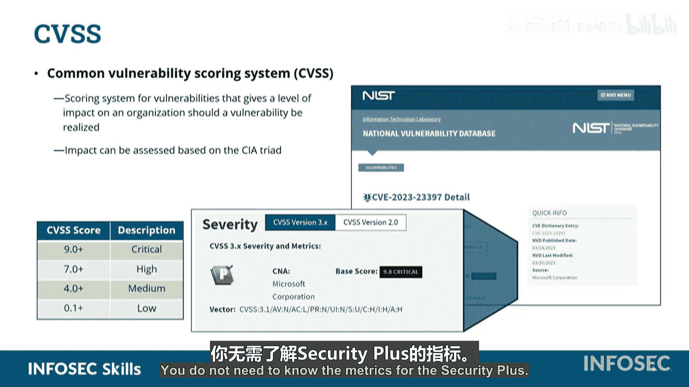

# 053：漏洞识别

在本节中，我们将学习如何识别和评估在漏洞扫描中发现的系统弱点。核心内容包括两种关键工具：用于唯一标识漏洞的CVE，以及用于评估漏洞严重程度的CVSS评分系统。

## CVE：漏洞的通用“身份证” 🆔

执行漏洞扫描后，扫描器会反馈结果，并使用一种标识系统来区分不同的漏洞。

我们识别漏洞的通用方法是使用“通用漏洞与暴露”标识符。

这是一种由MITRE公司提出的识别工具或方案。

MITRE公司作为麻省理工学院的衍生机构，创建了这种名为CVE的命名规范。

CVE标识符遵循 **`CVE-YYYY-NNNNN`** 的格式。幻灯片中提到，后面的数字部分是“任意的”。这意味着该数字本身不传达任何特定含义。例如，不能因为某个CVE编号是23000，就认为它代表某种特定类型的漏洞。这个数字只是一个唯一的序列号。前面的四位数字年份代表该漏洞被公开或发现的年份。

可以类比COVID-19。COVID-19指的是2019年发现的冠状病毒传染病。它并非只在2019年造成问题，但名称中包含了发现年份。因此，当你看到一个带有特定年份标识的CVE时，不要简单地认为它是一个“旧漏洞”，今天就不会影响你。你需要确认该漏洞是否已经发布了补丁。

屏幕上显示的图像是“美国国家漏洞数据库”。

这是一个由美国国家标准与技术研究院运营的、收录已公开和已发现漏洞的数据库或仓库。

国家漏洞数据库是一个包含各种漏洞的大型目录仓库。每个漏洞都会获得一个标识符，格式为CVE-，例如本例中的 **`CVE-2023-23397`**。

该标识符指明了这个特定的漏洞。标识符下方会有一个描述字段以及其他一些信息。

## CVSS：漏洞的“危险等级”评分 ⚠️

对于Security+考试，关键的是你在底部看到的CVSS。如果我们放大那个小区域，你会看到CVSS分数是基于许多不同的向量计算得出的。

那个放大框底部的向量列表显示了所采用的不同度量指标的数量。

对于Security+考试，你不需要知道这些具体的度量指标。这些内容将在其他网络安全认证考试中出现。

我们需要知道的是，CVSS代表“通用漏洞评分系统”。

它告诉我们某个特定漏洞的影响程度或危害性。

许多组织是CNA。它们是编号授权机构。它们扫描并计算漏洞的影响程度。它们根据我们刚才在底部看到的那些度量指标，得出一个基础分数。

然后，它们生成的分数就是你在这里侧面看到的。分数范围如下：
*   分数从0.1到4.0，属于**低**危级别。
*   分数从4.0到7.0，属于**中**危级别。
*   分数从7.0到9.0，属于**高**危级别。
*   分数从9.0到10.0，属于**严重**级别。这意味着你需要立即放下手头工作进行修复，这是一个非常严重的问题。

确实存在潜在的10分漏洞，这些漏洞一旦被利用，绝对会破坏你的系统。

## 总结 📝

本节课中，我们一起学习了漏洞识别的核心框架。**CVSS**是我们用来识别漏洞危险程度的方法，而**CVE**是我们用来命名不同漏洞的方法。这些工具使我们能够在不同系统间引用漏洞，并拥有一个统一的通用命名和评分规范。

在Security+考试中，请务必留意关于CVE和CVSS的题目。