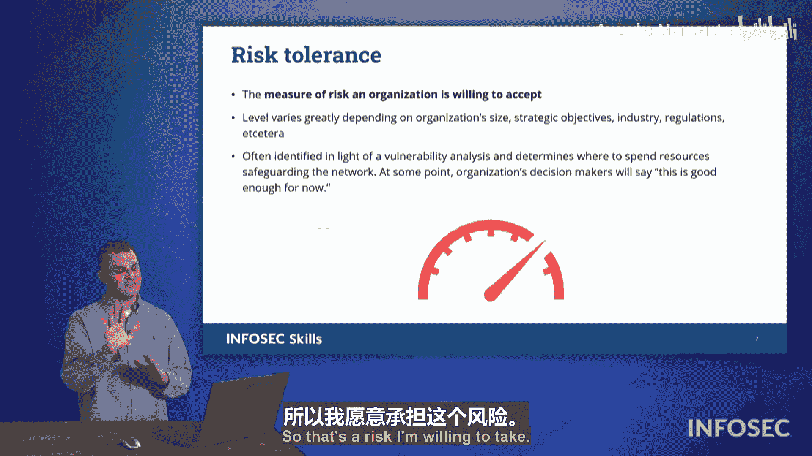

# 054：漏洞分析 🎯

在本节课中，我们将学习如何对漏洞扫描的结果进行分析。完成漏洞扫描后，关键步骤是审查发现的问题，并分析其中呈现的各种漏洞及其结果。我们将探讨如何判断扫描结果的准确性、如何对漏洞进行分类和优先级排序，以及如何评估漏洞对组织的影响。

## 漏洞扫描结果的准确性判断 🔍

上一节我们介绍了漏洞扫描的基本概念，本节中我们来看看如何判断扫描结果的准确性。分析的第一步是确定扫描发现是否正确。这涉及到四个核心概念：真阳性、真阴性、假阳性和假阴性。

以下是这四个术语的定义：

*   **真阳性**：扫描发现了漏洞，并且这个发现是正确的。
*   **真阴性**：扫描报告没有发现漏洞，并且这个评估是正确的。
*   **假阳性**：扫描报告发现了漏洞，但这个发现是错误的，实际上该漏洞并不存在。
*   **假阴性**：扫描报告没有发现漏洞，但这个发现是错误的，实际上存在未被检测到的漏洞。

假阳性和假阴性不仅会误报实际情况，还可能引发后续问题。例如，假阳性可能导致团队耗费大量时间和资源去修复一个根本不存在的“漏洞”。而假阴性则会造成虚假的安全感，让组织误以为一切安全，从而忽视真实存在的威胁。

在考试中，你需要能够根据提供的场景，判断其属于真阳性、真阴性、假阳性还是假阴性。预计会有一到两道相关题目，请仔细思考评估的内容及其真伪性可能带来的影响。

## 漏洞的优先级排序与分类 📊

了解了如何判断扫描结果的准确性后，下一步我们需要对真实的漏洞进行处理。我们根据技术在本组织中的使用方式以及修复特定漏洞所需的缓解措施来确定不同漏洞的优先级，因此处理方式也会有所不同。

处理漏洞时，可以遵循以下策略：

*   **资源分配**：某些漏洞可能涉及面广，需要更多人员参与或与不同供应商沟通。
*   **快速修复**：有些漏洞可能修复起来简单快捷，可以迅速组织团队批量处理。
*   **分类处理**：可以安排专人负责与外部供应商寻找解决方案，同时让团队其他成员处理具体的漏洞修复工作。

优先级排序因组织而异，取决于相关技术的具体使用情况。

我们还可以根据不同的指标对正在处理的漏洞进行分类。

分类时可以考虑以下维度：

*   **漏洞严重程度**：这个漏洞的影响是大还是小？
*   **影响范围**：它影响多少台机器？影响多少用户？
*   **受影响对象**：它影响什么类型的系统？或正在使用什么版本的软件？

## 环境变量与漏洞影响评估 ⚖️

每个组织使用技术的方式可能是独特的，因此其他组织可能非常担忧的漏洞，对你的组织来说可能无关紧要。

评估漏洞时，下一个要讨论的术语是**影响**，即查看该漏洞对我们组织的影响是什么。

漏洞可能带来多种不同的影响：

*   **财务损失**：直接造成经济损失，或引发监管罚款。
*   **声誉损害**：导致合作伙伴终止合作，客户信任度下降。
*   **运营中断**：例如导致订单无法发货、电话系统瘫痪等。

你需要能够考虑漏洞对组织的整体影响，以及其对整个行业的影响。近期历史上，航空制造业发生的一些事件导致整个行业受到审查，一家公司的问题可能会溢出并影响到行业内其他原本没有问题的制造商。

## 组织的风险承受能力 💰

最后，在查看不同漏洞时，你需要考虑**风险承受能力**，即我们作为一个组织愿意接受多少风险。

你所在组织愿意承受的风险水平，很大程度上取决于你所处的行业类型、领导层的思维方式以及网络安全预算的多少。业内常有一个玩笑：风险承受能力直接与预算挂钩。如果已经分配了特定金额并已花完，那么超出预算需要修复的部分，就被视为“愿意承担的风险”。

所有这些因素结合在一起——审视组织内的不同漏洞、分析漏洞的方法——构成了完整的漏洞分析流程。请留意安全+考试中可能出现的这些术语。

## 总结 📝

本节课中，我们一起学习了漏洞分析的核心流程。我们首先学习了如何通过真阳性、真阴性、假阳性和假阴性来判断漏洞扫描结果的准确性。接着，我们探讨了如何根据漏洞的严重性、影响范围和组织环境来对其进行优先级排序和分类。然后，我们分析了漏洞可能带来的财务、声誉和运营等多方面影响。最后，我们了解了组织的风险承受能力如何影响漏洞的处置决策。掌握这些分析技能，对于有效管理网络安全风险至关重要。