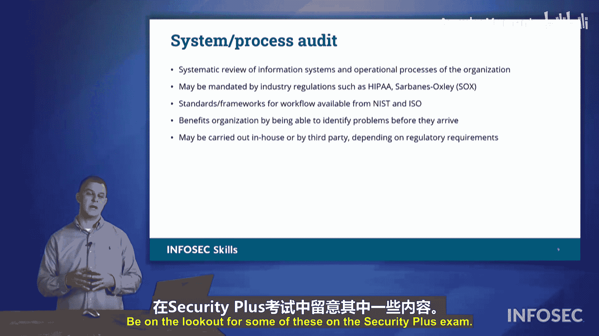

# 055：漏洞管理 🛡️

在本节课中，我们将学习如何识别和管理组织中的潜在安全漏洞。了解这些漏洞的来源和发现方法，是构建有效防御体系的第一步。

## 概述 📋

对于任何组织而言，在漏洞演变成实际问题之前发现它们至关重要。我们需要了解潜在的威胁，以便能够妥善处理。本节将讨论漏洞管理，以及发现和了解各种漏洞的方法。

## 发现漏洞的信息来源

有多种信息来源可以帮助我们了解漏洞。以下是几种主要途径。

### 开源情报

开源情报是指利用任何公开可用的信息来了解正在发生的攻击、已被发现的漏洞，或其他组织在其网络中观察到的现象。这类信息很有用，可以从开放的互联网、社交媒体等渠道获取。开源情报圈内会分享大量信息。

开源情报的问题是，你可能需要筛选大量信息才能提取出可操作的情报。

### 专有情报

为了浓缩信息，我们可能会依赖专有情报。专有情报是指你求助于那些已经收集并整理好信息的组织。他们筛选了所有信息，剔除了冗余内容，使你无需反复阅读相同的文章来获取微小的细节。他们完成了所有阅读工作，收集了那些微小的细节，从而为你提供一份更精炼、更专注于当前漏洞的报告。

由于是专有的，这类情报具有更高的信噪比。它不面向公众消费，也不在组织间广泛共享。专有情报很有用，因为你无需费力剔除其他文章叙述中可能包含的无关内容。

### 深网与暗网

我们也可以依赖深网，有时甚至是暗网。

深网是指存在于开放互联网上，但无法轻易通过搜索引擎找到的信息。它没有被主流搜索引擎索引。要访问深网信息，你必须知道去哪里寻找。深网信息并非刻意隐藏，它就在那里，只是搜索引擎无法抓取。深网可以是一个非常有用的工具和资源。

另一个资源是暗网或ToR网络。ToR代表洋葱路由器网络。ToR接收用户的数据，网络中有入口节点或中继节点。在ToR网络的这些节点上，每个链接都会被加密，网络中的每一跳都会增加一层新的加密。因此，你的通信从一点到另一点是随机化的，并且在所有之上提供了保密性。这使得追踪原始信息的发送者变得极其困难，因为数据包被一层又一层地加密，故名“洋葱路由器”。

暗网的问题是，因为它提供了保密性且难以追踪用户，许多黑客类型的人利用暗网进行非法活动。因此，使用ToR需要谨慎。使用ToR本身并不违法，但上面存在大量非法内容。你肯定不希望在没有大量批准、许可和相关人员签字的情况下，从公司网络使用ToR。

我们之前讨论的那些提供专有报告的组织，会搜索并从暗网中收集信息。暗网上存在黑客类型的论坛，他们可以在那里分享信息。例如，一个攻击者可能会说“看，我黑进了这家大公司，这是证据”，并向他人展示证据；或者他们可能说“我收集了这家机构所有客户的信用卡和身份信息，每份卖一美元”，而他们手上有成千上万份。暗网是一个聚集了许多可疑角色的地方，需要小心，但它是了解黑客在做什么、他们的兴趣点、他们正在策划什么以及下一步动向的信息宝库。

### 情报共享组织

我们还可以依赖其他组织进行情报共享。例如ISAC和SIE等情报共享团体。

ISAC代表信息共享与分析中心。SIE是安全信息交换组织。这些社区和机构的存在是为了在可能处于同一行业、具有相同组织规模或位于同一地理区域的组织之间共享信息。这些组织会分享信息，以便彼此守望相助，这是一种“围成一圈”的防御形式，是针对那些可能试图破坏某个组织的对手的共同统一防御。

在市场上竞争的组织之间共享网络安全情报和信息并非闻所未闻。例如，可口可乐和百事可乐可能在市场上激烈竞争，福特和雪佛兰可能在争夺客户销售，但在后台，他们的安全团队可能会相互分享信息，以确保彼此安全。因此，尽管我们在市场上视他们为竞争对手，但这并不意味着我们对竞争采取敌对态度。保持网络安全需要我们采取共同统一的防御。

### 渗透测试团队

我们还可以邀请团队对我们的网络进行渗透测试。他们会发起模拟攻击。我们将与他们合作，签署大量协议（这一点稍后会详细讨论）。然后，这些渗透测试将利用任何检测到的漏洞，并能够告诉我们：如果攻击者试图利用我们网络上的这些漏洞，他们可能获得什么访问权限？渗透测试团队由“白帽”黑客组成，他们会与我们分享他们的发现，记录他们做了什么、如何做的以及获得了什么访问权限。

### 自动化漏洞扫描

一种更自动化的方法是使用漏洞扫描软件，正如我们之前提到的。漏洞扫描是软件执行的自动化过程。而渗透测试则涉及人为因素，不是自动化过程。

### 漏洞赏金计划

我们还可以依靠其他人通过漏洞赏金计划、负责任的披露程序来提供帮助。如果供应商创建了一个新产品，并希望确保该产品安全且尽可能没有漏洞，他们可能会与Hacker One这样的平台合作。Hacker One是一个市场，漏洞赏金猎人在那里寻找产品中的漏洞，抢在对手之前发现它们。

我们在程序中发现这些漏洞，然后告知供应商：“嘿，你们即将推出的这个新产品存在这个问题、那个问题，需要解决。”而组织为了感谢你的工作，会根据该漏洞提供的风险严重程度向你支付报酬。因此，这些漏洞赏金计划是组织与富有创造力、寻求挑战的“白帽”黑客类型人才合作的好方法，他们希望在产品上市前确保其安全和网络安全。

### 内部流程审查

最后，我们还可以通过审查来确定我们组织内部各个流程中存在哪些问题、哪些漏洞。我们执行流程的方式可能需要遵守法律、行业法规或某些合规要求。我们将逐步检查这些不同的流程，看看其中存在哪些脆弱的环节，这些环节是我们组织继续正常运营所必需的。

## 总结 ✨

在本节中，我们讨论了了解不同漏洞的方法。在Security+考试中，请注意其中一些内容。掌握这些信息来源和评估方法，是实施有效漏洞管理策略的基础。通过结合自动化工具、人工测试、外部情报和内部审查，组织可以更全面地识别和应对安全威胁。